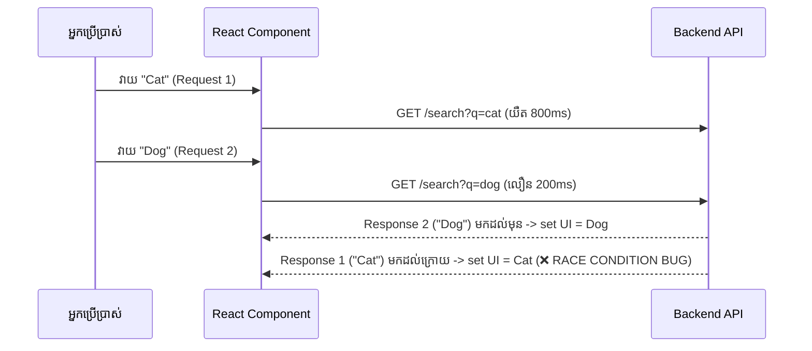

# 🏎️ Data Fetching Patterns & Race Conditions

នៅពេលដែលអ្នកប្រើប្រាស់ចុចប្តូរ Tabs ឬវាយពាក្យស្វែងរកលឿនៗ Requests ជាច្រើនត្រូវបានបាញ់ចេញដំណាលគ្នា។



---

## ការដោះស្រាយដោយប្រើ Cleanup Flag Pattern

```tsx
import { useState, useEffect } from "react";

export function SearchResults({ query }: { query: string }) {
  const [data, setData] = useState<string[]>([]);

  useEffect(() => {
    let ignore = false; // Flag ដើម្បីទប់ស្កាត់ Stale Response

    async function fetchData() {
      const res = await fetch(`https://api.example.com/search?q=${query}`);
      const json = await res.json();
      if (!ignore) {
        setData(json.results);
      }
    }

    if (query) {
      fetchData();
    }

    return () => {
      ignore = true; // ប្រសិនបើ query ផ្លាស់ប្តូរ Ignore response ចាស់ចោលភ្លាម
    };
  }, [query]);

  return <div>{/* Render Results */}</div>;
}
```
