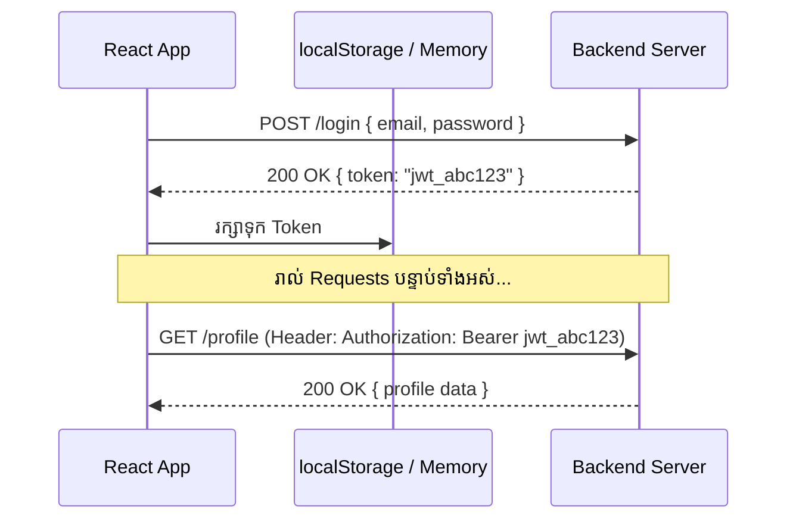

# 🔐 Token Handling & Secure HTTP Requests

នៅក្នុងស្ថាបត្យកម្មទំនើប React Client ផ្ទៀងផ្ទាត់សិទ្ធិជាមួយ REST API តាមរយៈ **JSON Web Tokens (JWT)**។



---

## ការភ្ជាប់ Authorization Header ដោយស្វ័យប្រវត្តិតាម Axios

```tsx
import axios from "axios";

export const authAxios = axios.create({
  baseURL: import.meta.env.VITE_API_URL,
});

authAxios.interceptors.request.use((config) => {
  const token = localStorage.getItem("auth_token");
  if (token) {
    config.headers.Authorization = `Bearer ${token}`;
  }
  return config;
});
```
