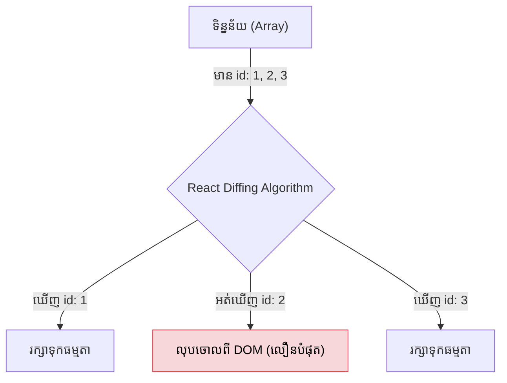

## 🔄 ការប្រើប្រាស់ `map()` នៅក្នុង JSX

ជាញឹកញាប់ អ្នកនឹងទទួលបានទិន្នន័យពី Database (API) ក្នុងទម្រង់ជា Array (បញ្ជី) ហើយអ្នកត្រូវយកវាមកបង្ហាញជាកាត (Cards) ឫតារាង (Tables) នៅលើវេបសាយ។

នៅក្នុង React យើងមិនមាន V-For (ដូច Vue) ឫ ngFor (ដូច Angular) ទេ។ យើងប្រើប្រាស់អនុគមន៍ `.map()` របស់ JavaScript ធម្មតាសុទ្ធសាធ!

```jsx
const fruits = ['Apple', 'Banana', 'Orange'];

function FruitList() {
  return (
    <ul>
      {/* ប្រើសញ្ញា { } ដើម្បីបង្កប់កូដ JS រួចហៅ map() */}
      {fruits.map((fruit) => (
         <li>{fruit}</li>
      ))}
    </ul>
  );
}
```
*បញ្ជាក់: ពេលសរសេរកូដខាងលើ React នឹងលោត Warning ពណ៌ក្រហមនៅក្នុង Console ដោយប្រាប់ថា `Each child in a list should have a unique "key" prop.` តើវាមានន័យយ៉ាងម៉េច?*

---

## 🔑 អាថ៌កំបាំងរបស់ `key` Prop

នៅពេល React គូររូបរាងបញ្ជី (List) ហើយក្រោយមកបញ្ជីនោះមានការប្រែប្រួល (ឧទាហរណ៍ អ្នកលុបផ្លែចេកចោល)។ តើ React ដឹងដោយរបៀបណាថា ត្រូវលុប Element មួយណាចោល ដើម្បីកុំអោយវា Render ឡើងវិញទាំងអស់?

ចម្លើយគឺ React ត្រូវការអោយអ្នកបំពាក់ **ស្លាកឈ្មោះ (Key)** ទៅអោយ Element នីមួយៗ! 
Key ត្រូវតែជាតម្លៃដែល៖
1. **មានតែមួយគត់ (Unique):** កុំអោយជាន់ជាមួយបងប្អូនរបស់វា
2. **ស្ថិតស្ថេរ (Stable):** វាមិនប្រែប្រួលសោះឡើយ ទោះជាបញ្ជីនោះត្រូវរៀបចំថ្មី (Sort) ក៏ដោយ។



---

## 🚫 បម្រាម៖ គ្រោះថ្នាក់នៃការប្រើ `index` ជា `key`

សិស្សថ្មីៗជាច្រើនចូលចិត្តសរសេរកូដបែបនេះ ពេលរក Key មិនឃើញ៖
```jsx
// ❌ ការប្រើប្រាស់ index ជា key (ជៀសវាងអោយបាន!)
{items.map((item, index) => (
  <ItemCard key={index} data={item} />
))}
```
**ហេតុអ្វីវាខុស?** 
ឧបមាថាបញ្ជីមានធាតុ [A, B, C] ដែលមាន Index [0, 1, 2]។
បើអ្នកលុប A ចោល, ពេលនេះ B នឹងធ្លាក់មកយកលេខ Index [0] ជំនួសវិញ! ពេលនោះ React នឹងយល់ច្រឡំថា A នៅរស់រានមានជីវិតដដែល គ្រាន់តែប្តូរឈ្មោះទៅជា B។ វានឹងបណ្តាលអោយមានកំហុសធ្ងន់ធ្ងរ ប្រសិនបើមានប្រអប់អត្ថបទ (Input) នៅខាងក្នុងវា។

**ដំណោះស្រាយត្រឹមត្រូវ:**
ត្រូវតែប្រើប្រាស់លេខ ID របស់ទិន្នន័យ ដែលបានមកពី Database ជានិច្ច!
```jsx
// ✅ ការប្រើប្រាស់ ID ជា key
{items.map((item) => (
  <ItemCard key={item.id} data={item} />
))}
```
