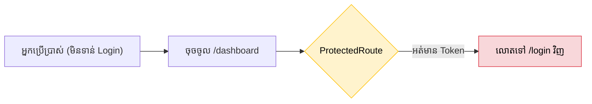

## 🛡️ ការបង្កើត Protected Route Component

បច្ចេកទេសដ៏ពេញនិយមបំផុតដើម្បីការពារទំព័រ គឺការបង្កើត Component សំបក (Wrapper) មួយ ដែលមានតួនាទីសួរថា *"តើអ្នកបាន Login ហើយឫនៅ?"* មុននឹងអនុញ្ញាតអោយបង្ហាញទំព័រពិតប្រាកដ។

```jsx
// ឯកសារ: components/ProtectedRoute.jsx
import { Navigate, Outlet } from 'react-router-dom';

function ProtectedRoute({ isAuthenticated, allowedRole }) {
  // 1. បើមិនទាន់ Login សោះ -> បណ្តេញទៅទំព័រ Login
  if (!isAuthenticated) {
    return <Navigate to="/login" replace />;
  }

  // 2. (ជម្រើស) បើទាមទារសិទ្ធិ Admin តែគាត់ជាសមាជិកធម្មតា -> បណ្តេញទៅទំព័រដើម
  if (allowedRole && allowedRole !== "admin") {
    return <Navigate to="/" replace />;
  }

  // 3. បើគ្រប់លក្ខខណ្ឌទាំងអស់ត្រឹមត្រូវ -> អនុញ្ញាតអោយឃើញទំព័រ (Outlet)
  return <Outlet />;
}
```

---

## 🚦 ការយកមកប្រើប្រាស់ជាមួយ React Router

នៅក្នុងឯកសារ `App.jsx` យើងគ្រាន់តែយក `<ProtectedRoute>` ទៅរុំពីលើ Routes ណាដែលយើងចង់ការពារ!



```jsx
import { Routes, Route } from 'react-router-dom';
import ProtectedRoute from './components/ProtectedRoute';

function App() {
  const isAuth = true; // ជាក់ស្តែងបានមកពី Context ឫ State
  const userRole = "user";

  return (
    <Routes>
      {/* 🟢 ទំព័រសាធារណៈ (នរណាក៏អាចមើលបាន) */}
      <Route path="/" element={<Home />} />
      <Route path="/login" element={<Login />} />

      {/* 🟡 ទំព័រឯកជន (ទាល់តែ Login ទើបមើលបាន) */}
      <Route element={<ProtectedRoute isAuthenticated={isAuth} />}>
        <Route path="/profile" element={<Profile />} />
        <Route path="/settings" element={<Settings />} />
      </Route>

      {/* 🔴 ទំព័ររដ្ឋបាល (ទាល់តែជា Admin ទើបមើលបាន) */}
      <Route element={<ProtectedRoute isAuthenticated={isAuth} allowedRole={userRole} />}>
        <Route path="/admin" element={<AdminDashboard />} />
      </Route>
    </Routes>
  );
}
```

> **🔑 Authentication vs Authorization:** 
> - **Authentication (AuthN):** បញ្ជាក់ថា "តើអ្នកជានរណា?" (បាន Login ឫនៅ)។
> - **Authorization (AuthZ):** បញ្ជាក់ថា "តើអ្នកមានសិទ្ធិធ្វើអ្វីខ្លះ?" (ជា Admin ឫ User ធម្មតា)។
