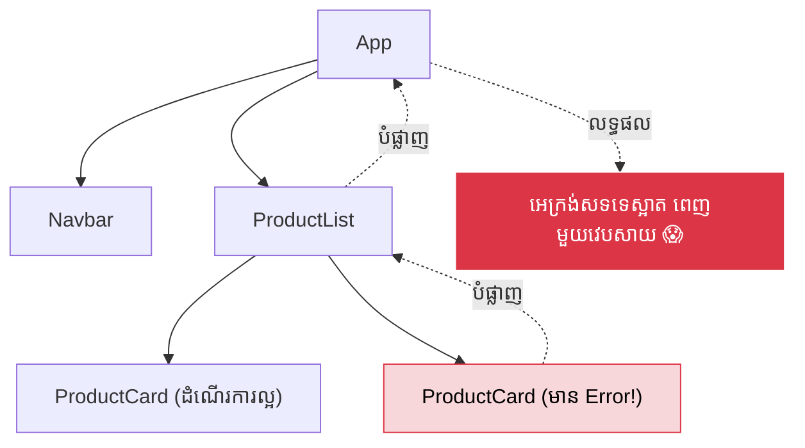

## 💥 បញ្ហា "អេក្រង់ស" (White Screen of Death)

នៅក្នុង React ប្រសិនបើមាន Component ណាមួយមានកំហុស (Error) នៅក្នុងពេលកំពុង Render នោះ React នឹងដក Component Tree ទាំងមូលចេញពីអេក្រង់តែម្តង! ជាលទ្ធផល អ្នកប្រើប្រាស់នឹងឃើញតែ "អេក្រង់សទទេស្អាត" ដោយមិនដឹងថាមានរឿងអ្វីកើតឡើង។



---

## 🛡️ ការពារដោយ Error Boundaries

ដើម្បីទប់ស្កាត់បញ្ហានេះ យើងត្រូវការ **Error Boundaries**។ វាជា Component ពិសេសមួយដែលអាចចាប់យកកំហុសរបស់កូនៗវា ហើយបង្ហាញផ្ទាំង "សុំទោស" (Fallback UI) ជំនួសអោយការគាំងវេបសាយទាំងមូល។

ជាទូទៅ សហគមន៍ React ណែនាំអោយប្រើបណ្ណាល័យ `react-error-boundary` ព្រោះវាងាយស្រួលប្រើជាងការសរសេរ Class Component ដោយខ្លួនឯង។

```bash
npm install react-error-boundary
```

```jsx
import { ErrorBoundary } from 'react-error-boundary';

// 1. បង្កើតផ្ទាំងជំនួស (Fallback UI)
function ErrorFallback({ error, resetErrorBoundary }) {
  return (
    <div role="alert" className="error-box">
      <p>សូមអភ័យទោស មានកំហុសមួយបានកើតឡើង:</p>
      <pre style={{ color: 'red' }}>{error.message}</pre>
      {/* អនុញ្ញាតអោយអ្នកប្រើប្រាស់ចុចសាកល្បងម្តងទៀត */}
      <button onClick={resetErrorBoundary}>សាកល្បងម្តងទៀត</button>
    </div>
  );
}

function App() {
  return (
    <div>
      <Navbar />
      
      {/* 2. រុំកន្លែងដែលងាយរងគ្រោះដោយ ErrorBoundary */}
      <ErrorBoundary 
        FallbackComponent={ErrorFallback}
        onReset={() => {
          // សម្អាត State បើចាំបាច់
        }}
      >
        <ProductList />
      </ErrorBoundary>
      
      <Footer />
    </div>
  );
}
```

ឥឡូវនេះ ប្រសិនបើ `ProductList` គាំង គឺវាខូចតែផ្នែកកណ្តាលប៉ុណ្ណោះ រីឯ `Navbar` និង `Footer` នៅតែដំណើរការល្អធម្មតា!

---

## 🚫 អ្វីដែល Error Boundaries មិនអាចចាប់បាន

ដូចដែលមានក្នុង Quiz ខាងលើ សូមចងចាំថា Error Boundaries **មិនមែន** ជាថ្នាំទិព្វទេ។ វាមិនអាចចាប់កំហុសនៅក្នុងករណីខាងក្រោមបានទេ៖
1. **Event Handlers:** (ការចុចប៊ូតុង, វាយអក្សរ)
2. **Asynchronous Code:** (ការហៅ API តាមរយៈ `fetch` ឫ `setTimeout`)
3. **Server-Side Rendering (SSR):** ពេលប្រើជាមួយ Next.js

សម្រាប់ករណីទាំងនេះ អ្នកត្រូវតែប្រើប្រាស់ `try / catch` ជាដាច់ខាត៖

```jsx
// ✅ ការគ្រប់គ្រងកំហុស API ដែលត្រឹមត្រូវ
const handleSubmit = async () => {
  try {
    const res = await fetch('/api/login');
    if (!res.ok) throw new Error("បាត់បង់ការតភ្ជាប់!");
  } catch (err) {
    // ត្រូវមាន State ដើម្បីបង្ហាញកំហុសនេះលើ UI
    setErrorMessage(err.message); 
  }
};
```
