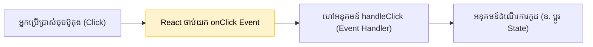

## 🖱️ ការស្ទាក់ចាប់សកម្មភាព (Event Handling)

នៅក្នុង HTML ធម្មតា យើងប្រើប្រាស់ `onclick` (អក្សរតូច) ប៉ុន្តែនៅក្នុង React (JSX) ព្រឹត្តិការណ៍ទាំងអស់ត្រូវសរសេរជា **camelCase** (ឧ. `onClick`, `onChange`, `onSubmit`, `onMouseEnter`)។



---

## ⚠️ កំហុសដ៏ធំបំផុត: ការហៅអនុគមន៍ភ្លាមៗ!

ដូចមានក្នុង Quiz ខាងលើ សូមប្រុងប្រយ័ត្នខ្ពស់ចំពោះការសរសេររង្វង់ក្រចក `()` នៅពេលភ្ជាប់ Event៖

```jsx
function App() {
  const sayHello = () => alert("សួស្តី!");

  return (
    <div>
      {/* ✅ ត្រូវ: បញ្ជូនតែឈ្មោះ (Reference) អោយទៅ React ដើម្បីហៅពេលក្រោយ */}
      <button onClick={sayHello}>ចុចខ្ញុំ (ត្រឹមត្រូវ)</button>

      {/* ❌ ខុស: រង្វង់ក្រចកបញ្ជាអោយកូដរត់ភ្លាមៗ ពេល Load ទំព័រ! */}
      <button onClick={sayHello()}>ចុចខ្ញុំ (ខុស)</button>
    </div>
  );
}
```

**ចុះបើអ្នកចង់បញ្ជូនទិន្នន័យ (Parameters) ទៅអោយអនុគមន៍នោះ?**
ប្រសិនបើអ្នកត្រូវការបញ្ជូនទិន្នន័យ អ្នកត្រូវប្រើប្រាស់ **Inline Arrow Function** ជាស្ពានចម្លង៖

```jsx
function App() {
  const deleteItem = (id) => alert("កំពុងលុបលេខ: " + id);

  return (
    // ✅ ត្រូវ: បង្កើតអនុគមន៍តូចមួយ ដើម្បីហៅអនុគមន៍ធំ
    <button onClick={() => deleteItem(15)}>លុបទំនិញទី១៥</button>
  );
}
```

---

## 📥 Event Object ដ៏មានឥទ្ធិពល

រាល់ពេលមានព្រឹត្តិការណ៍កើតឡើង React នឹងលួចបញ្ជូនទិន្នន័យមួយដុំហៅថា **Event Object** (ជាទូទៅគេតាងដោយអក្សរ `e` ឫ `event`) ទៅអោយអនុគមន៍របស់អ្នក។ 
វផ្ទុកព័ត៌មានគ្រប់យ៉ាងទាក់ទងនឹងអ្វីដែលទើបតែកើតឡើង!

ការប្រើប្រាស់ដ៏ពេញនិយមបំផុតគឺការចាប់យកអក្សរដែលអ្នកប្រើប្រាស់កំពុងវាយបញ្ចូល (typing) តាមរយៈ `onChange`៖

```jsx
import { useState } from 'react';

function SearchInput() {
  const [text, setText] = useState("");

  const handleChange = (e) => {
    // e.target គឺសំដៅលើ <input> នោះ
    // e.target.value គឺជាតួអក្សរដែលកំពុងវាយបញ្ជូល
    setText(e.target.value);
  };

  return (
    <div>
      <input 
        type="text" 
        onChange={handleChange} 
        placeholder="ស្វែងរកទីនេះ..." 
      />
      <p>អ្នកកំពុងស្វែងរក: {text}</p>
    </div>
  );
}
```

> **⚡ សម្រាប់អនាគត (TypeScript):** នៅពេលអ្នករៀនវគ្គ TypeScript ជាបន្តបន្ទាប់ អ្នកនឹងត្រូវបំពាក់ប្រភេទ (Type) អោយ Event Object នេះ។ ឧទាហរណ៍ `const handleChange = (e: React.ChangeEvent<HTMLInputElement>) => { ... }`។ វាជួយការពារអ្នកពីការសរសេរកូដខុសបានយ៉ាងអស្ចារ្យ!
