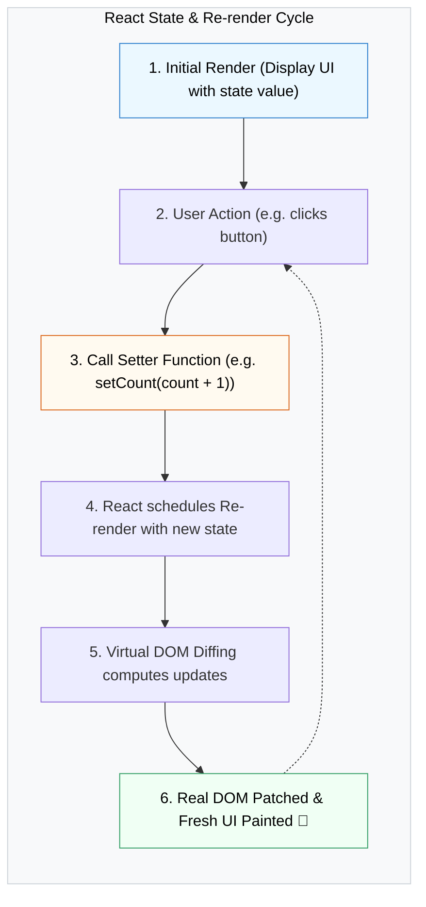

## 🚦 1. យន្តការនៃ `useState`

React មិនតាមដានការប្រែប្រួលរបស់ regular variable `let x = 0` ឡើយ។ ដើម្បីឱ្យ UI ធ្វើការ **Re-render** យើងត្រូវប្រើប្រាស់ **State** តាមរយៈ Hook `useState`៖



---

## 🛠️ 2. Functional Updates

នៅពេលការគណនា State ថ្មីត្រូវពឹងផ្អែកលើតម្លៃ State ចាស់ យើងគួរប្រើប្រាស់ **Functional Update Pattern** ជានិច្ច៖

```jsx
import { useState } from 'react';

export default function Counter() {
  const [count, setCount] = useState(0);

  const incrementThreeTimes = () => {
    // ✅ ប្រើ functional updates ដើម្បីធានាតម្លៃថ្មីបំផុតជានិច្ច
    setCount((prev) => prev + 1);
    setCount((prev) => prev + 1);
    setCount((prev) => prev + 1);
  };

  return (
    <div className="p-6 border rounded-2xl text-center max-w-xs">
      <h2 className="text-3xl font-black mb-4">{count}</h2>
      <button 
        onClick={incrementThreeTimes}
        className="px-4 py-2 bg-blue-600 text-white font-bold rounded-xl hover:bg-blue-700"
      >
        +3 ក្នុងម្តងចុច
      </button>
    </div>
  );
}
```
