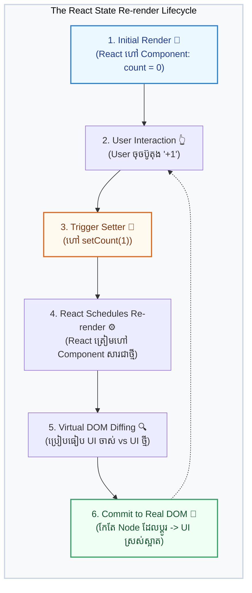

## 🚦 ១. Mechanics of `useState` & Re-render Cycle

> [!IMPORTANT]
> **និយមន័យ React State & useState (Definition) ៖**  
> យោងតាមគេហទំព័រផ្លូវការរបស់ React (**react.dev**), **React State** គឺជាអង្គចងចាំផ្ទាល់ខ្លួន (Component Memory) សម្រាប់រក្សាទុកទិន្នន័យដែលអាចផ្លាស់ប្តូរបានទៅតាមពេលវេលា ឬសកម្មភាពរបស់អ្នកប្រើប្រាស់ (User Interactions)។  
> 
> Hook **`useState`** ផ្តល់ត្រឡប់មកវិញនូវ Array មាន ២ ធាតុ ៖ `[stateValue, setterFunction]` ៖
> 1. **`stateValue` ៖** តម្លៃបច្ចុប្បន្ននៃ State ក្នុង Render មួយនេះ (Snapshot)។
> 2. **`setterFunction` ៖** Function សម្រាប់ប្រាប់ React ឱ្យធ្វើបច្ចុប្បន្នភាព State និង **កេះដំណើរការ Re-render (Trigger a Render)**។


```mermaid
flowchart TD
    subgraph RenderCycle["The React State Re-render Lifecycle"]
        direction TB
        S1["1. Initial Render 🚀<br/>(React ហៅ Component: count = 0)"] --> S2["2. User Interaction 👆<br/>(User ចុចប៊ូតុង '+1')"]
        S2 --> S3["3. Trigger Setter 📨<br/>(ហៅ setCount(1))"]
        S3 --> S4["4. React Schedules Re-render ⚙️<br/>(React ត្រៀមហៅ Component សារជាថ្មី)"]
        S4 --> S5["5. Virtual DOM Diffing 🔍<br/>(ប្រៀបធៀប UI ចាស់ vs UI ថ្មី)"]
        S5 --> S6["6. Commit to Real DOM 🎨<br/>(កែតែ Node ដែលប្តូរ -> UI ស្រស់ស្អាត)"]
        S6 -.-> S2
    end

    style RenderCycle fill:#f8f9fa,stroke:#cbd5e1,stroke-width:2px,color:#000
    style S1 fill:#ebf8ff,stroke:#3182ce,stroke-width:2px,color:#1e3a8a
    style S3 fill:#fffaf0,stroke:#dd6b20,stroke-width:2px,color:#78350f
    style S6 fill:#f0fff4,stroke:#38a169,stroke-width:2px,color:#14532d
```

---

## 📸 ២. The "State as a Snapshot" Mental Model (react.dev Standard)

រឿងដែល Developer ថ្មីៗតែងតែយល់ច្រឡំ ៖
```javascript
console.log(count); // 0
setCount(count + 1);
console.log(count); // នៅតែ 0 ដដែល! មិនទាន់ក្លាយជា 1 ភ្លាមៗទេ!
```

> [!NOTE]
> **ហេតុអ្វី?**  
> យោងតាម `react.dev`, **State មិនមែនជា Regular JavaScript Variable ធម្មតាឡើយ**! វាមិនផ្លាស់ប្តូរភ្លាមៗក្នុងបន្ទាត់បន្ទាប់ទេ ប៉ុន្តែវាដើរតួដូចជា **រូបថត (Snapshot)** មួយសន្លឹកនៃ Render បច្ចុប្បន្ន។  
> ការហៅ `setCount(...)` មិនមែនជាការប្តូរអថេរក្នុងបន្ទាត់នោះទេ តែវាជាការ **ផ្ញើសារកក់កាលវិភាគទៅ React** ថា ៖ *«សូមថតរូប Component នេះម្តងទៀតក្នុង Render បន្ទាប់ ដោយជំនួសតម្លៃ count = 1!»*

---

## 💻 ៣. ឧទាហរណ៍ជាក់ស្តែង ៖ Functional Updates & Automatic Batching

```jsx
// src/components/CounterMastery.jsx
import { useState } from 'react';

export default function CounterMastery() {
  const [count, setCount] = useState(0);

  // 1. របៀបធម្មតា (Direct Value Update)
  const handleAddOne = () => {
    setCount(count + 1);
  };

  // 2. របៀប Functional Updates (Safe Queued Updates)
  const handleAddThree = () => {
    // React នឹងយក callback functions ទាំង ៣ នេះទៅដាក់ក្នុង Queue ដើម្បីគណនាបន្តកន្ទុយគ្នា
    setCount((prev) => prev + 1); // prev = 0 -> return 1
    setCount((prev) => prev + 1); // prev = 1 -> return 2
    setCount((prev) => prev + 1); // prev = 2 -> return 3
  };

  const handleReset = () => {
    setCount(0);
  };

  return (
    <div className="max-w-xs mx-auto p-6 bg-white dark:bg-slate-900 border border-slate-200 dark:border-slate-800 rounded-2xl shadow-lg text-center space-y-4">
      <span className="text-xs font-bold uppercase tracking-wider text-slate-400">
        Current Count
      </span>
      <h2 className="text-5xl font-black text-slate-800 dark:text-white">
        {count}
      </h2>

      <div className="flex gap-2 justify-center">
        <button
          onClick={handleAddOne}
          className="px-3 py-2 bg-slate-100 hover:bg-slate-200 text-slate-700 text-xs font-bold rounded-xl transition"
        >
          +1 ធម្មតា
        </button>

        <button
          onClick={handleAddThree}
          className="px-3 py-2 bg-blue-600 hover:bg-blue-700 text-white text-xs font-bold rounded-xl transition shadow-sm"
        >
          +3 Functional
        </button>

        <button
          onClick={handleReset}
          className="px-3 py-2 bg-rose-50 hover:bg-rose-100 text-rose-600 text-xs font-bold rounded-xl transition"
        >
          Reset
        </button>
      </div>
    </div>
  );
}
```

---

## 🔍 ៤. ការពន្យល់កូដមួយជួរៗ (Line-by-Line Breakdown)

| បន្ទាត់ (Line) | កូដ (Code) | ការពន្យល់លម្អិតបច្ចេកទេស |
| :--- | :--- | :--- |
| **Line 5** | `const [count, setCount] = useState(0);` | **1. `useState(0)` ៖** ចុះឈ្មោះ State ជាមួយ Initial Value ស្មើ `0`។<br/>**2. Array Destructuring ៖** ទាញយក `count` (តម្លៃបច្ចុប្បន្ន) និង `setCount` (Setter Function)។<br/>**3. `const` ៖** យើងប្រើ `const` ជានិច្ច ព្រោះតម្លៃ `count` មិនត្រូវកែប្រែដោយផ្ទាល់ឡើយ។ |
| **Line 8-10** | `const handleAddOne = () => { setCount(count + 1); };` | បញ្ជូនតម្លៃ `count + 1` ទៅកាន់ setter។ React នឹងកត់ត្រាតម្លៃថ្មី និងរៀបចំកាលវិភាគ Re-render។ |
| **Line 13-19** | `setCount((prev) => prev + 1);` | **Functional Update Pattern ៖** ជំនួសឱ្យការបញ្ជូនតម្លៃត្រង់ៗ យើងបញ្ជូន Updater Function។ React នឹងផ្តល់តម្លៃ State ចុងក្រោយបំផុត (`prev`) មកក្នុង Argument ជានិច្ច ទោះបីជាហៅច្រើនដងជាប់គ្នាក៏ដោយ។ |
| **Line 26** | `<h2>{count}</h2>` | បង្ហាញតម្លៃ State ទៅលើអេក្រង់។ រាល់ពេល State ផ្លាស់ប្តូរ React នឹង Re-render Component នេះឡើងវិញដោយស្វ័យប្រវត្តិ។ |
| **Line 30-48** | Buttons with `onClick` Handlers | ភ្ជាប់ Event Handlers ទៅនឹងប៊ូតុងនីមួយៗតាមរយៈ JSX camelCase attribute `onClick`។ |

---

## ⚡ ៥. Automatic Batching ក្នុង React 18 & 19

តើមានអ្វីកើតឡើងប្រសិនបើអ្នកហៅ State Setters ច្រើនក្នុង Handler តែមួយ?
```javascript
function handleClick() {
  setCount(c => c + 1);
  setFlag(f => !f);
  setUser('Dara');
}
```
* **ក្នុងជំនាន់ចាស់ (React 17 ចុះក្រោម) ៖** បើកូដនេះស្ថិតក្នុង `fetch()` ឬ `setTimeout` វានឹងធ្វើឱ្យ React ត្រូវ Re-render ចំនួន ៣ ដងដាច់ដោយឡែកពីគ្នា!
* **ក្នុងជំនាន់ថ្មី (React 18 & 19) ៖** React មានមុខងារ **Automatic Batching** — វានឹងប្រមូលផ្តុំរាល់ State Updates ទាំងអស់បញ្ចូលគ្នាតែមួយ ហើយ Re-render តែ **១ ដងគត់** នៅចុងបញ្ចប់ ដែលជួយបង្កើនល្បឿន និង Performance យ៉ាងអស្ចារ្យ!

---

## 📋 ៦. សង្ខេបចំណុចសំខាន់ៗ (Key Takeaways)

- **State** គឺជា Component Memory — ការហៅ Setter Function (`setCount`) គឺជាវិធីតែមួយគត់ដើម្បីកេះ Re-render។
- **State as a Snapshot ៖** តម្លៃ State នៅដដែលពេញមួយ Render cycle នោះ វាមិនប្តូរភ្លាមៗក្នុងបន្ទាត់បន្ទាប់ឡើយ។
- ប្រើ **Functional Updates (`prev => prev + 1`)** ជានិច្ច នៅពេល State ថ្មីពឹងផ្អែកលើតម្លៃចាស់។
- React 18/19 ប្រើ **Automatic Batching** ដើម្បីបង្រួម Multi-state updates ឱ្យ Re-render តែមួយដងគត់។
