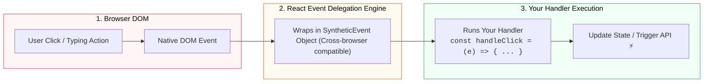

## 🖱️ 1. React SyntheticEvent Engine

React មិនភ្ជាប់ Event Listener ទៅលើ DOM Node នីមួយៗដោយផ្ទាល់ទេ ប៉ុន្តែវាប្រើប្រាស់ **Top-Level Event Delegation** និង wrap Native Event ទៅជា **`SyntheticEvent`** ដើម្បីធានាភាពស៊ីសង្វាក់គ្នានៅលើគ្រប់ Browser ទាំងអស់។



---

## 🛠️ 2. Event Handlers សំខាន់ៗទាំង ៣

```jsx
export default function EventDemo() {
  const handleClick = (e) => {
    console.log("Button clicked!", e.target);
  };

  const handleInputChange = (e) => {
    console.log("Typing:", e.target.value);
  };

  const handleSubmit = (e) => {
    e.preventDefault(); // 🛑 ការពារ Browser កុំឱ្យ Refresh ទំព័រ
    alert("Form submitted successfully!");
  };

  return (
    <form onSubmit={handleSubmit} className="p-6 space-y-4 max-w-sm">
      <div>
        <label className="block text-sm font-semibold mb-1">ស្វែងរក:</label>
        <input 
          type="text" 
          onChange={handleInputChange} 
          className="w-full px-3 py-2 border rounded-lg"
          placeholder="វាយអក្សរទីនេះ..."
        />
      </div>

      <button 
        type="button" 
        onClick={handleClick} 
        className="px-4 py-2 bg-gray-200 text-gray-800 rounded-lg hover:bg-gray-300"
      >
        Click Me
      </button>

      <button 
        type="submit" 
        className="px-4 py-2 bg-blue-600 text-white font-bold rounded-lg hover:bg-blue-700 block w-full"
      >
        Submit Form
      </button>
    </form>
  );
}
```
