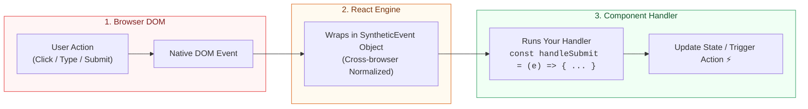

## 🖱️ ១. React SyntheticEvent Engine

> [!IMPORTANT]
> **និយមន័យ SyntheticEvent (Definition) ៖**  
> យោងតាមគេហទំព័រផ្លូវការរបស់ React (**react.dev**), **SyntheticEvent** គឺជា Cross-browser Wrapper របស់ React ជុំវិញ Native DOM Event របស់ Browser។  
> 
> វាផ្តល់ Interface ដូចគ្នាទាំងស្រុងទៅនឹង W3C Spec (ដូចជា `e.preventDefault()`, `e.stopPropagation()`, `e.target`) ប៉ុន្តែ ៖  
> 1. **Cross-Browser Normalization ៖** ដំណើរការដូចគ្នា ១០០% លើគ្រប់ Browsers (Chrome, Safari, Firefox, Edge) ដោយលុបបំបាត់ភាពមិនស៊ីសង្វាក់គ្នានៃ Browser Quirks។  
> 2. **Top-Level Event Delegation ៖** React មិនភ្ជាប់ Event Listeners ទៅលើ DOM Node រាប់ពាន់ដោយផ្ទាល់ទេ តែវាស្តាប់នៅកម្រិត Root DOM Container តែមួយគត់ ដើម្បីសន្សំសំចៃ Memory និងបង្កើនល្បឿនយ៉ាងខ្លាំង។


```mermaid
flowchart LR
    subgraph Browser["1. Browser DOM"]
        A["User Action<br/>(Click / Type / Submit)"] --> B["Native DOM Event"]
    end

    subgraph ReactCore["2. React Engine"]
        B --> C["Wraps in SyntheticEvent Object<br/>(Cross-browser Normalized)"]
    end

    subgraph AppCode["3. Component Handler"]
        C --> D["Runs Your Handler<br/><code>const handleSubmit = (e) => { ... }</code>"]
        D --> E["Update State / Trigger Action ⚡"]
    end

    style Browser fill:#fff5f5,stroke:#e53e3e,color:#7f1d1d
    style ReactCore fill:#fffaf0,stroke:#dd6b20,color:#78350f
    style AppCode fill:#f0fff4,stroke:#38a169,color:#14532d
```

---

## 🛠️ ២. ឧទាហរណ៍ជាក់ស្តែង ៖ EventDemo Component

```jsx
// src/components/EventDemo.jsx
import React, { useState } from 'react';

export default function EventDemo() {
  const [searchTerm, setSearchTerm] = useState('');
  const [submittedQuery, setSubmittedQuery] = useState('');

  // 1. Click Handler ទទួល Event Object
  const handleButtonClick = (e) => {
    console.log("Button clicked target:", e.target);
  };

  // 2. Change Handler ចាប់យកអក្សរពេល User វាយ
  const handleInputChange = (e) => {
    setSearchTerm(e.target.value);
  };

  // 3. Submit Handler ទប់ស្កាត់ Page Reload
  const handleSubmit = (e) => {
    e.preventDefault(); // 🛑 ទប់ស្កាត់ការ Refresh ទំព័រ
    if (!searchTerm.trim()) return;
    setSubmittedQuery(searchTerm);
  };

  return (
    <div className="p-6 max-w-sm mx-auto bg-white dark:bg-slate-900 border border-slate-200 dark:border-slate-800 rounded-2xl shadow-lg space-y-4">
      <form onSubmit={handleSubmit} className="space-y-3">
        <label className="block text-sm font-bold text-slate-800 dark:text-white">
          ស្វែងរកទិន្នន័យ ៖
        </label>
        
        <input 
          type="text" 
          value={searchTerm}
          onChange={handleInputChange} 
          className="w-full px-3.5 py-2 border rounded-xl dark:bg-slate-800 dark:border-slate-700 text-sm outline-none focus:ring-2 focus:ring-blue-500"
          placeholder="វាយអក្សរស្វែងរក..."
        />

        <div className="flex gap-2">
          <button 
            type="submit" 
            className="flex-1 px-4 py-2 bg-blue-600 hover:bg-blue-700 text-white font-bold text-xs rounded-xl shadow-sm transition"
          >
            Submit
          </button>
          <button 
            type="button" 
            onClick={handleButtonClick}
            className="px-4 py-2 bg-slate-100 hover:bg-slate-200 dark:bg-slate-800 text-slate-700 dark:text-slate-300 font-bold text-xs rounded-xl transition"
          >
            Click Test
          </button>
        </div>
      </form>

      {submittedQuery && (
        <div className="p-3 bg-emerald-50 dark:bg-emerald-950/30 border border-emerald-200 text-emerald-700 dark:text-emerald-400 text-xs rounded-xl">
          លទ្ធផលស្វែងរកចុងក្រោយ ៖ <strong>{submittedQuery}</strong>
        </div>
      )}
    </div>
  );
}
```

---

## 🔍 ៣. ការពន្យល់កូដមួយជួរៗ (Line-by-Line Breakdown)

| បន្ទាត់ (Line) | កូដ (Code) | ការពន្យល់លម្អិតបច្ចេកទេស |
| :--- | :--- | :--- |
| **Line 8-10** | `const handleButtonClick = (e) => { ... };` | **SyntheticEvent Object ៖** Parameter `e` គឺជា SyntheticEvent ដែលផ្ទុកព័ត៌មានលម្អិតនៃ Click event (កូអរដោនេ, target DOM element, etc.)។ |
| **Line 13-15** | `const handleInputChange = (e) => { setSearchTerm(e.target.value); };` | **Input Text Extraction ៖** `e.target` សំដៅលើ `<input>` element ហើយ `e.target.value` គឺជាអក្សរដែល User ទើបតែវាយបញ្ចូល។ យើងបញ្ជូនវាទៅ Update State ភ្លាមៗ។ |
| **Line 18-22** | `const handleSubmit = (e) => { e.preventDefault(); ... };` | **Form Prevention ៖** ហៅ `e.preventDefault()` ដើម្បីបញ្ឈប់ Browser លំនាំដើមពីការ Refresh ទំព័រ និងត្រួតពិនិត្យថាបើ SearchTerm ទទេ មិនឱ្យ Submit ឡើយ។ |
| **Line 26** | `<form onSubmit={handleSubmit} ...>` | ភ្ជាប់ Handler ទៅនឹង `<form>` តាមរយៈ prop `onSubmit` (ធ្វើការទាំងពេលចុចប៊ូតុង Submit និងពេលចុចគ្រាប់ចុច Enter លើ Keyboard)។ |
| **Line 31-36** | `<input value={searchTerm} onChange={handleInputChange} ... />` | **Controlled Input ៖** ចងភ្ជាប់ State និង Event ជាមួយគ្នា ដើម្បីឱ្យ React គ្រប់គ្រង Form Data ១០០%។ |
| **Line 46** | `onClick={handleButtonClick}` | **Function Reference ៖** យើងបញ្ជូន `handleButtonClick` ដោយ **គ្មានរង្វង់ក្រចក `()`** ដើម្បីរង់ចាំដល់ពេល User ចុចទើប Function ដំណើរការ។ |

---

## ⚠️ ៤. កំហុសធ្ងន់ធ្ងរ ៖ Passing a Function vs Calling a Function

| ទម្រង់កូដ | ស្ថានភាព | លទ្ធផលជាក់ស្តែង |
| :--- | :--- | :--- |
| `onClick={handleClick}` | ✅ **ត្រឹមត្រូវ** | បញ្ជូន Function Reference — Function នឹងដំណើរការតែពេល User ចុចប៉ុណ្ណោះ។ |
| `onClick={() => handleClick(id)}` | ✅ **ត្រឹមត្រូវ** | ប្រើ Inline Arrow Function នៅពេលត្រូវការបញ្ជូន Parameters/Arguments បន្ថែម។ |
| `onClick={handleClick()}` | ❌ **ខុសធ្ងន់ធ្ងរ!** | **Immediate Invocation ៖** Function នឹងរត់ភ្លាមៗនៅពេល Render នាំឱ្យមាន Bugs ឬ Infinite Re-render Loop បើវាហៅ `setState`! |

---

## 📋 ៥. សង្ខេបចំណុចសំខាន់ៗ (Key Takeaways)

- React ប្រើ **`SyntheticEvent`** ដើម្បីធានាថា Event API ដំណើរការដូចគ្នាលើគ្រប់ Web Browsers ទាំងអស់។
- តែងតែហៅ **`e.preventDefault()`** ក្នុង Form Submit ដើម្បីចៀសវាង Page Refresh ក្នុង Single Page Applications។
- បញ្ជូនតែ **Function Reference (`onClick={fn}`)** ឬ **Arrow Function Callback (`onClick={() => fn(arg)}`)** ប៉ុណ្ណោះ ហាមដាក់រង្វង់ក្រចក `fn()` ដោយផ្ទាល់ក្នុង JSX ឡើយ។
