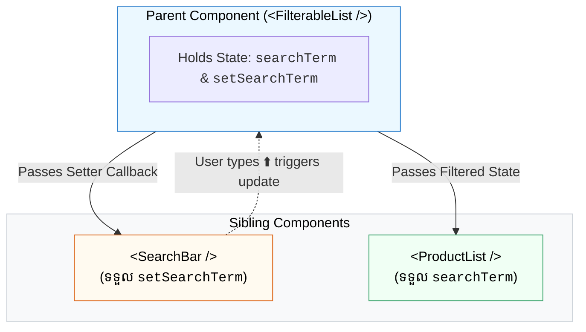

## ⬆️ 1. អ្វីទៅជា Lifting State Up?

នៅពេល Component ពីរ ឬច្រើនត្រូវការ State តែមួយ ដំណោះស្រាយរបស់ React គឺ **"លើក State នោះឡើងទៅកាន់ Parent រួមដែលនៅជិតបំផុត (Closest Common Ancestor)"**។



---

## 🛠️ 2. កូដគំរូអនុវត្តជាក់ស្តែង

```jsx
import { useState } from 'react';

// Child A: Input Box
function SearchInput({ value, onChangeText }) {
  return (
    <input 
      type="text" 
      value={value} 
      onChange={(e) => onChangeText(e.target.value)} 
      placeholder="ស្វែងរកឈ្មោះ..."
      className="border px-4 py-2 rounded-lg w-full mb-4"
    />
  );
}

// Child B: Display Count
function ResultSummary({ count }) {
  return <p className="font-bold text-gray-700">រកឃើញចំនួន៖ {count} នាក់</p>;
}

// Parent: រក្សាទុក State រួម
export default function SearchApp() {
  const [query, setQuery] = useState('');
  const allNames = ['រដ្ឋា', 'សីហា', 'ពិសិដ្ឋ', 'សុខា', 'វណ្ណា'];
  
  const filtered = allNames.filter((n) => n.includes(query));

  return (
    <div className="p-6 max-w-md mx-auto border rounded-2xl shadow-sm">
      <SearchInput value={query} onChangeText={setQuery} />
      <ResultSummary count={filtered.length} />
      <ul className="mt-3 list-disc pl-5">
        {filtered.map((name, i) => <li key={i}>{name}</li>)}
      </ul>
    </div>
  );
}
```
