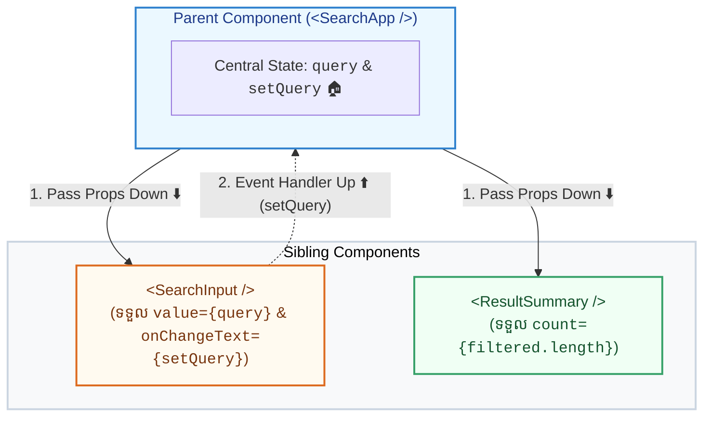

## ⬆️ ១. The Lifting State Up Pattern (Single Source of Truth)

> [!IMPORTANT]
> **និយមន័យ Lifting State Up (Definition) ៖**  
> យោងតាមគេហទំព័រផ្លូវការរបស់ React (**react.dev**), **Lifting State Up** គឺជា React Pattern ដ៏សំខាន់ដែលយើងផ្លាស់ទី State ចេញពី Child Component នីមួយៗឡើងទៅកាន់ **Parent Component រួមដែលនៅជិតបំផុត (Closest Common Ancestor)**។  
> 
> វិធីនេះអនុវត្តតាមគោលការណ៍ **Single Source of Truth** ៖  
> 1. **Data Down ⬇️ ៖** Parent រក្សាទុក State ពិតប្រាកដតែមួយគត់ ហើយចែករំលែកវាចុះទៅឱ្យ Children តាមរយៈ **Props**។  
> 2. **Events Up ⬆️ ៖** Parent បញ្ជូន Callback Function (ដូចជា Setter) ចុះទៅក្រោម ដើម្បីឱ្យ Child អាចកេះដំណឹងឡើងលើនៅពេលដែល User ធ្វើសកម្មភាព។


```mermaid
flowchart TD
    subgraph Parent["Parent Component (&lt;SearchApp /&gt;)"]
        State["Central State: <code>query</code> &amp; <code>setQuery</code> 🏠"]
    end

    subgraph Children["Sibling Components"]
        ChildA["&lt;SearchInput /&gt;<br/>(ទទួល <code>value={query}</code> &amp; <code>onChangeText={setQuery}</code>)"]
        ChildB["&lt;ResultSummary /&gt;<br/>(ទទួល <code>count={filtered.length}</code>)"]
    end

    Parent -->|"1. Pass Props Down ⬇️"| ChildA
    Parent -->|"1. Pass Props Down ⬇️"| ChildB
    ChildA -.->|"2. Event Handler Up ⬆️ (setQuery)"| Parent

    style Parent fill:#ebf8ff,stroke:#3182ce,stroke-width:2px,color:#1e3a8a
    style Children fill:#f8f9fa,stroke:#cbd5e1,stroke-width:2px,color:#000
    style ChildA fill:#fffaf0,stroke:#dd6b20,stroke-width:2px,color:#78350f
    style ChildB fill:#f0fff4,stroke:#38a169,stroke-width:2px,color:#14532d
```

---

## 🛠️ ២. ឧទាហរណ៍ជាក់ស្តែង ៖ Filterable User Directory

```jsx
// src/components/SearchApp.jsx
import { useState } from 'react';

// 1. Child A: Input Box (ទទួលទិន្នន័យ និង Function បាញ់ដំណឹង)
export function SearchInput({ value, onChangeText }) {
  return (
    <input 
      type="text" 
      value={value} 
      onChange={(e) => onChangeText(e.target.value)} 
      placeholder="ស្វែងរកឈ្មោះ..."
      className="border border-slate-200 dark:border-slate-800 bg-white dark:bg-slate-900 px-4 py-2.5 rounded-xl w-full text-sm outline-none focus:ring-2 focus:ring-blue-500"
    />
  );
}

// 2. Child B: Display Count Summary (ទទួល Count បង្ហាញ)
export function ResultSummary({ count }) {
  return (
    <p className="font-bold text-slate-700 dark:text-slate-300 text-sm">
      រកឃើញចំនួន ៖ <span className="text-blue-600 font-black">{count}</span> នាក់
    </p>
  );
}

// 3. Parent: គ្រប់គ្រង State កណ្តាល និងផ្គុំ Sibling Components
export default function SearchApp() {
  const [query, setQuery] = useState('');
  const allNames = ['រដ្ឋា', 'សីហា', 'ពិសិដ្ឋ', 'សុខា', 'វណ្ណា', 'ដារ៉ា'];
  
  // 🧮 Derived State: Filter បញ្ជីឈ្មោះដោយផ្ទាល់
  const filtered = allNames.filter((name) =>
    name.toLowerCase().includes(query.toLowerCase())
  );

  return (
    <div className="p-6 max-w-md mx-auto bg-white dark:bg-slate-900 border border-slate-200 dark:border-slate-800 rounded-2xl shadow-lg space-y-4">
      <h3 className="font-black text-lg text-slate-900 dark:text-white">
        👥 បញ្ជីឈ្មោះសមាជិក (Lifting State Up)
      </h3>

      {/* Child A ទទួល State និង Setter Callback */}
      <SearchInput value={query} onChangeText={setQuery} />

      {/* Child B ទទួល Derived State */}
      <ResultSummary count={filtered.length} />

      {/* បង្ហាញបញ្ជីឈ្មោះ */}
      <ul className="divide-y divide-slate-100 dark:divide-slate-800 border-t border-slate-100 dark:border-slate-800 pt-2">
        {filtered.map((name, i) => (
          <li key={i} className="py-2 text-sm text-slate-700 dark:text-slate-300 flex items-center gap-2">
            <span className="w-2 h-2 rounded-full bg-blue-500" />
            {name}
          </li>
        ))}
      </ul>
    </div>
  );
}
```

---

## 🔍 ៣. ការពន្យល់កូដមួយជួរៗ (Line-by-Line Breakdown)

| ផ្នែកនៃកូដ (Code Section) | បន្ទាត់កូដគន្លឹះ (Key Code) | ការពន្យល់លម្អិតបច្ចេកទេស |
| :--- | :--- | :--- |
| **Child A Props** | `function SearchInput({ value, onChangeText })` | `SearchInput` មិនមាន State ផ្ទាល់ខ្លួនទេ (Controlled Stateless Component) — វាទទួលតម្លៃតាម `value` និងហៅ `onChangeText` ពេល User វាយអក្សរ។ |
| **Child A Trigger** | `onChange={(e) => onChangeText(e.target.value)}` | នៅពេល Native Input Event កើតឡើង វាស្រង់យក `e.target.value` រួចបញ្ជូនទៅកាន់ Parent តាម Callback Function (Events Up ⬆️)។ |
| **Child B Summary** | `function ResultSummary({ count })` | `ResultSummary` ទទួលតែ prop `count` ដើម្បី Render UI សុទ្ធសាធ (Pure Presentational Component)។ |
| **Parent Central State** | `const [query, setQuery] = useState('');` | **Single Source of Truth ៖** State ត្រូវបានលើកមកទុកនៅទីនេះ ដើម្បីឱ្យ Components កូនៗទាំងពីរអាចប្រើប្រាស់វាបាន។ |
| **Derived Filtering** | `const filtered = allNames.filter(...)` | គណនាទិន្នន័យ Filtered ផ្ទាល់ក្នុង Render cycle ដោយមិនបាច់បង្កើត `useState` ស្ទួនមួយទៀតឡើយ។ |
| **Child Integration** | `<SearchInput value={query} onChangeText={setQuery} />` | Parent បញ្ជូន `query` ជា `value` (Data Down ⬇️) និងបញ្ជូន `setQuery` ជា `onChangeText` (Callback Down)។ |
| **Keyed List Rendering** | `{filtered.map((name, i) => ...)}` | បម្លែង Array នៃឈ្មោះឱ្យទៅជា JSX Elements ដោយប្រើ Unique `key` prop។ |

---

## 📋 ៤. សង្ខេបចំណុចសំខាន់ៗ (Key Takeaways)

- **Lifting State Up** គឺជាវិធីស្តង់ដារក្នុង React សម្រាប់ចែករំលែកទិន្នន័យរវាង Sibling Components។
- **Data Down, Events Up ៖** ទិន្នន័យហូរចុះក្រោមតាម Props ហើយការធ្វើបច្ចុប្បន្នភាពធ្វើឡើងតាម Callback Handlers បាញ់ឡើងលើ។
- **Single Source of Truth ៖** ទិន្នន័យត្រូវតែមានម្ចាស់តែមួយគត់ (Single Owner) ដើម្បីចៀសវាងបញ្ហាទិន្នន័យខុសគ្នា (Out-of-sync Bugs)។
