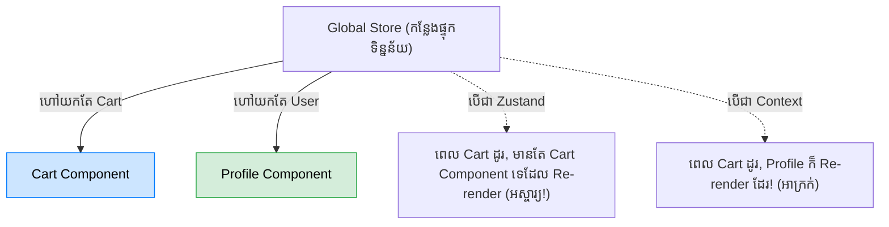

## 🛑 ដែនកំណត់របស់ Context API

Context គឺអស្ចារ្យសម្រាប់ទិន្នន័យដែលនៅស្ងៀម មិនសូវប្រែប្រួល (Static) ដូចជា Theme, Language ឫ User Authentication។ ប៉ុន្តែសម្រាប់ទិន្នន័យដែលផ្លាស់ប្តូរញឹកញាប់រៀងរាល់វិនាទី (ឧ. ការអូសផែនទី, ទិន្នន័យទំនិញក្នុងរទេះ) Context នឹងធ្វើអោយវេបសាយអ្នកគាំង!



---

## 🐻 ស្គាល់ Zustand (បណ្ណាល័យសាមញ្ញនិងរហ័ស)

បច្ចុប្បន្ន សម្រាប់គម្រោង React ភាគច្រើន សហគមន៍បានប្តូរទៅប្រើប្រាស់ **Zustand** ជាជាង Redux ដោយសារតែវាមានភាពងាយស្រួល ខ្លី និងរហ័ស។

ការដំឡើង: `npm install zustand`

### របៀបប្រើប្រាស់ដ៏សាមញ្ញ

1. **បង្កើត Store (ឃ្លាំងទិន្នន័យ):**
```jsx
// ឯកសារ: store/useCartStore.js
import { create } from 'zustand';

// បង្កើត Hook មួយឈ្មោះ useCartStore
export const useCartStore = create((set) => ({
  items: 0,
  // អនុគមន៍សម្រាប់ប្តូរ State អាចសរសេរក្នុងនេះបានតែម្តង!
  addToCart: () => set((state) => ({ items: state.items + 1 })),
  clearCart: () => set({ items: 0 }),
}));
```

2. **ហៅយកទៅប្រើប្រាស់ក្នុង Component ណាក៏បាន (ដោយមិនបាច់មាន Provider រុំ!):**
```jsx
import { useCartStore } from './store/useCartStore';

function Navbar() {
  // ជ្រើសយកតែ items (ទោះបីមុខងារផ្សេងដូរ ក៏ Component នេះមិន Re-render ដែរ)
  const items = useCartStore((state) => state.items);
  
  return <nav>រទេះទំនិញមាន: {items}</nav>;
}

function ProductCard() {
  // ទាញយកអនុគមន៍
  const addToCart = useCartStore((state) => state.addToCart);
  
  return <button onClick={addToCart}>ទិញឥឡូវនេះ</button>;
}
```

---

## ⚖️ ការសម្រេចចិត្ត: តើគួរប្រើមួយណា?

- **Local State (`useState`):** សម្រាប់ទិន្នន័យផ្ទាល់ខ្លួនរបស់ Component នោះ (ឧ. បើក/បិទប្រអប់, អក្សរក្នុង Input)។
- **Context API:** សម្រាប់ទិន្នន័យដែលមិនសូវប្រែប្រួល ហើយត្រូវចែករំលែកទូទាំង App (ឧ. Dark Mode, Language, User Session)។
- **Zustand / Redux Toolkit:** សម្រាប់ទិន្នន័យដែលផ្លាស់ប្តូរញឹកញាប់ មានរចនាសម្ព័ន្ធស្មុគស្មាញ និងត្រូវប្រើប្រាស់រួមគ្នាលើទំព័រច្រើន (ឧ. រទេះទំនិញ, ទិន្នន័យហ្គេម)។
- **React Query:** សម្រាប់គ្រប់គ្រងទិន្នន័យដែលបានមកពី API (Server State) ទាំងស្រុង!
