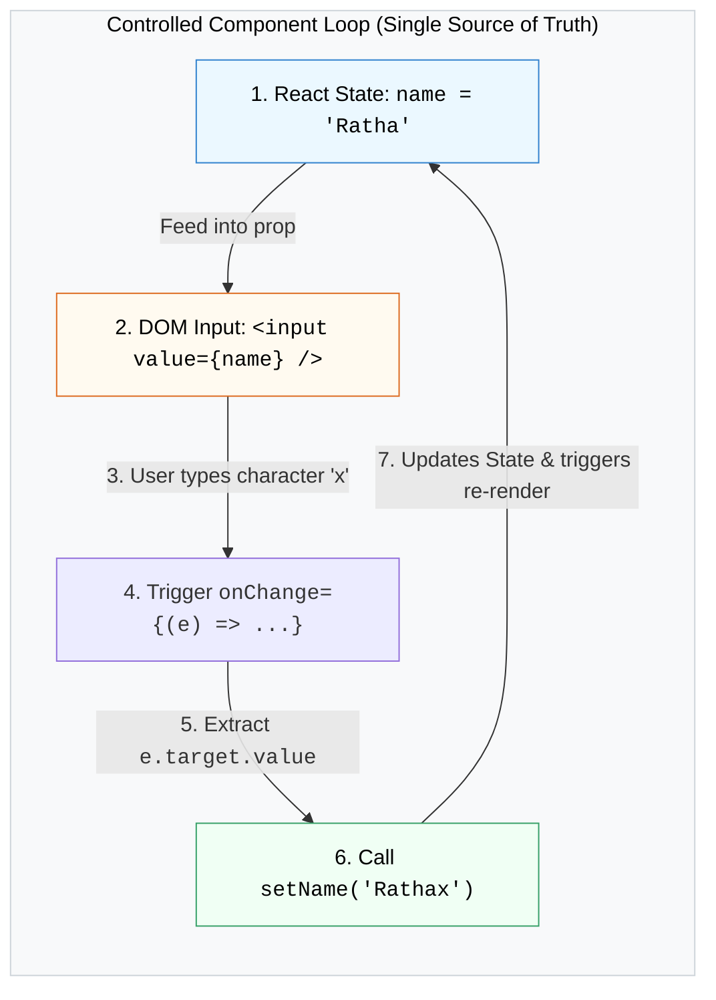

## 📝 1. Two-Way Data Binding Loop



---

## 🔤 2. Single Controlled Input

### 🌐 Normal HTML Structure:

```html
<!-- HTML Input ធម្មតា (DOM គ្រប់គ្រងតម្លៃផ្ទាល់ខ្លួន) -->
<div class="field">
  <label for="username">ឈ្មោះអ្នកប្រើប្រាស់:</label>
  <input type="text" id="username" placeholder="បញ្ចូលឈ្មោះ..." />
</div>
```

### 💻 React Controlled Code:

```jsx
import { useState } from 'react';

export function SingleInput() {
  // 1. State ជាអ្នកគ្រប់គ្រងតម្លៃ Value
  const [username, setUsername] = useState('');

  // 2. Event Handler ពេល User វាយអក្សរ
  const handleInputChange = (e) => {
    setUsername(e.target.value);
  };

  return (
    <div>
      <label>ឈ្មោះអ្នកប្រើប្រាស់:</label>
      <input
        type="text"
        value={username}           // បញ្ជូន State ទៅឱ្យ Input
        onChange={handleInputChange} // ស្តាប់ការប្រែប្រួលរាល់ពេលចុច Key
        placeholder="បញ្ចូលឈ្មោះ..."
      />
      <p>អ្នកកំពុងវាយ: <strong>{username}</strong></p>
    </div>
  );
}
```

### 🔍 ការពន្យល់មួយជួរៗ (Line-by-Line Explanation):

1. `const [username, setUsername] = useState('');`
   - បង្កើត React State ដើម្បីធ្វើជា **Single Source of Truth**។
2. `value={username}`
   - Input លែងគ្រប់គ្រងតម្លៃខ្លួនឯងទៀតហើយ — តម្លៃដែលបង្ហាញលើអេក្រង់គឺយកចេញពី `username` state ជានិច្ច។
3. `onChange={(e) => setUsername(e.target.value)}`
   - រាល់ពេល User វាយអក្សរថ្មី `onChange` នឹងបាញ់ Event Object `e` មក។ `e.target.value` គឺជាអក្សរចុងក្រោយដែលត្រូវបានបញ្ជូនទៅ `setUsername` ដើម្បី update state និង re-render UI។

---

## 📋 3. Handling Multiple Inputs with One State Object

ជំនួសឱ្យការបង្កើត `useState` ១០ ដងសម្រាប់ ១០ fields យើងប្រើ Object State តែមួយរួមជាមួយ **Computed Property Name `[name]: value`**៖

### 🌐 Normal HTML Structure:

```html
<!-- HTML Form មាន Email និង Role Dropdown -->
<form>
  <input type="email" name="email" placeholder="Email" />
  <select name="role">
    <option value="student">សិស្ស</option>
    <option value="developer">Developer</option>
  </select>
</form>
```

### 💻 React Multi-Input Code:

```jsx
const [formData, setFormData] = useState({
  email: '',
  role: 'student',
  agreeTerms: false,
});

// Handler តែមួយ គ្រប់គ្រងគ្រប់ Inputs ទាំងអស់!
const handleChange = (e) => {
  const { name, value, type, checked } = e.target;

  setFormData((prev) => ({
    ...prev,
    // បើជា Checkbox យកតម្លៃ checked (true/false) បើជា Input ធម្មតាយក value
    [name]: type === 'checkbox' ? checked : value,
  }));
};
```

### 🔍 ការពន្យល់មួយជួរៗ (Line-by-Line Explanation):

1. `const { name, value, type, checked } = e.target;`
   - ទាញយក properties ចេញពី HTML Input ដែលទើបត្រូវបានចុច។
2. `...prev`
   - ចម្លង field ផ្សេងៗទៀតទាំងអស់ដែលមិនទាន់កែប្រែ ដើម្បីកុំឱ្យបាត់បង់ទិន្នន័យ (Immutability)។
3. `[name]: type === 'checkbox' ? checked : value`
   - ប្រើ JavaScript **Computed Property Name `[name]`**។ ប្រសិនបើ User កំពុងវាយលើ `<input name="email" />` នោះ `[name]` នឹងក្លាយជា `email: value` ដោយស្វ័យប្រវត្តិ។

---

## 🚀 4. Complete Integrated Registration Form

```jsx
import { useState } from 'react';

export default function ControlledForm() {
  const [formData, setFormData] = useState({
    fullName: '',
    email: '',
    role: 'developer',
    agreeTerms: false,
  });

  const [submittedData, setSubmittedData] = useState(null);

  const handleChange = (e) => {
    const { name, value, type, checked } = e.target;
    setFormData((prev) => ({
      ...prev,
      [name]: type === 'checkbox' ? checked : value,
    }));
  };

  const handleSubmit = (e) => {
    e.preventDefault(); // ការពារកុំឱ្យ Reload ទំព័រ

    if (!formData.agreeTerms) {
      alert('សូមយល់ព្រមតាមលក្ខខណ្ឌជាមុនសិន!');
      return;
    }

    setSubmittedData(formData);
  };

  return (
    <div className="max-w-md mx-auto p-6 bg-white dark:bg-slate-800 rounded-2xl shadow">
      <h2 className="text-xl font-bold mb-4 text-slate-800 dark:text-white">
        📝 Controlled Registration Form
      </h2>

      <form onSubmit={handleSubmit} className="space-y-4">
        {/* Full Name */}
        <div>
          <label className="block text-xs font-semibold mb-1">ឈ្មោះពេញ</label>
          <input
            type="text"
            name="fullName"
            value={formData.fullName}
            onChange={handleChange}
            placeholder="Sok Dara"
            className="w-full px-3 py-2 border rounded-xl dark:bg-slate-700 dark:text-white text-sm"
          />
        </div>

        {/* Email */}
        <div>
          <label className="block text-xs font-semibold mb-1">Email</label>
          <input
            type="email"
            name="email"
            value={formData.email}
            onChange={handleChange}
            placeholder="dara@example.com"
            className="w-full px-3 py-2 border rounded-xl dark:bg-slate-700 dark:text-white text-sm"
          />
        </div>

        {/* Role Select Dropdown */}
        <div>
          <label className="block text-xs font-semibold mb-1">តួនាទី (Role)</label>
          <select
            name="role"
            value={formData.role}
            onChange={handleChange}
            className="w-full px-3 py-2 border rounded-xl dark:bg-slate-700 dark:text-white text-sm"
          >
            <option value="student">🎓 Student</option>
            <option value="developer">💻 Developer</option>
            <option value="designer">🎨 Designer</option>
          </select>
        </div>

        {/* Checkbox */}
        <div className="flex items-center gap-2">
          <input
            type="checkbox"
            id="agreeTerms"
            name="agreeTerms"
            checked={formData.agreeTerms}
            onChange={handleChange}
            className="w-4 h-4 rounded"
          />
          <label htmlFor="agreeTerms" className="text-xs text-slate-600 dark:text-slate-300">
            ខ្ញុំយល់ព្រមតាមលក្ខខណ្ឌប្រើប្រាស់
          </label>
        </div>

        <button
          type="submit"
          className="w-full py-2.5 bg-blue-600 hover:bg-blue-700 text-white font-bold rounded-xl text-sm transition"
        >
          ចុះឈ្មោះ (Submit)
        </button>
      </form>

      {/* Submitted Result Preview */}
      {submittedData && (
        <div className="mt-6 p-4 bg-slate-50 dark:bg-slate-700 rounded-xl text-xs space-y-1">
          <p className="font-bold text-slate-800 dark:text-white">🎉 ទិន្នន័យដែលបាន Submit:</p>
          <p>ឈ្មោះ: <strong>{submittedData.fullName}</strong></p>
          <p>Email: <strong>{submittedData.email}</strong></p>
          <p>Role: <strong>{submittedData.role}</strong></p>
        </div>
      )}
    </div>
  );
}
```
