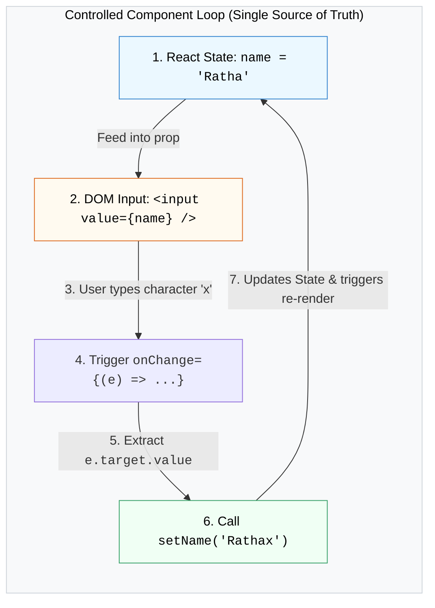

## 📝 1. Controlled Component Two-Way Data Binding Loop



---

## 🛠️ 2. កូដគំរូ: Multi-Input Form ជាមួយ Validation

```jsx
import { useState } from 'react';

export default function RegistrationForm() {
  const [formData, setFormData] = useState({
    email: '',
    password: '',
    agreeTerms: false,
  });

  const [errors, setErrors] = useState({});

  const handleChange = (e) => {
    const { name, value, type, checked } = e.target;
    setFormData((prev) => ({
      ...prev,
      [name]: type === 'checkbox' ? checked : value,
    }));
  };

  const validate = () => {
    const errs = {};
    if (!formData.email.includes('@')) errs.email = 'Email មិនត្រឹមត្រូវឡើយ!';
    if (formData.password.length < 6) errs.password = 'Password ត្រូវមានយ៉ាងតិច ៦ តួអក្សរ!';
    if (!formData.agreeTerms) errs.agreeTerms = 'សូមយល់ព្រមតាមលក្ខខណ្ឌ!';
    return errs;
  };

  const handleSubmit = (e) => {
    e.preventDefault();
    const validationErrors = validate();
    if (Object.keys(validationErrors).length > 0) {
      setErrors(validationErrors);
      return;
    }

    setErrors({});
    alert("ចុះឈ្មោះជោគជ័យ! 🎉");
  };

  return (
    <form onSubmit={handleSubmit} className="p-6 border rounded-2xl max-w-sm mx-auto space-y-4">
      <div>
        <label className="block text-sm font-semibold mb-1">Email:</label>
        <input 
          type="email" 
          name="email"
          value={formData.email} 
          onChange={handleChange}
          className="w-full border px-3 py-2 rounded-lg"
        />
        {errors.email && <p className="text-red-500 text-xs mt-1">{errors.email}</p>}
      </div>

      <div>
        <label className="block text-sm font-semibold mb-1">Password:</label>
        <input 
          type="password" 
          name="password"
          value={formData.password} 
          onChange={handleChange}
          className="w-full border px-3 py-2 rounded-lg"
        />
        {errors.password && <p className="text-red-500 text-xs mt-1">{errors.password}</p>}
      </div>

      <div className="flex items-center gap-2">
        <input 
          type="checkbox" 
          name="agreeTerms"
          checked={formData.agreeTerms} 
          onChange={handleChange}
          id="terms"
        />
        <label htmlFor="terms" className="text-sm">ខ្ញុំយល់ព្រមតាមលក្ខខណ្ឌ</label>
      </div>
      {errors.agreeTerms && <p className="text-red-500 text-xs">{errors.agreeTerms}</p>}

      <button type="submit" className="w-full py-2 bg-blue-600 text-white font-bold rounded-xl hover:bg-blue-700">
        បង្កើតគណនី
      </button>
    </form>
  );
}
```
