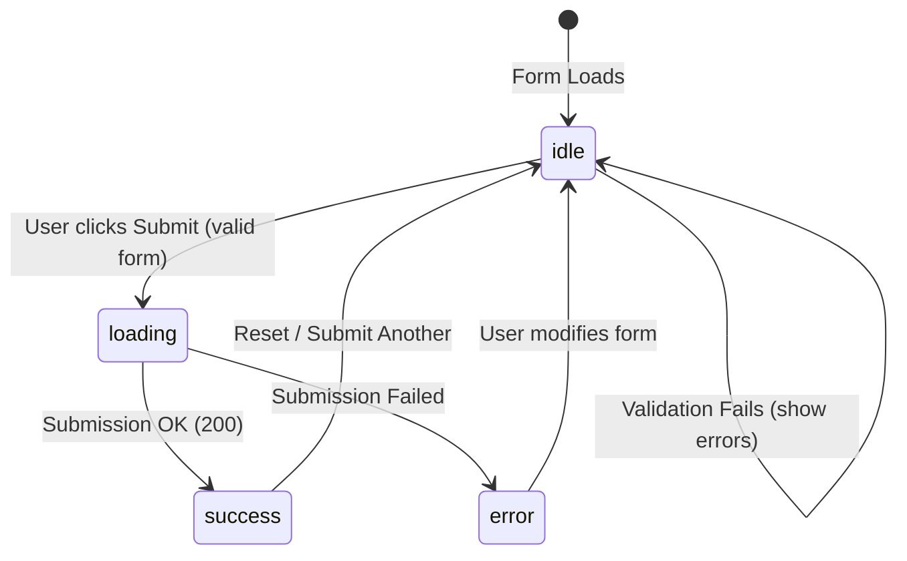

## 🔄 1. Submit State Flow



---

## 📝 2. Normal HTML Form Structure (ទម្រង់ HTML ធម្មតា)

មុននឹងបន្ថែម React Validation Logic នេះជារចនាសម្ព័ន្ធ HTML ស្តង់ដារនៃ Form ចុះឈ្មោះ៖

```html
<!-- HTML Registration Form Structure -->
<form class="register-form">
  <!-- Email Group -->
  <div class="form-group">
    <label for="email">អ៊ីម៉ែល</label>
    <input type="email" id="email" name="email" placeholder="name@example.com" />
    <span class="error-text">⚠️ ទម្រង់ Email មិនត្រឹមត្រូវ!</span>
  </div>

  <!-- Password Group -->
  <div class="form-group">
    <label for="password">ពាក្យសម្ងាត់</label>
    <input type="password" id="password" name="password" placeholder="យ៉ាងតិច ៨ តួអក្សរ" />
    <span class="error-text">⚠️ Password ត្រូវមានយ៉ាងតិច ៨ តួអក្សរ!</span>
  </div>

  <!-- Confirm Password Group -->
  <div class="form-group">
    <label for="confirm">ផ្ទៀងផ្ទាត់ពាក្យសម្ងាត់</label>
    <input type="password" id="confirm" name="confirmPassword" placeholder="ផ្ទៀងផ្ទាត់ Password" />
    <span class="error-text">⚠️ Password ផ្ទៀងផ្ទាត់មិនដូចគ្នា!</span>
  </div>

  <!-- Submit Button -->
  <button type="submit">ចុះឈ្មោះ</button>
</form>
```

---

## 🛡️ 3. Validation Logic (Pure JavaScript Function)

### 💻 Code សម្រាប់តែ Validation Function:

```javascript
function validateField(name, value, allValues) {
  switch (name) {
    case 'email':
      if (!value.trim()) return 'Email មិនអាចទទេបានឡើយ!';
      if (!/^[^\s@]+@[^\s@]+\.[^\s@]+$/.test(value)) return 'ទម្រង់ Email មិនត្រឹមត្រូវ!';
      return '';

    case 'password':
      if (!value) return 'Password មិនអាចទទេបានឡើយ!';
      if (value.length < 8) return 'Password ត្រូវមានយ៉ាងតិច ៨ តួអក្សរ!';
      return '';

    case 'confirmPassword':
      if (!value) return 'សូមផ្ទៀងផ្ទាត់ Password ម្តងទៀត!';
      if (value !== allValues.password) return 'Password ផ្ទៀងផ្ទាត់មិនដូចគ្នា!';
      return '';

    default:
      return '';
  }
}
```

### 🔍 ការពន្យល់មួយជួរៗ (Line-by-Line Explanation):

1. `function validateField(name, value, allValues)`
   - ទទួល parameter ចំនួន ៣៖ `name` (ឈ្មោះ field), `value` (តម្លៃដែល user វាយ), និង `allValues` (object form ទាំងមូល)។
2. `if (!value.trim()) return '...';`
   - ពិនិត្យមើលថាតើតម្លៃទទេ ឬមានតែ space ដែរឬទេ។
3. `!/^[^\s@]+@[^\s@]+\.[^\s@]+$/.test(value)`
   - ប្រើ Regular Expression (Regex) ដើម្បី verify ទម្រង់ email ស្តង់ដារ (មាន `@` និង domain `.com`, `.net`, etc.)។
4. `value !== allValues.password`
   - ប្រៀបធៀបតម្លៃ `confirmPassword` ទៅនឹង `allValues.password` ដើម្បីធានាថា password ទាំងពីរដូចគ្នា ១០០%។

---

## 👆 4. Touched State Pattern & React Input Binding

### 🌐 Normal HTML vs 💻 React Binding:

```jsx
// 1. React State គ្រប់គ្រង Inputs និង Touched Fields
const [formData, setFormData] = useState({ email: '', password: '', confirmPassword: '' });
const [touched, setTouched] = useState({});

// 2. Change & Blur Handlers
const handleChange = (e) => {
  const { name, value } = e.target;
  setFormData((prev) => ({ ...prev, [name]: value }));
};

const handleBlur = (e) => {
  const { name } = e.target;
  setTouched((prev) => ({ ...prev, [name]: true }));
};

// 3. JSX Field Rendering (បង្ហាញ error តែពេល user បាន blur ចេញ)
<div>
  <label>Email</label>
  <input
    type="email"
    name="email"
    value={formData.email}
    onChange={handleChange}
    onBlur={handleBlur}
    placeholder="name@example.com"
  />
  {touched.email && errors.email && (
    <span className="text-red-500 text-xs">⚠️ {errors.email}</span>
  )}
</div>
```

### 🔍 ការពន្យល់មួយជួរៗ (Line-by-Line Explanation):

1. `onBlur={handleBlur}`
   - ព្រឹត្តិការណ៍ `onBlur` កើតឡើងនៅពេល Focus ចាកចេញពី input field (User ចុចចេញ)។
2. `setTouched((prev) => ({ ...prev, [name]: true }));`
   - Mark field នោះថា `true` (User បានឆ្លងកាត់ field នេះរួច)។
3. `{touched.email && errors.email && (...) }`
   - **Good UX:** មិនបង្ហាញ Error ក្រហមភ្លាមៗពេលទំព័រទើបបើកមកឡើយ — បង្ហាញតែពេល User បានវាយ ឬចាកចេញពី field ប៉ុណ្ណោះ។

---

## ⏳ 5. Submit State Machine & Prevention of Double-Submit

### 💻 Code សម្រាប់តែ handleSubmit:

```jsx
const [submitState, setSubmitState] = useState('idle'); // 'idle' | 'loading' | 'success' | 'error'

const handleSubmit = async (e) => {
  e.preventDefault();

  // 1. Mark fields ទាំងអស់ថា touched ដើម្បីបង្ហាញ Error ទាំងអស់បើមិនទាន់បំពេញ
  setTouched({ email: true, password: true, confirmPassword: true });

  // 2. ប្រសិនបើមាន Error សូម្បីតែមួយ កុំអនុញ្ញាតឱ្យ Submit
  if (!isFormValid) return;

  // 3. ប្តូរស្ថានភាពទៅជា loading
  setSubmitState('loading');

  try {
    // ក្លែងធ្វើការផ្ញើទិន្នន័យទៅ Server (Network Request 1.2s)
    await new Promise((resolve) => setTimeout(resolve, 1200));
    setSubmitState('success');
  } catch (err) {
    setSubmitState('error');
  }
};
```

### 🔍 ការពន្យល់មួយជួរៗ (Line-by-Line Explanation):

1. `setSubmitState('loading');`
   - ប្តូរ State ទៅ `loading` — ធ្វើឱ្យប៊ូតុង Submit ក្លាយជា Disable (ចុចលែងកើត) និងបង្ហាញ Spinner ការពារ Double-submit។
2. `await new Promise(...)`
   - ក្លែងធ្វើ asynchronous API call រយៈពេល 1.2 វិនាទី។
3. `setSubmitState('success');`
   - ប្តូរទៅកាន់ Success Screen ឬបង្ហាញសារអបអរសាទរ។

---

## 🚀 6. Complete Integrated Registration Form

```jsx
import { useState } from 'react';

function validateField(name, value, allValues) {
  switch (name) {
    case 'email':
      if (!value.trim()) return 'Email មិនអាចទទេបានឡើយ!';
      if (!/^[^\s@]+@[^\s@]+\.[^\s@]+$/.test(value)) return 'ទម្រង់ Email មិនត្រឹមត្រូវ!';
      return '';
    case 'password':
      if (!value) return 'Password មិនអាចទទេបានឡើយ!';
      if (value.length < 8) return 'Password ត្រូវមានយ៉ាងតិច ៨ តួអក្សរ!';
      return '';
    case 'confirmPassword':
      if (!value) return 'សូមផ្ទៀងផ្ទាត់ Password!';
      if (value !== allValues.password) return 'Password ផ្ទៀងផ្ទាត់មិនដូចគ្នា!';
      return '';
    default:
      return '';
  }
}

export default function RegistrationForm() {
  const [formData, setFormData] = useState({ email: '', password: '', confirmPassword: '' });
  const [touched, setTouched] = useState({});
  const [submitState, setSubmitState] = useState('idle');

  const errors = {
    email: validateField('email', formData.email, formData),
    password: validateField('password', formData.password, formData),
    confirmPassword: validateField('confirmPassword', formData.confirmPassword, formData),
  };

  const isFormValid = !errors.email && !errors.password && !errors.confirmPassword;

  const handleChange = (e) => {
    const { name, value } = e.target;
    setFormData((prev) => ({ ...prev, [name]: value }));
  };

  const handleBlur = (e) => {
    setTouched((prev) => ({ ...prev, [e.target.name]: true }));
  };

  const handleSubmit = async (e) => {
    e.preventDefault();
    setTouched({ email: true, password: true, confirmPassword: true });
    if (!isFormValid) return;

    setSubmitState('loading');
    await new Promise((r) => setTimeout(r, 1200));
    setSubmitState('success');
  };

  if (submitState === 'success') {
    return (
      <div className="max-w-md mx-auto p-6 bg-white dark:bg-slate-800 rounded-2xl text-center shadow-md">
        <span className="text-4xl">🎉</span>
        <h3 className="text-lg font-bold text-slate-800 dark:text-white mt-2">ចុះឈ្មោះជោគជ័យ!</h3>
        <p className="text-sm text-slate-500 mt-1">គណនីរបស់អ្នកត្រូវបានបង្កើតដោយជោគជ័យ។</p>
        <button
          onClick={() => {
            setFormData({ email: '', password: '', confirmPassword: '' });
            setTouched({});
            setSubmitState('idle');
          }}
          className="mt-4 px-4 py-2 bg-blue-600 text-white rounded-xl text-sm font-bold"
        >
          ចុះឈ្មោះម្តងទៀត
        </button>
      </div>
    );
  }

  return (
    <div className="max-w-md mx-auto p-6 bg-white dark:bg-slate-800 rounded-2xl shadow-md">
      <h2 className="text-xl font-bold text-slate-800 dark:text-white mb-4">
        🔐 Form Validation ជាន់ខ្ពស់
      </h2>

      <form onSubmit={handleSubmit} className="space-y-4">
        {/* Email Field */}
        <div>
          <label className="block text-xs font-semibold text-slate-600 dark:text-slate-300 mb-1">Email</label>
          <input
            type="email"
            name="email"
            value={formData.email}
            onChange={handleChange}
            onBlur={handleBlur}
            placeholder="name@example.com"
            className="w-full px-3 py-2 border rounded-xl dark:bg-slate-700 dark:text-white"
          />
          {touched.email && errors.email && (
            <p className="text-xs text-red-500 mt-1">⚠️ {errors.email}</p>
          )}
        </div>

        {/* Password Field */}
        <div>
          <label className="block text-xs font-semibold text-slate-600 dark:text-slate-300 mb-1">Password</label>
          <input
            type="password"
            name="password"
            value={formData.password}
            onChange={handleChange}
            onBlur={handleBlur}
            placeholder="យ៉ាងតិច ៨ តួអក្សរ"
            className="w-full px-3 py-2 border rounded-xl dark:bg-slate-700 dark:text-white"
          />
          {touched.password && errors.password && (
            <p className="text-xs text-red-500 mt-1">⚠️ {errors.password}</p>
          )}
        </div>

        {/* Confirm Password Field */}
        <div>
          <label className="block text-xs font-semibold text-slate-600 dark:text-slate-300 mb-1">Confirm Password</label>
          <input
            type="password"
            name="confirmPassword"
            value={formData.confirmPassword}
            onChange={handleChange}
            onBlur={handleBlur}
            placeholder="ផ្ទៀងផ្ទាត់ Password"
            className="w-full px-3 py-2 border rounded-xl dark:bg-slate-700 dark:text-white"
          />
          {touched.confirmPassword && errors.confirmPassword && (
            <p className="text-xs text-red-500 mt-1">⚠️ {errors.confirmPassword}</p>
          )}
        </div>

        {/* Submit Button */}
        <button
          type="submit"
          disabled={submitState === 'loading'}
          className="w-full py-2.5 bg-blue-600 hover:bg-blue-700 disabled:opacity-50 text-white font-bold rounded-xl transition"
        >
          {submitState === 'loading' ? 'កំពុងផ្ញើ...' : 'Submit Form'}
        </button>
      </form>
    </div>
  );
}
```
