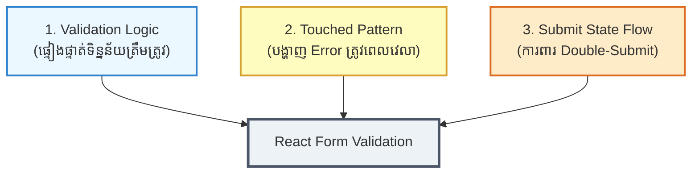
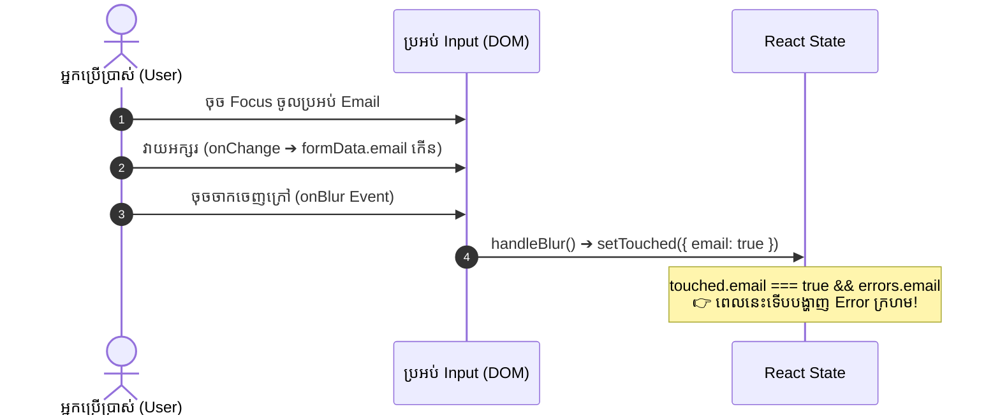
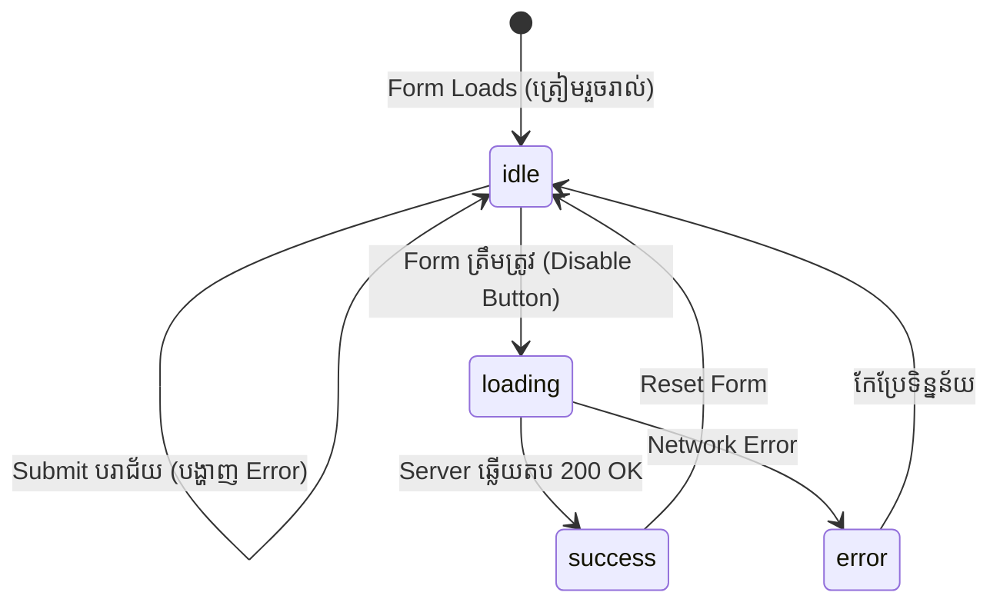

## 🌟 ១. ហេតុអ្វីបានជា Form Validation ពិបាកយល់? (The 3 Core Pillars)

ស្រមៃមើលស្ថានភាពពិតមួយ៖ អ្នកដើរចូលធនាគារដើម្បីបំពេញទម្រង់បើកគណនី។ អ្នកទើបតែចាប់ប៊ិចដាក់លើក្រដាសមិនទាន់បានសរសេរអក្សរមួយតួផង ស្រាប់តែបុគ្គលិកធនាគារស្រែកដាក់អ្នកថា៖  
> **«⚠️ ឈ្មោះមិនអាចទទេបានទេ! អ៊ីម៉ែលខុសទម្រង់! ពាក្យសម្ងាត់ខ្វះតួ!»**

តើអ្នកមានអារម្មណ៍យ៉ាងណា? ប្រាកដជាតានតឹង និងធុញទ្រាន់ខ្លាំង!  
នោះហើយជាអ្វីដែលកើតឡើងចំពោះ Website ភាគច្រើនដែល **ធ្វើ Form Validation មិនត្រឹមត្រូវ** — Error ក្រហមលោតព្រោងព្រាតតាំងពីទំព័រទើបបើកមក!

ដើម្បីធ្វើ Form Validation ឱ្យមានប្រសិទ្ធភាព និងមាន UX ល្អបំផុត គ្រប់ React Developer ត្រូវយល់ពី **សសរទ្រូងទាំង ៣ (The 3 Pillars)** នេះ៖



---

## 🎮 ២. Interactive Simulator — សាកល្បងដោយផ្ទាល់

ខាងក្រោមនេះជា Simulator អន្តរកម្ម។ អ្នកអាចសាកល្បងបំពេញទិន្នន័យផ្ទាល់ និងប្តូររវាង **UX Mode ទាំងពីរ** ដើម្បីមើលភាពខុសគ្នានៃការបង្ហាញ Error និងការប្រែប្រួល React State ក្នុងពេលដំណាលគ្នា៖

```reactdiagram
FormValidation
```

> [!TIP]
> **សាកល្បងពិសោធន៍:**
> 1. ចុចជ្រើសរើស **«❌ គ្មាន Touched (Aggressive UX)»** ➔ សង្កេតមើលថា Error លោតឡើងតាំងពីអ្នកមិនទាន់វាយអក្សរ!
> 2. ចុចជ្រើសរើស **«✅ ប្រើ Touched Pattern (UX ល្អ)»** ➔ សាកល្បងចុចចូលក្នុង Email Input រួចចុចចេញក្រៅ (Blur) ➔ Error នឹងបង្ហាញ **តែបន្ទាប់ពី** អ្នកចាកចេញពីប្រអប់នោះប៉ុណ្ណោះ!
> 3. មើលផ្ទាំង **React State Inspector** ខាងស្តាំ ដើម្បីឃើញថា `formData`, `touched`, `errors`, និង `submitState` ប្រែប្រួលយ៉ាងណា។

---

## 🛡️ ៣. ជំហានទី ១ — បង្កើត Pure Validation Function

ក្បួនច្បាប់ដំបូងគេ៖ **កុំច្របល់កូដផ្ទៀងផ្ទាត់ (Validation) ជាមួយ UI JSX ឡើយ!**  
យើងគួរបង្កើត **Pure JavaScript Function** មួយនៅក្រៅ Component ដែលទទួល `values` ហើយ Return ត្រឡប់មកវិញនូវ `errors` Object៖

```javascript
// Pure Function — មិនពឹងផ្អែកលើ React ឬ UI អ្វីទាំងអស់
function validate(values) {
  const errors = {};

  // 1. ផ្ទៀងផ្ទាត់ Email
  if (!values.email.trim()) {
    errors.email = 'Email មិនអាចទទេបានឡើយ!';
  } else if (!/^[^\s@]+@[^\s@]+\.[^\s@]+$/.test(values.email)) {
    errors.email = 'ទម្រង់ Email មិនត្រឹមត្រូវ (ឧ. name@example.com)!';
  }

  // 2. ផ្ទៀងផ្ទាត់ Password
  if (!values.password) {
    errors.password = 'Password មិនអាចទទេបានឡើយ!';
  } else if (values.password.length < 8) {
    errors.password = 'Password ត្រូវមានយ៉ាងតិច ៨ តួអក្សរ!';
  }

  // 3. ផ្ទៀងផ្ទាត់ Confirm Password
  if (!values.confirmPassword) {
    errors.confirmPassword = 'សូមផ្ទៀងផ្ទាត់ Password ម្តងទៀត!';
  } else if (values.confirmPassword !== values.password) {
    errors.confirmPassword = 'Password ផ្ទៀងផ្ទាត់មិនដូចគ្នាឡើយ!';
  }

  return errors;
}
```

### 🔍 ការពន្យល់មួយជួរៗ (Line-by-Line):

| បន្ទាត់កូដ | តួនាទី និងអត្ថន័យ |
| :--- | :--- |
| `function validate(values)` | ជា Pure Function ទទួល `values` (ឧ. `{ email, password, confirmPassword }`) |
| `!values.email.trim()` | កាត់ចោល space ខាងដើម និងខាងចុង។ ប្រសិនបើ User វាយតែ space សុទ្ធ ក៏រាប់ថាទទេដែរ |
| `/^[^\s@]+@[^\s@]+\.[^\s@]+$/` | Regular Expression (Regex) ពិនិត្យថាមានអក្សរ + សញ្ញា `@` + domain name + `.com` |
| `values.password.length < 8` | ពិនិត្យប្រវែង Password ដើម្បីធានាសុវត្ថិភាពយ៉ាងតិច ៨ តួអក្សរ |
| `values.confirmPassword !== values.password` | ប្រៀបធៀប Password ទាំងពីរ ដើម្បីឱ្យប្រាកដថា User វាយត្រូវគ្នា ១០០% |
| `return errors;` | Return object ដែលមានកំហុស។ បើគ្មាន Error ទាល់តែសោះ វានឹង return `{}` (object ទទេ) |

---

## 👆 ៤. ជំហានទី ២ — Touched Pattern & ព្រឹត្តិការណ៍ `onBlur`

នេះជាចំណុចដែល **មនុស្សជាច្រើនយល់ច្រឡំបំផុត**!

### ❓ សំណួរ៖ ហេតុអ្វីបានជាយើងមិនសរសេរ `{errors.email && <span>{errors.email}</span>}` ដោយផ្ទាល់?
👉 **ចម្លើយ៖** ប្រសិនបើអ្នកសរសេរដូច្នេះ នៅពេល User បើកទំព័រមកភ្លាម `errors.email` គឺស្មើនឹង `'Email មិនអាចទទេបានឡើយ!'` (ព្រោះ form ទទេ)។ ជាលទ្ធផល អក្សរក្រហមនឹងលោតឡើងភ្លាមៗ ទាំងដែល User មិនទាន់បានប៉ះ keyboard ផង!

### 💡 ដំណោះស្រាយ៖ Touched State
យើងបង្កើត State មួយឈ្មោះថា `touched` ដើម្បីកត់ត្រាថា៖ **«តើ User បានចុចចូល ហើយដើរចេញពី Input នោះហើយឬនៅ?»**



### 💻 កូដអនុវត្តន៍ជាក់ស្តែង៖

```jsx
// ១. បង្កើត State សម្រាប់ Touched
const [touched, setTouched] = useState({});

// ២. Handler ពេល User ចុចចាកចេញពី Input (onBlur)
const handleBlur = (e) => {
  const { name } = e.target;
  // កំណត់ថា field នេះត្រូវបាន "ប៉ះពាល់ (touched)" រួចរាល់ហើយ
  setTouched((prev) => ({ ...prev, [name]: true }));
};

// ៣. បង្ហាញ Error លុះត្រាតែបាន Touched រួចរាល់
return (
  <div>
    <label>Email</label>
    <input
      type="email"
      name="email"
      value={formData.email}
      onChange={handleChange}
      onBlur={handleBlur} // 👈 ភ្ជាប់ជាមួយ onBlur
    />

    {/* ✨ រូបមន្តមាស: បង្ហាញ Error តែពេល Touched === true ប៉ុណ្ណោះ */}
    {touched.email && errors.email && (
      <span className="error-text">⚠️ {errors.email}</span>
    )}
  </div>
);
```

> [!NOTE]
> **ព្រឹត្តិការណ៍ `onBlur` ជាអ្វី?**  
> នៅក្នុង JavaScript, `onBlur` គឺជា Event ដែលកេះឡើង (fire) នៅពេលដែល cursor ចាកចេញពី Input នោះ (Focus lost)។ ឧទាហរណ៍៖ User វាយ Email រួចចុច Tab ឬចុច Mouse ទៅកាន់ប្រអប់ Password ➔ នោះប្រអប់ Email នឹងបញ្ចេញព្រឹត្តិការណ៍ `blur`។

---

## 💡 ៥. ជំហានទី ៣ — ហេតុអ្វី Errors គួរតែជា Derived State?

នេះជាកំហុសដ៏ធំបំផុតមួយដែលអ្នករៀនថ្មីៗតែងតែជួបប្រទះ៖

### ❌ កំហុសទូទៅ (Anti-pattern):
```javascript
// ❌ កុំធ្វើបែបនេះ! បង្កើត useState សម្រាប់ errors នាំឱ្យមានបញ្ហា Desynchronization
const [formData, setFormData] = useState({ email: '', password: '' });
const [errors, setErrors] = useState({});

const handleChange = (e) => {
  setFormData({ ...formData, [e.target.name]: e.target.value });
  // ត្រូវហៅ setErrors តាមក្រោយ... ងាយភ្លេច និង delay 1 render!
};
```

### ✅ វិធីត្រឹមត្រូវ (Derived State):
```javascript
// ✅ ត្រឹមត្រូវបំផុត: គណនា Errors ផ្ទាល់ចេញពី formData ក្នុងពេល Render!
const [formData, setFormData] = useState({ email: '', password: '' });

// គណនាភ្លាមៗរាល់ពេល Component Re-render
const errors = validate(formData);
const isFormValid = Object.keys(errors).length === 0;
```

**ហេតុអ្វីវិធីនេះល្អជាងដាច់?**
1. **Always in Sync:** រាល់ពេលដែល User វាយអក្សរ (`formData` ប្រែប្រួល) Component នឹង Re-render ហើយ `errors` នឹងត្រូវគណនាឡើងវិញភ្លាមៗដោយស្វ័យប្រវត្តិ។
2. **គ្មាន Bugs:** មិនបាច់សរសេរ `useEffect` ស្មុគស្មាញដើម្បីចាំ update errors ឡើយ។
3. **`isFormValid` ងាយស្រួលដឹង:** បើ `errors` ជា object ទទេ (`{}`) មានន័យថា Form ត្រឹមត្រូវ ១០០%!

---

## ⏳ ៦. ជំហានទី ៤ — Submit State Machine & ការពារ Double-Click

ស្រមៃមើលថាអ្នកកំពុងទិញទំនិញតម្លៃ $500។ នៅពេលអ្នកចុចប៊ូតុង **«ទូទាត់ប្រាក់»** ប្រព័ន្ធអ៊ីនធឺណិតដើរយឺតបន្តិច។ ប្រសិនបើប៊ូតុងមិន Disable ទេ អ្នកប្រហែលជាចុចប៊ូតុងនោះ ៣ ទៅ ៤ ដងជាប់ៗគ្នា — ជាលទ្ធផល លុយរបស់អ្នកអាចនឹងត្រូវកាត់ $2,000!

ដើម្បីដោះស្រាយបញ្ហានេះ យើងប្រើ **Submit State Flow**:



### 💻 កូដ `handleSubmit` ដ៏រឹងមាំ៖

```javascript
const [submitState, setSubmitState] = useState('idle'); // 'idle' | 'loading' | 'success' | 'error'

const handleSubmit = async (e) => {
  e.preventDefault();

  // 1. បើក Touched លើគ្រប់ Field ទាំងអស់!
  // (បើ User មិនទាន់បំពេញអ្វីសោះហើយចុច Submit នោះ Error ទាំងអស់នឹងលោតព្រមគ្នា)
  setTouched({
    email: true,
    password: true,
    confirmPassword: true,
  });

  // 2. បើ Form នៅមាន Error មិនអនុញ្ញាតឱ្យ Submit ឡើយ!
  if (!isFormValid) {
    return;
  }

  // 3. ប្តូរទៅ Loading ➔ ប៊ូតុងនឹង Disable ភ្លាម ការពារ Double-click
  setSubmitState('loading');

  try {
    // ក្លែងធ្វើការផ្ញើទិន្នន័យទៅកាន់ API Server (រង់ចាំ 1.5 វិនាទី)
    await new Promise((resolve) => setTimeout(resolve, 1500));

    // 4. ជោគជ័យ!
    setSubmitState('success');
  } catch (err) {
    setSubmitState('error');
  }
};
```

---

## 🚀 ៧. កូដពេញលេញ (Complete Working Implementation)

នេះជា Component ពេញលេញដែលរួមបញ្ចូលគ្នានូវគោលការណ៍ទាំង ៤ ខាងលើ៖

```jsx
import { useState } from 'react';

// ==========================================
// ១. PURE VALIDATION FUNCTION (នៅក្រៅ Component)
// ==========================================
function validate(values) {
  const errors = {};

  if (!values.email.trim()) {
    errors.email = 'Email មិនអាចទទេបានឡើយ!';
  } else if (!/^[^\s@]+@[^\s@]+\.[^\s@]+$/.test(values.email)) {
    errors.email = 'ទម្រង់ Email មិនត្រឹមត្រូវ!';
  }

  if (!values.password) {
    errors.password = 'Password មិនអាចទទេបានឡើយ!';
  } else if (values.password.length < 8) {
    errors.password = 'Password ត្រូវមានយ៉ាងតិច ៨ តួអក្សរ!';
  }

  if (!values.confirmPassword) {
    errors.confirmPassword = 'សូមផ្ទៀងផ្ទាត់ Password ម្តងទៀត!';
  } else if (values.confirmPassword !== values.password) {
    errors.confirmPassword = 'Password ផ្ទៀងផ្ទាត់មិនដូចគ្នាឡើយ!';
  }

  return errors;
}

// ==========================================
// ២. REACT COMPONENT
// ==========================================
export default function RegistrationForm() {
  // State ទី ១: ផ្ទុកទិន្នន័យដែល User វាយ
  const [formData, setFormData] = useState({
    email: '',
    password: '',
    confirmPassword: '',
  });

  // State ទី ២: កត់ត្រាប្រអប់ដែល User បានចុចចូលហើយចាកចេញ (onBlur)
  const [touched, setTouched] = useState({});

  // State ទី ៣: តាមដានដំណាក់កាល Submit ('idle' | 'loading' | 'success' | 'error')
  const [submitState, setSubmitState] = useState('idle');

  // DERIVED STATE: គណនា Errors ដោយស្វ័យប្រវត្តិចេញពី formData
  const errors = validate(formData);
  const isFormValid = Object.keys(errors).length === 0;

  // Handler ពេល User វាយអក្សរ
  const handleChange = (e) => {
    const { name, value } = e.target;
    setFormData((prev) => ({ ...prev, [name]: value }));
  };

  // Handler ពេល User ចាកចេញពី Input
  const handleBlur = (e) => {
    const { name } = e.target;
    setTouched((prev) => ({ ...prev, [name]: true }));
  };

  // Handler ពេល User ចុច Submit
  const handleSubmit = async (e) => {
    e.preventDefault();

    // បង្ហាញ Error គ្រប់ field ទាំងអស់បើ user ចុច Submit ទាំងមិនទាន់បំពេញ
    setTouched({ email: true, password: true, confirmPassword: true });

    if (!isFormValid) return;

    setSubmitState('loading');
    // ក្លែងធ្វើការហៅ Network API រយៈពេល 1.2 វិនាទី
    await new Promise((resolve) => setTimeout(resolve, 1200));
    setSubmitState('success');
  };

  // បើ Submit ជោគជ័យ បង្ហាញផ្ទាំង Success Screen
  if (submitState === 'success') {
    return (
      <div className="max-w-md mx-auto p-6 bg-white dark:bg-slate-800 rounded-2xl text-center shadow-lg border border-slate-200 dark:border-slate-700">
        <span className="text-5xl block mb-2">🎉</span>
        <h3 className="text-xl font-bold text-slate-800 dark:text-white">ចុះឈ្មោះជោគជ័យ!</h3>
        <p className="text-sm text-slate-500 dark:text-slate-400 mt-2">
          ទិន្នន័យរបស់អ្នកត្រូវបានផ្ទៀងផ្ទាត់ និងបញ្ជូនទៅ Server ដោយជោគជ័យ។
        </p>
        <button
          onClick={() => {
            setFormData({ email: '', password: '', confirmPassword: '' });
            setTouched({});
            setSubmitState('idle');
          }}
          className="mt-5 px-5 py-2.5 bg-blue-600 hover:bg-blue-700 text-white rounded-xl text-sm font-bold transition shadow-md"
        >
          ចុះឈ្មោះម្តងទៀត
        </button>
      </div>
    );
  }

  return (
    <div className="max-w-md mx-auto p-6 bg-white dark:bg-slate-800 rounded-2xl shadow-lg border border-slate-200 dark:border-slate-700">
      <h2 className="text-xl font-bold text-slate-800 dark:text-white mb-5">
        🔐 ចុះឈ្មោះគណនីថ្មី
      </h2>

      <form onSubmit={handleSubmit} className="space-y-4">
        {/* Email Field */}
        <div>
          <label className="block text-xs font-bold text-slate-700 dark:text-slate-300 mb-1">
            Email
          </label>
          <input
            type="email"
            name="email"
            value={formData.email}
            onChange={handleChange}
            onBlur={handleBlur}
            placeholder="name@example.com"
            className="w-full px-3.5 py-2 text-sm border rounded-xl dark:bg-slate-900 dark:border-slate-700 dark:text-white outline-none focus:ring-2 focus:ring-blue-500 transition"
          />
          {touched.email && errors.email && (
            <p className="text-xs text-red-500 font-medium mt-1">⚠️ {errors.email}</p>
          )}
        </div>

        {/* Password Field */}
        <div>
          <label className="block text-xs font-bold text-slate-700 dark:text-slate-300 mb-1">
            Password (យ៉ាងតិច ៨ តួ)
          </label>
          <input
            type="password"
            name="password"
            value={formData.password}
            onChange={handleChange}
            onBlur={handleBlur}
            placeholder="••••••••"
            className="w-full px-3.5 py-2 text-sm border rounded-xl dark:bg-slate-900 dark:border-slate-700 dark:text-white outline-none focus:ring-2 focus:ring-blue-500 transition"
          />
          {touched.password && errors.password && (
            <p className="text-xs text-red-500 font-medium mt-1">⚠️ {errors.password}</p>
          )}
        </div>

        {/* Confirm Password Field */}
        <div>
          <label className="block text-xs font-bold text-slate-700 dark:text-slate-300 mb-1">
            Confirm Password
          </label>
          <input
            type="password"
            name="confirmPassword"
            value={formData.confirmPassword}
            onChange={handleChange}
            onBlur={handleBlur}
            placeholder="••••••••"
            className="w-full px-3.5 py-2 text-sm border rounded-xl dark:bg-slate-900 dark:border-slate-700 dark:text-white outline-none focus:ring-2 focus:ring-blue-500 transition"
          />
          {touched.confirmPassword && errors.confirmPassword && (
            <p className="text-xs text-red-500 font-medium mt-1">⚠️ {errors.confirmPassword}</p>
          )}
        </div>

        {/* Submit Button with Loading State */}
        <button
          type="submit"
          disabled={submitState === 'loading'}
          className="w-full py-3 bg-blue-600 hover:bg-blue-700 disabled:opacity-50 disabled:cursor-not-allowed text-white font-bold rounded-xl text-sm transition shadow-md flex items-center justify-center gap-2"
        >
          {submitState === 'loading' ? (
            <>
              <span className="w-4 h-4 border-2 border-white border-t-transparent rounded-full animate-spin" />
              <span>កំពុងបង្កើតគណនី...</span>
            </>
          ) : (
            <span>ចុះឈ្មោះឥឡូវនេះ</span>
          )}
        </button>
      </form>
    </div>
  );
}
```

---

## 🧠 ៨. តារាងសង្ខេប Mental Model (Cheat Sheet)

ចងចាំរូបមន្តខ្លីៗទាំង ៤ នេះ អ្នកនឹងអាចដោះស្រាយគ្រប់បញ្ហា Form ក្នុង React ដោយទំនុកចិត្ត៖

| ព្រឹត្តិការណ៍ / គំនិត | តួនាទីជាក់ស្តែង | កូដគំរូ |
| :--- | :--- | :--- |
| **`onChange`** | ធ្វើបច្ចុប្បន្នភាពទិន្នន័យអក្សរក្នុង `formData` | `setFormData(prev => ({...prev, [name]: value}))` |
| **`onBlur`** | កត់ត្រាថា User បានប៉ះពាល់ field នោះរួចរាល់ | `setTouched(prev => ({...prev, [name]: true}))` |
| **`errors` (Derived)** | គណនា Error ភ្លាមៗចេញពី State ដោយមិនបាច់ `useState` | `const errors = validate(formData);` |
| **បង្ហាញ Error លើ UI** | បង្ហាញ Error លុះត្រាតែបាន Touched និងមាន Error ពិតប្រាកដ | `{touched.email && errors.email && <span>...</span>}` |
| **`onSubmit`** | បើក Touched ទាំងអស់ ➔ ឆែក `isFormValid` ➔ ប្តូរទៅ `loading` | `if (!isFormValid) return; setSubmitState('loading');` |
