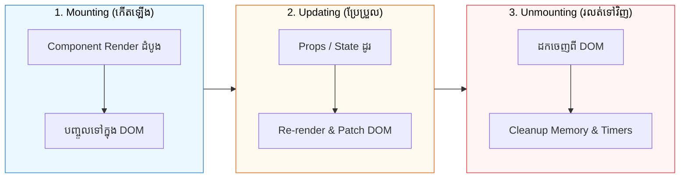

## 🔄 1. ដំណាក់កាលទាំង ៣ នៃ Lifecycle

Component នីមួយៗក្នុង React ឆ្លងកាត់វដ្តជីវិត (Lifecycle) ចំនួន ៣ ដំណាក់កាល៖

---

## ⚡ 2. ហេតុអ្វីត្រូវស្គាល់ Lifecycle?

នៅក្នុងការសរសេរកូដជាក់ស្តែង យើងតែងតែត្រូវការ៖
- **នៅពេល Mount:** ទាញយកទិន្នន័យពី Backend API, បង្កើត WebSocket Connection, ចាប់ផ្តើម Timer
- **នៅពេល Update:** Update ទិន្នន័យថ្មីនៅពេល User ប្តូរ ID ឬ Filter
- **នៅពេល Unmount:** Clear Timers (`clearInterval`), បិទ WebSocket ដើម្បីកុំឱ្យ Leak Memory!
