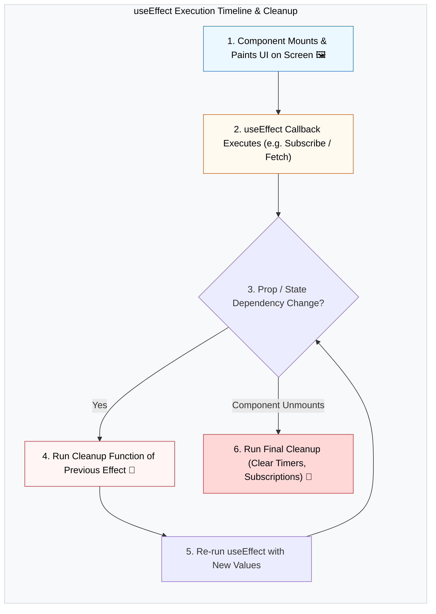

## 🪢 1. Lifecycle Timeline ជាមួយ `useEffect`



---

## 🛠️ 2. Dependency Array Rules & Cleanup Code

```jsx
import { useState, useEffect } from 'react';

export default function TimerApp() {
  const [seconds, setSeconds] = useState(0);
  const [isRunning, setIsRunning] = useState(true);

  useEffect(() => {
    if (!isRunning) return;

    // 1. Setup Side Effect (Timer)
    const intervalId = setInterval(() => {
      setSeconds((prev) => prev + 1);
    }, 1000);

    // 2. Return Cleanup Function (ដំណើរការពេល unmount ឬ ពេល isRunning ប្រែប្រួល)
    return () => {
      clearInterval(intervalId);
      console.log("Timer cleared! 🧹");
    };
  }, [isRunning]); // Dependency: Re-run តែពេល isRunning ដូរ

  return (
    <div className="p-6 border rounded-2xl max-w-xs text-center">
      <h2 className="text-4xl font-black mb-4">{seconds}s</h2>
      <button 
        onClick={() => setIsRunning(!isRunning)}
        className={`px-4 py-2 text-white font-bold rounded-xl ${isRunning ? 'bg-amber-600' : 'bg-green-600'}`}
      >
        {isRunning ? 'ផ្អាក (Pause)' : 'បន្ត (Resume)'}
      </button>
    </div>
  );
}
```
