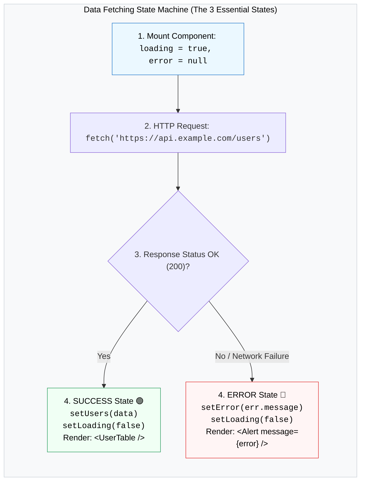

## 📡 1. Data Fetching State Machine



---

## 🛠️ 2. កូដគំរូ: Data Fetching ជាមួយ Skeleton Loader

```jsx
import { useState, useEffect } from 'react';

export default function ArticleFeed() {
  const [articles, setArticles] = useState([]);
  const [loading, setLoading] = useState(true);
  const [error, setError] = useState(null);

  const fetchArticles = async () => {
    setLoading(true);
    setError(null);
    try {
      const res = await fetch('https://jsonplaceholder.typicode.com/posts?_limit=5');
      if (!res.ok) throw new Error('មិនអាចទាញយកទិន្នន័យពី Server បានឡើយ!');
      const data = await res.json();
      setArticles(data);
    } catch (err) {
      setError(err.message);
    } finally {
      setLoading(false);
    }
  };

  useEffect(() => {
    fetchArticles();
  }, []);

  // 1. ERROR STATE
  if (error) {
    return (
      <div className="p-6 bg-red-50 border border-red-200 rounded-2xl text-center">
        <p className="text-red-700 font-bold mb-3">⚠️ កំហុស៖ {error}</p>
        <button onClick={fetchArticles} className="px-4 py-2 bg-red-600 text-white rounded-lg font-bold">
          ព្យាយាមម្តងទៀត (Retry)
        </button>
      </div>
    );
  }

  // 2. LOADING SKELETON STATE
  if (loading) {
    return (
      <div className="space-y-4 max-w-lg mx-auto">
        {[1, 2, 3].map((i) => (
          <div key={i} className="p-5 border rounded-2xl animate-pulse space-y-3 bg-white">
            <div className="h-5 bg-gray-200 rounded w-3/4"></div>
            <div className="h-4 bg-gray-200 rounded w-full"></div>
            <div className="h-4 bg-gray-200 rounded w-1/2"></div>
          </div>
        ))}
      </div>
    );
  }

  // 3. SUCCESS DATA STATE
  return (
    <div className="space-y-4 max-w-lg mx-auto">
      {articles.map((article) => (
        <div key={article.id} className="p-5 bg-white border border-gray-100 rounded-2xl shadow-sm">
          <h3 className="font-bold text-gray-900 capitalize text-lg">{article.title}</h3>
          <p className="text-gray-600 text-sm mt-2">{article.body}</p>
        </div>
      ))}
    </div>
  );
}
```
