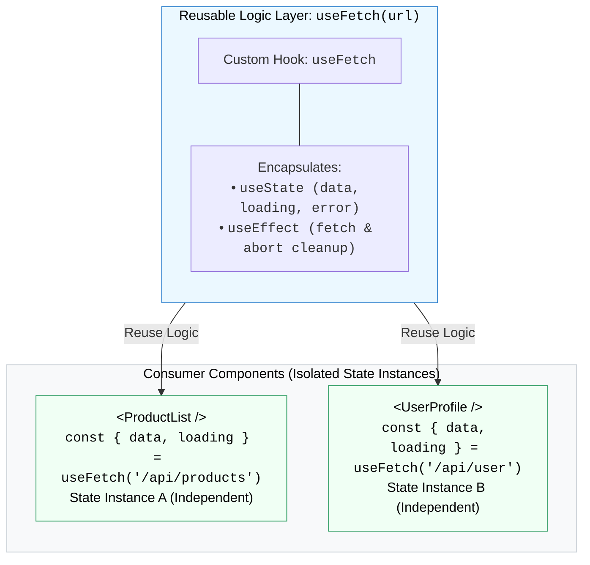

## 🪢 1. Custom Hook Architecture



---

## 🛠️ 2. បង្កើត Reusable `useFetch` Hook

```javascript
// ឯកសារ: src/hooks/useFetch.js
import { useState, useEffect } from 'react';

export function useFetch(url) {
  const [data, setData] = useState(null);
  const [loading, setLoading] = useState(true);
  const [error, setError] = useState(null);

  useEffect(() => {
    let isMounted = true; // Flag ការពារ state update ពេល unmount
    setLoading(true);

    fetch(url)
      .then((res) => {
        if (!res.ok) throw new Error('Failed to fetch data!');
        return res.json();
      })
      .then((json) => {
        if (isMounted) {
          setData(json);
          setError(null);
        }
      })
      .catch((err) => {
        if (isMounted) setError(err.message);
      })
      .finally(() => {
        if (isMounted) setLoading(false);
      });

    return () => {
      isMounted = false; // Cleanup
    };
  }, [url]);

  return { data, loading, error };
}
```

### យកទៅប្រើប្រាស់ក្នុង Component៖
```jsx
import { useFetch } from './hooks/useFetch';

export default function UserProfile() {
  const { data: users, loading, error } = useFetch('https://jsonplaceholder.typicode.com/users');

  if (loading) return <p>កំពុងទាញយក...</p>;
  if (error) return <p className="text-red-500">កំហុស: {error}</p>;

  return (
    <ul>
      {users.map((u) => <li key={u.id}>{u.name}</li>)}
    </ul>
  );
}
```
