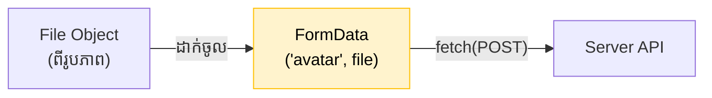

## 📎 ការចាប់យកឯកសារ (Handling File Input)

ការគ្រប់គ្រង File Input គឺមានលក្ខណៈខុសប្លែកពី Text Input ធម្មតាបន្តិច។ ជំនួសអោយការចាប់យក `e.target.value` យើងត្រូវទាញយក `e.target.files` ដែលជាបញ្ជី (Array) នៃឯកសារទាំងអស់ដែលអ្នកប្រើប្រាស់បានជ្រើសរើស។

```jsx
import { useState } from 'react';

function UploadAvatar() {
  const [selectedFile, setSelectedFile] = useState(null);

  const handleFileChange = (e) => {
    // ចាប់យកឯកសារទី១ (បើគេជ្រើសរើសតែមួយ)
    const file = e.target.files[0];
    
    // អ្នកអាចត្រួតពិនិត្យ (Validate) នៅទីនេះបាន
    if (file && file.size > 2000000) {
      alert("រូបភាពធំពេកហើយ! សូមជ្រើសរើសទំហំក្រោម 2MB។");
      return;
    }
    
    setSelectedFile(file);
  };

  return (
    <div>
      <input type="file" accept="image/*" onChange={handleFileChange} />
      {selectedFile && <p>អ្នកបានរើសឯកសារ: {selectedFile.name}</p>}
    </div>
  );
}
```

---

## 🖼️ ការបង្ហាញរូបភាពគំរូ (Image Preview)

មុនពេលបញ្ជូនរូបភាពទៅ Server វាជាបទពិសោធន៍អ្នកប្រើប្រាស់ (UX) ដ៏ល្អមួយដែលយើងអាចបង្ហាញរូបភាពនោះអោយគេឃើញសិន។ យើងអាចប្រើប្រាស់ `URL.createObjectURL()` ដើម្បីបង្កើតតំណភ្ជាប់បណ្តោះអាសន្ន។

```jsx
const [previewUrl, setPreviewUrl] = useState(null);

const handleFileChange = (e) => {
  const file = e.target.files[0];
  if (file) {
    setSelectedFile(file);
    // បង្កើត URL បណ្តោះអាសន្នពីរូបភាពក្នុងកុំព្យូទ័រ
    const objectUrl = URL.createObjectURL(file);
    setPreviewUrl(objectUrl);
  }
};

// ... នៅក្នុង return
{previewUrl && }
```

---

## 🚀 ការបញ្ជូនទៅកាន់ Server ជាមួយ FormData

ដូចដែលបានរៀបរាប់នៅក្នុង Quiz ខាងលើ អ្នកមិនអាចបញ្ជូន File តាមរយៈ JSON បានទេ។ អ្នកត្រូវយកវាទៅវេចខ្ចប់ក្នុង `FormData` ជាមុនសិន។



```jsx
const handleUpload = async () => {
  if (!selectedFile) return;

  // 1. បង្កើត FormData ថ្មី
  const formData = new FormData();
  
  // 2. ញាត់ទិន្នន័យបញ្ជូល (ឈ្មោះ key ត្រូវតែដូចអ្វីដែល Backend ទាមទារ)
  formData.append('avatar', selectedFile);
  
  // (ជម្រើស) អ្នកអាចញាត់អក្សរផ្សេងៗចូលជាមួយគ្នាក៏បាន
  formData.append('username', 'rathasam');

  try {
    const response = await fetch('https://api.example.com/upload', {
      method: 'POST',
      // ចំណាំសំខាន់: ពេលប្រើ FormData អ្នក **មិនត្រូវ** ដាក់ Header 'Content-Type' ទេ!
      // Browser នឹងរៀបចំ Header 'multipart/form-data' អោយអ្នកដោយស្វ័យប្រវត្តិ។
      body: formData,
    });

    if (response.ok) {
      alert("បង្ហោះរូបភាពបានជោគជ័យ!");
    }
  } catch (error) {
    console.error("បញ្ហាក្នុងការបង្ហោះ:", error);
  }
};
```
