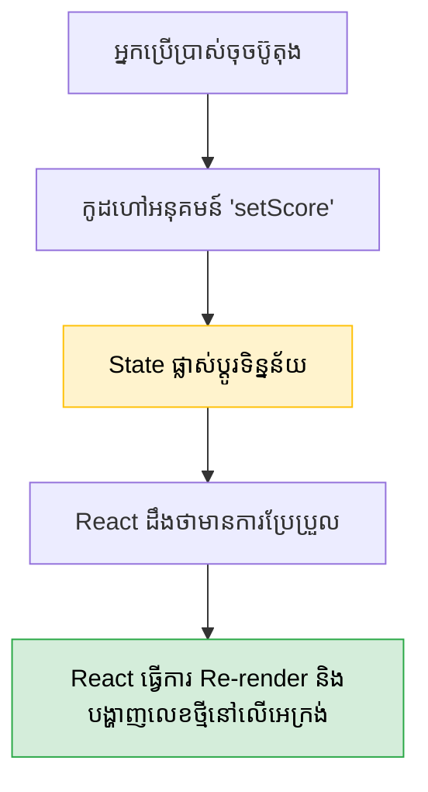

## 🚦 អ្វីទៅជា State?

ប្រសិនបើអ្នកបង្កើតអថេរធម្មតា `let score = 0` ហើយអ្នកបូកវាឡើងរហូតដល់ ១០, តួលេខនៅលើអេក្រង់វេបសាយ វានៅតែបង្ហាញលេខ ០ ដដែល។ ហេតុអ្វី? ព្រោះ React **មិនដឹង** ថាអថេរនោះប្រែប្រួលទេ។

ដើម្បីប្រាប់ React អោយ **"គូររូបរាងឡើងវិញ (Re-render)"** រាល់ពេលទិន្នន័យប្រែប្រួល យើងត្រូវប្រើប្រាស់ **State** តាមរយៈអនុគមន៍ពិសេសមួយឈ្មោះថា `useState` (ហៅថា Hook)។



---

## 🪝 របៀបប្រើប្រាស់ `useState`

`useState` បញ្ជូនតម្លៃត្រលប់មកវិញជា Array ដែលមានសមាជិក ២ គឺ៖
1. **តម្លៃបច្ចុប្បន្ន (State Variable)**
2. **អនុគមន៍សម្រាប់ប្តូរតម្លៃ (Setter Function)**

```jsx
import { useState } from 'react';

function Counter() {
  // ប្រកាស State ឈ្មោះ count ដែលមានតម្លៃលំនាំដើមស្មើ 0
  const [count, setCount] = useState(0);

  return (
    <div>
      <p>ពិន្ទុ: {count}</p>
      {/* ហៅ Setter Function ដើម្បីប្តូរតម្លៃ */}
      <button onClick={() => setCount(count + 1)}>បន្ថែមពិន្ទុ</button>
    </div>
  );
}
```

---

## 🔬 បច្ចេកទេសកម្រិតខ្ពស់ (Functional Updates)

ដូចដែលមានសួរក្នុង Quiz, ប្រសិនបើអ្នកចង់ Update តម្លៃដោយផ្អែកលើតម្លៃ **"មុននេះបន្តិច (Previous State)"** កុំប្រើ `setCount(count + 1)` អោយសោះ!

អ្នកគួរប្រើ **Functional Update** (ហៅតាមរយៈ Callback Function):

```jsx
// ❌ បើហៅ ៣ ដងជាប់គ្នា លទ្ធផលនៅតែ 1 ព្រោះវាយកតម្លៃ 0 មកគណនាដដែលៗ
setCount(count + 1); 

// ✅ ត្រូវ! លទ្ធផលនឹងឡើងដល់ 3 ព្រោះ prev តំណាងអោយតម្លៃចុងក្រោយបំផុតជានិច្ច
setCount((prev) => prev + 1);
```

---

## 📦 ការគ្រប់គ្រង Objects និង Arrays ក្នុង State

បម្រាមដ៏ធំបំផុត: **ហាមកែប្រែ Object ឫ Array ដោយផ្ទាល់ (Do not mutate state directly)!** អ្នកត្រូវតែថតចម្លង (Copy) វាសិនមុននឹងកែប្រែ។

### 1. សម្រាប់ Objects
អ្នកត្រូវប្រើ `...` (Spread Operator) ដើម្បីចម្លងទិន្នន័យចាស់ រួចសរសេរជាន់ពីលើទិន្នន័យថ្មី៖

```jsx
const [user, setUser] = useState({ name: 'រដ្ឋា', age: 25 });

// ❌ ខុស: user.age = 26;
// ✅ ត្រូវ: ថតចម្លងរបស់ចាស់ រួចប្តូរតែអាយុ
setUser(prevUser => ({ ...prevUser, age: 26 }));
```

### 2. សម្រាប់ Arrays
ស្រដៀងគ្នាដែរ អ្នកត្រូវថតចម្លង Array ចាស់ រួចថែមសមាជិកថ្មីបញ្ជូល៖

```jsx
const [items, setItems] = useState(['ផ្លែប៉ោម', 'ចេក']);

// ❌ ខុស: items.push('ក្រូច');
// ✅ ត្រូវ: បង្កើត Array ថ្មី, បាចរបស់ចាស់ចូល រួចថែម ក្រូច ពីក្រោយ
setItems(prevItems => [...prevItems, 'ក្រូច']);
```

```reactdiagram
StateRender
```


## ⬆️ ការលើក State ឡើងលើ (Lifting State Up)

នេះជាបញ្ហាដ៏ពេញនិយមបំផុត៖ ឧបមាថាអ្នកមាន Component ឪពុកមួយឈ្មោះ `Dashboard` ដែលមានកូនពីរគឺ `SearchBar` (សម្រាប់វាយអក្សរស្វែងរក) និង `ProductList` (សម្រាប់បង្ហាញទំនិញ)។ 

តើ `ProductList` ដឹងដោយរបៀបណាថាគេកំពុងវាយអក្សរអ្វីនៅក្នុង `SearchBar`? 
វាគ្មានផ្លូវទេ ព្រោះពួកវាជាបងប្អូននឹងគ្នា!

**ដំណោះស្រាយ:** យើងត្រូវ **លើក (Lift)** State `searchQuery` ពីក្នុង `SearchBar` យកទៅទុកក្នុង `Dashboard` វិញ។ 

```jsx
function Dashboard() {
  // 1. State ឥឡូវនេះស្ថិតនៅផ្ទះឪពុក
  const [searchQuery, setSearchQuery] = useState("");

  return (
    <div>
      {/* 2. ឪពុកបញ្ជូនសិទ្ធិកែប្រែ State ទៅអោយកូនទី១ (អ្នកវាយ) */}
      <SearchBar onSearch={setSearchQuery} />
      
      {/* 3. ឪពុកបញ្ជូនទិន្នន័យដែលបានកែប្រែរួច ទៅអោយកូនទី២ (អ្នកបង្ហាញ) */}
      <ProductList query={searchQuery} />
    </div>
  );
}
```
នេះគឺជាក្បួនដោះស្រាយបញ្ហាទិន្នន័យដ៏មានឥទ្ធិពលបំផុត មុននឹងអ្នកឈានដល់ការប្រើប្រាស់ Redux ឫ Context API!
