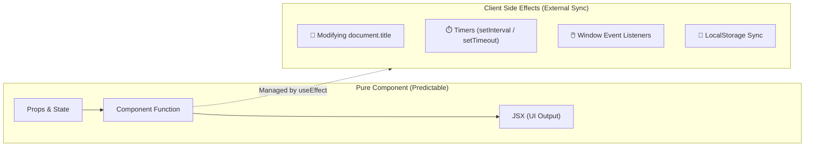

## 🧭 1. Mental Model: Pure Rendering vs Side Effects



---

## 📄 2. Example: Synchronizing Document Title

### 🌐 Normal HTML / JavaScript (របៀបធម្មតា):

```html
<!-- HTML Document Title & Button ធម្មតា -->
<!DOCTYPE html>
<html>
  <head>
    <title>My Website</title>
  </head>
  <body>
    <button onclick="document.title = '🔔 Notification (1)'">
      Send Notification
    </button>
  </body>
</html>
```

### 💻 React Code (ជាមួយ `useEffect`):

```jsx
import { useState, useEffect } from 'react';

export function TitleSyncDemo() {
  const [unreadCount, setUnreadCount] = useState(0);

  // 1. ដំណើរការ Side Effect ក្រោយ Paint UI
  useEffect(() => {
    // កែប្រែ Title លើ Browser Tab
    document.title = unreadCount > 0 
      ? `(${unreadCount}) សារថ្មី - My App` 
      : 'My App';
  }, [unreadCount]); // 2. រត់តែពេល unreadCount ផ្លាស់ប្តូរ

  return (
    <button onClick={() => setUnreadCount((c) => c + 1)}>
      📩 ផ្ញើសារ ({unreadCount})
    </button>
  );
}
```

### 🔍 ការពន្យល់មួយជួរៗ (Line-by-Line Explanation):

1. `useEffect(() => { ... }, [unreadCount]);`
   - ចុះឈ្មោះ Side Effect ជាមួយ React។ React នឹងរង់ចាំឱ្យ Browser បង្ហាញ UI រួចរាល់សិន ទើបមកដំណើរការកូដក្នុង Callback នេះ។
2. `document.title = ...`
   - កែប្រែ Browser Tab Title ខាងក្រៅ React Component (Side Effect) ទៅតាមចំនួន `unreadCount`។
3. `[unreadCount]` (Dependency Array)
   - ប្រាប់ React ថា: "ដំណើរការ Effect នេះតែនៅពេលណាដែលតម្លៃ `unreadCount` ប្រែប្រួលប៉ុណ្ណោះ"។ បើ `unreadCount` នៅដដែល វាមិន run ឥតប្រយោជន៍ឡើយ។

---

## 🚀 3. Complete Integrated Component

```jsx
import { useState, useEffect } from 'react';

export default function DocumentTitleSync() {
  const [count, setCount] = useState(0);

  useEffect(() => {
    document.title = count > 0 ? `(${count}) សារថ្មី | EduApp` : 'EduApp';
  }, [count]);

  return (
    <div className="max-w-sm mx-auto p-6 bg-white dark:bg-slate-800 rounded-2xl shadow border text-center">
      <h3 className="font-bold text-lg text-slate-800 dark:text-white mb-2">
        📄 Browser Tab Title Sync
      </h3>
      <p className="text-xs text-slate-400 mb-4">
        មើលចំណងជើង Browser Tab របស់អ្នកពេលចុចប៊ូតុងខាងក្រោម៖
      </p>

      <div className="flex justify-center items-center gap-3">
        <button
          onClick={() => setCount((c) => Math.max(0, c - 1))}
          className="px-3 py-1.5 bg-slate-100 dark:bg-slate-700 text-slate-700 dark:text-slate-200 rounded-xl font-bold text-sm"
        >
          −
        </button>
        <span className="font-black text-xl text-blue-600 dark:text-blue-400 w-8">{count}</span>
        <button
          onClick={() => setCount((c) => c + 1)}
          className="px-3 py-1.5 bg-blue-600 text-white rounded-xl font-bold text-sm"
        >
          +
        </button>
      </div>
    </div>
  );
}
```
