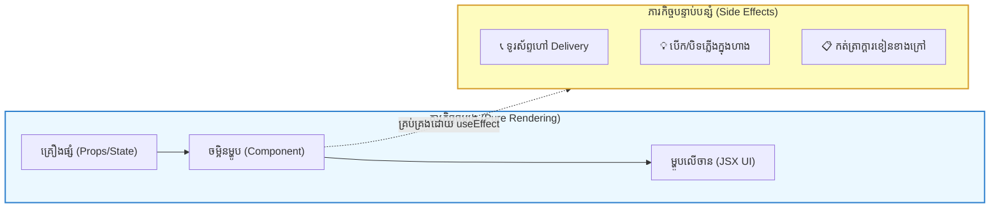
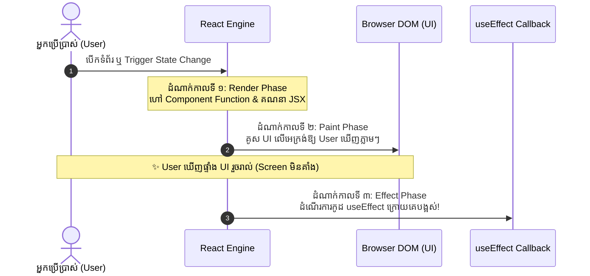

## 🌟 ១. តើ Side Effects ជាអ្វី? (ឧទាហរណ៍ចុងភៅក្នុងភោជនីយដ្ឋាន 👨‍🍳)

ដើម្បីយល់ពី `useEffect` ឱ្យបានងាយស្រួលបំផុត សូមស្រមៃមើល **ចុងភៅក្នុងភោជនីយដ្ឋាន** មួយ៖



1. **ភារកិច្ចចម្បង (Pure Rendering):** គឺយកគ្រឿងផ្សំ (Props & State) មកចម្អិនចេញជាម្ហូបលើចានជូនភ្ញៀវ (Return JSX ដើម្បីបង្ហាញលើអេក្រង់)។ នេះជាការងារសុទ្ធស្អាត (Pure Function)។
2. **ភារកិច្ចបន្ទាប់បន្សំ (Side Effects):** គឺការងារដែលប៉ះពាល់ដល់ **ពិភពខាងក្រៅផ្ទះបាយ** ដូចជា៖
   - ទូរស័ព្ទហៅអ្នកដឹកជញ្ជូន ➔ *ដូចជាការហៅ API (`fetch` / Axios)*
   - កត់ត្រាចំនួនភ្ញៀវលើក្តារខៀនខាងមុខហាង ➔ *ដូចជាការកែប្រែ `document.title`*
   - កំណត់ម៉ោងរោទិ៍ចម្អិន ➔ *ដូចជា `setInterval` / `setTimeout`*
   - រក្សាទុកទិន្នន័យក្នុងទូរដែក ➔ *ដូចជា `localStorage`*

> [!IMPORTANT]
> នៅក្នុង React: **រាល់ប្រតិបត្តិការណាដែលទាក់ទងនឹងប្រព័ន្ធខាងក្រៅក្រៅពីការ Return JSX ត្រូវបានហៅថា «Side Effects»!**

---

## ⚠️ ២. ហេតុអ្វីមិនអាចសរសេរ Side Effects ក្នុង Function Body ផ្ទាល់?

នេះជាកំហុសដ៏ធំបំផុតដែលអ្នកទើបរៀន React តែងតែជួបប្រទះ៖

```jsx
// ❌ កូដខុសធ្ងន់ធ្ងរ — បង្កជា INFINITE LOOP CRASH!
function UserProfile() {
  const [userData, setUserData] = useState(null);

  // ⚠️ ដាក់ Fetch ក្នុង Body ផ្ទាល់:
  fetch('https://api.example.com/user')
    .then(res => res.json())
    .then(data => setUserData(data)); // 👈 setUserData នឹងកេះឱ្យ Component Re-render ឡើងវិញ!

  return <div>{userData?.name}</div>;
}
```

### 💣 មហន្តរាយដែលកើតឡើង៖
1. Component រត់លើកទី ១ ➔ ជួប `fetch` ➔ ទទួលបានទិន្នន័យ ➔ ហៅ `setUserData`
2. `setUserData` បញ្ជាឱ្យ React **Re-render Component ឡើងវិញ**
3. Component រត់លើកទី ២ ➔ ជួប `fetch` ម្តងទៀត ➔ ហៅ `setUserData` ម្តងទៀត
4. ... **រង្វង់ Luop មិនចេះចប់ (Infinite Loop)** ➔ កម្មវិធីគាំង Browser ភ្លាម!

👉 **ដំណោះស្រាយ៖** ត្រូវប្រើ Hook **`useEffect`** ដើម្បីប្រាប់ React ថា៖ *«សូមបង្ហាញ UI ជូន User សិន រួចចាំដំណើរការកូដនេះនៅពេលក្រោយ!»*

---

## 🎮 ៣. Interactive Simulator — សាកល្បងដោយផ្ទាល់

ខាងក្រោមនេះជា Simulator អន្តរកម្ម។ អ្នកអាចសាកល្បងប្តូររវាង **ទម្រង់ទាំង ៣ នៃ Dependency Array** រួចចុចប៊ូតុង State ដើម្បីមើលថាពេលណាខ្លះដែល `useEffect` ដំណើរការ និងពេលណាខ្លះដែលវាត្រូវបានរំលង (Skipped)៖

```reactdiagram
UseEffect
```

> [!TIP]
> **សាកល្បងពិសោធន៍:**
> 1. ជ្រើសរើស **«1. គ្មាន [] (No Array)»** ➔ ចុចប៊ូតុងទាំងពីរ ➔ សង្កេតមើលថា Effect Run គ្រប់ដងរាល់ពេល Re-render!
> 2. ជ្រើសរើស **«2. ទទេ [] (Empty Array)»** ➔ ចុចប៊ូតុងទាំងពីរ ➔ Effect **មិន Run ទៀតទេ** (រក្សានៅត្រឹម ១ ដងដដែល)!
> 3. ជ្រើសរើស **«3. មាន [count] (With Deps)»** ➔ ចុច "ប្តូរ Count" (Effect Run ✅) រួចសាកចុច "ប្តូរ Text" (Effect រំលងចោល ⏭️ ព្រោះ count មិនបានប្រែប្រួល)!

---

## 🔄 ៤. លំដាប់លំហូរការងារទាំង ៣ ដំណាក់កាល (Execution Lifecycle)

`useEffect` មិនដំណើរការភ្លាមៗក្នុងពេល Render ឡើយ។ React បែងចែកការងារជា ៣ ជំហានច្បាស់លាស់៖



> [!NOTE]
> **ហេតុអ្វី React ធ្វើបែបនេះ?**  
> ដើម្បីឱ្យ User មើលឃើញទំព័រភ្លាមៗ (Fast UI Paint) ដោយមិនបាច់រង់ចាំ Side Effects ដែលស៊ីពេល (ដូចជា Network Request ឬ Timers) នោះឡើយ!

---

## 🎯 ៥. ច្បាប់មាសទាំង ៣ នៃ Dependency Array (៣ ទម្រង់ដែលត្រូវចងចាំ)

Syntax របស់ `useEffect` គឺ៖ `useEffect(setupFunction, dependenciesArray)`

| ទម្រង់ Dependency | កូដសរសេរ | ពេលណាទើប Effect ដំណើរការ? | ករណីប្រើប្រាស់ទូទៅ |
| :--- | :--- | :--- | :--- |
| **១. គ្មាន Array សោះ** | `useEffect(() => { ... })` | **រាល់ពេល Render** (លើកដំបូង + រាល់ពេល State ណាមួយប្តូរ) | កម្រប្រើខ្លាំងណាស់ (ប្រយ័ត្នបញ្ហា Performance) |
| **២. Array ទទេ `[]`** | `useEffect(() => { ... }, [])` | **តែ ១ ដងគត់** ពេល Component ទើបបង្ហាញដំបូង (Mount) | Fetch Data លើកដំបូង, Event Listeners (`window.addEventListener`) |
| **៣. មាន Dependency `[prop, state]`** | `useEffect(() => { ... }, [count])` | **ពេល Mount + ពេលតម្លៃក្នុង Array ផ្លាស់ប្តូរ** | Sync Document Title, Fetch Data ពេល ID ផ្លាស់ប្តូរ |

---

## 📄 ៦. ឧទាហរណ៍ជាក់ស្តែង ៖ ធ្វើសមកាលកម្ម Browser Tab Title

ចូរក្រឡេកមើលកូដជាក់ស្តែងនៃការ Sync ចំនួនសារមិនទាន់អាន ទៅលើ Browser Tab Title (`document.title`)៖

```jsx
import { useState, useEffect } from 'react';

export default function DocumentTitleSync() {
  const [unreadCount, setUnreadCount] = useState(0);

  // ដំណើរការ Side Effect ក្រោយពេល UI បង្ហាញរួចរាល់
  useEffect(() => {
    // កែប្រែ Title លើ Browser Tab ខាងក្រៅ React
    if (unreadCount > 0) {
      document.title = `🔔 (${unreadCount}) សារថ្មី | MyApp`;
    } else {
      document.title = 'MyApp - ទំព័រដើម';
    }

    console.log("Effect បាន run ព្រោះ unreadCount =", unreadCount);
  }, [unreadCount]); // 👈 ដំណើរការឡើងវិញ តែពេល unreadCount ប្រែប្រួលប៉ុណ្ណោះ!

  return (
    <div className="max-w-sm mx-auto p-6 bg-white dark:bg-slate-800 rounded-2xl shadow-lg border text-center">
      <h3 className="font-bold text-lg text-slate-800 dark:text-white mb-2">
        📄 Browser Tab Title Sync
      </h3>
      <p className="text-xs text-slate-500 dark:text-slate-400 mb-4">
        សង្កេតមើលចំណងជើង Tab លើ Browser របស់អ្នកពេលចុចប៊ូតុង៖
      </p>

      <div className="flex justify-center items-center gap-3">
        <button
          onClick={() => setUnreadCount((c) => Math.max(0, c - 1))}
          className="px-3.5 py-2 bg-slate-100 dark:bg-slate-700 text-slate-800 dark:text-slate-200 rounded-xl font-bold text-sm hover:bg-slate-200 transition"
        >
          − ដកសារ
        </button>

        <span className="font-black text-2xl text-blue-600 dark:text-blue-400 w-10">
          {unreadCount}
        </span>

        <button
          onClick={() => setUnreadCount((c) => c + 1)}
          className="px-3.5 py-2 bg-blue-600 text-white rounded-xl font-bold text-sm hover:bg-blue-700 transition shadow"
        >
          + ផ្ញើសារថ្មី
        </button>
      </div>
    </div>
  );
}
```

### 🔍 ការពន្យល់មួយជួរៗ (Line-by-Line Explanation):

1. `useEffect(() => { ... }, [unreadCount]);`
   - ចុះឈ្មោះ Side Effect ជាមួយ React ដោយប្រាប់ថា៖ *«សូមចាំមើលតម្លៃ `unreadCount`។ ឱ្យតែវាប្រែប្រួល ចូររត់កូដក្នុងនេះ!»*
2. `document.title = ...`
   - កែប្រែ DOM របស់ Browser Window ផ្ទាល់។ នេះគឺជា Side Effect ព្រោះវានៅក្រៅ React Component។
3. `[unreadCount]` (Dependency Array):
   - ប្រសិនបើ Component Re-render ដោយសារ State ផ្សេងទៀត (ឧ. dark mode toggle) តែ `unreadCount` នៅដដែល នោះ React នឹង **រំលងកូដក្នុង `useEffect` នេះចោល** មិនឱ្យខាត Performance ឡើយ!

---

## 🧠 ៧. សង្ខេប Mental Model ងាយចាំ (Quick Cheat Sheet)

| សំណួរគន្លឹះ | ចម្លើយខ្លីខ្លឹម |
| :--- | :--- |
| **តើអ្វីជា Side Effect?** | ការងារដែលទាក់ទងនឹងប្រព័ន្ធខាងក្រៅក្រៅពី JSX (API, DOM, Timers) |
| **តើ useEffect រត់ពេលណា?** | **ក្រោយពេល Paint UI រួចរាល់** (Screen មិនកកស្ទះ) |
| **`useEffect(fn)`** | រត់រាល់ពេល Render ទាំងអស់ ⚠️ |
| **`useEffect(fn, [])`** | រត់តែម្តងគត់ពេល Mount ដំបូង ✅ |
| **`useEffect(fn, [x])`** | រត់ពេល Mount + ពេលតម្លៃ `x` ប្រែប្រួល ✅ |
