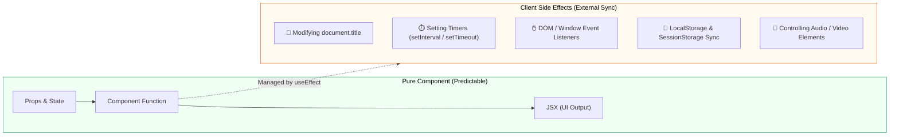
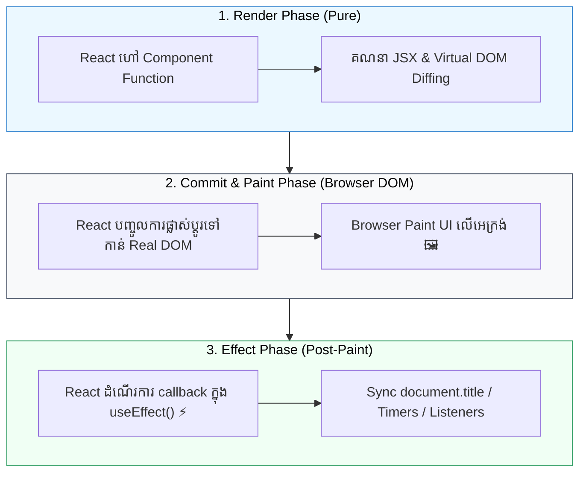

## 🧭 1. តើអ្វីទៅជា Side Effects ក្នុង React?

នៅក្នុង React, Functional Component ដ៏ល្អត្រូវតែជា **Pure Function**៖
- **Input:** ទទួល `props` និង `state`
- **Output:** Return ចេញជា `JSX` (UI representation)
- **លក្ខណៈពិសេស:** រាល់ពេលដែល Input ដូចគ្នា វាតែងតែ Return JSX ដដែល ដោយមិនកែប្រែអ្វីមួយនៅខាងក្រៅខ្លួនឡើយ (No Side Effects)។



> **និយមន័យ Side Effect:** គឺជាប្រតិបត្តិការ (Operation) ទាំងឡាយណាដែល **ទាក់ទង ឬ កែប្រែអ្វីមួយនៅខាងក្រៅ** Scope នៃ Component Function របស់ React ដូចជា៖
> 1. **Direct DOM Mutation:** ការកែប្រែ `document.title`, `document.body.style`
> 2. **Timers:** ការប្រើប្រាស់ `setTimeout` ឬ `setInterval`
> 3. **Window Event Listeners:** ការចាប់ព្រឹត្តិការណ៍ `resize`, `scroll`, `keydown` លើ `window`
> 4. **Browser Storage:** ការអាន ឬ សរសេរទៅកាន់ `localStorage` / `sessionStorage`
> 5. **Media Controls:** ការបញ្ជា `audio.play()`, `video.pause()` ឬ Canvas Drawing

---

## 🚫 2. ហេតុអ្វីមិនអាចដាក់ Side Effects ក្នុង Render Phase?

ចូរពិនិត្យមើលកូដមិនត្រឹមត្រូវខាងក្រោម៖

```jsx
// ❌ កូដខុសធ្ងន់ធ្ងរ៖ Side effect ដាក់ក្នុង render phase ដោយផ្ទាល់
export function BadComponent({ count }) {
  // គ្រោះថ្នាក់៖ កែប្រែ DOM ខាងក្រៅក្នុងពេល render
  document.title = `Count: ${count}`;

  // គ្រោះថ្នាក់៖ បង្កើត timer ថ្មីរាល់ពេល render ដោយគ្មាន cleanup
  setInterval(() => {
    console.log("Tick!");
  }, 1000);

  return <h1>Count is {count}</h1>;
}
```

### បញ្ហាដែលកើតឡើង៖
1. **Block ការបង្ហាញ UI:** ប្រតិបត្តិការដែលស៊ីពេលនឹងធ្វើឱ្យ UI គាំង (Freeze) មិនទាន់ paint លើអេក្រង់។
2. **Zombie Timers & Leaks:** `setInterval` ត្រូវបានបង្កើតម្តងហើយម្តងទៀតរាល់ render ធ្វើឱ្យ memory ពេញ។
3. **Inconsistent UI:** Side Effects ដំណើរការមុនពេល DOM ពិតប្រាកដត្រូវបាន update។

---

## ⚙️ 3. Execution Cycle របស់ React ជាមួយ useEffect

React បែងចែកការងារជា ៣ ដំណាក់កាលច្បាស់លាស់៖



```reactdiagram
Lifecycle
```

---

## 📝 4. Syntax និង Mental Model នៃ `useEffect`

`useEffect` គឺជា Hook មួយដែលអនុញ្ញាតឱ្យយើង **Synchronize (ធ្វើសមកាលកម្ម)** Component របស់យើងជាមួយ External System (ដូចជា Browser APIs, Timers, DOM) បន្ទាប់ពី UI ត្រូវបានបង្ហាញលើអេក្រង់។

```jsx
import { useEffect } from 'react';

useEffect(() => {
  // 1. Setup Code (ដំណើរការបន្ទាប់ពី Paint DOM រួចរាល់)
  console.log("Effect បានដំណើរការ!");

  return () => {
    // 2. Cleanup Code (ដំណើរការមុន Re-run Effect ឬ ពេល Unmount)
    console.log("សម្អាត (Cleanup)!");
  };
}, [/* 3. Dependencies */]);
```

### Parameter ទាំងពីររបស់ `useEffect`៖
1. **Effect Callback Function (`setup`):** ជា Function ដែលផ្ទុកកូដ Side Effect របស់យើង។
2. **Dependency Array (`dependencies`):** ជា Array នៃតម្លៃ (Props ឬ State) ដែល React ត្រូវតាមដានដើម្បីសម្រេចថាតើត្រូវ Re-run Effect នេះនៅពេលណា។

---

## 💻 5. ឧទាហរណ៍អនុវត្តជាក់ស្តែង៖ Sync Document Title & Notification Badge

ចូរពិនិត្យមើលឧទាហរណ៍ជាក់ស្តែងមួយនៃការ Sync State ទៅកាន់ Browser Tab Title តាមរយៈ `useEffect`៖

```jsx
import { useState, useEffect } from 'react';

export default function NotificationBadge() {
  const [unreadCount, setUnreadCount] = useState(0);

  // ✅ Synchronize document.title ជាមួយ unreadCount state
  useEffect(() => {
    if (unreadCount > 0) {
      document.title = `(${unreadCount}) សារថ្មី - Dashboard`;
    } else {
      document.title = `Dashboard - គ្មានសារថ្មី`;
    }

    console.log(`Document title ត្រូវបាន Sync ទៅ៖ ${document.title}`);
  }, [unreadCount]); // Re-run តែនៅពេល unreadCount ប្រែប្រួលប៉ុណ្ណោះ

  return (
    <div className="p-6 max-w-sm mx-auto bg-white dark:bg-gray-900 border border-gray-200 dark:border-gray-800 rounded-2xl shadow-sm text-center">
      <div className="inline-flex items-center justify-center w-12 h-12 rounded-full bg-blue-100 dark:bg-blue-900/40 text-blue-600 dark:text-blue-400 mb-4 font-black text-xl">
        🔔
      </div>
      
      <h3 className="text-xl font-bold text-gray-900 dark:text-white mb-1">
        ប្រព័ន្ធដំណឹង (Notification Badge)
      </h3>
      <p className="text-sm text-gray-500 dark:text-gray-400 mb-6">
        ចំនួនសារមិនទាន់អាន៖ <span className="font-bold text-blue-600 dark:text-blue-400">{unreadCount}</span>
      </p>

      <div className="flex gap-2 justify-center">
        <button
          onClick={() => setUnreadCount(prev => prev + 1)}
          className="px-4 py-2 bg-blue-600 hover:bg-blue-700 text-white text-sm font-semibold rounded-xl transition shadow-sm"
        >
          + ផ្ញើសារថ្មី
        </button>
        <button
          onClick={() => setUnreadCount(0)}
          className="px-4 py-2 bg-gray-100 hover:bg-gray-200 dark:bg-gray-800 dark:hover:bg-gray-700 text-gray-700 dark:text-gray-300 text-sm font-semibold rounded-xl transition"
        >
          សម្អាត (Clear)
        </button>
      </div>
    </div>
  );
}
```

---

## 🎯 សេចក្តីសង្ខេប (Key Takeaways)

1. **Pure Rendering:** Render Phase ត្រូវតែគ្មាន Side Effects ជានិច្ច។
2. **Post-Paint Timing:** `useEffect` ដំណើរការបន្ទាប់ពី Browser បាន Paint DOM រួច ដើម្បីកុំឱ្យប៉ះពាល់ដល់ល្បឿន Render។
3. **Synchronization Focus:** គិតពី `useEffect` ថាជាឧបករណ៍សម្រាប់ **Sync Component ជាមួយ External Systems** (DOM, Browser APIs, Timers, Window Listeners)។
