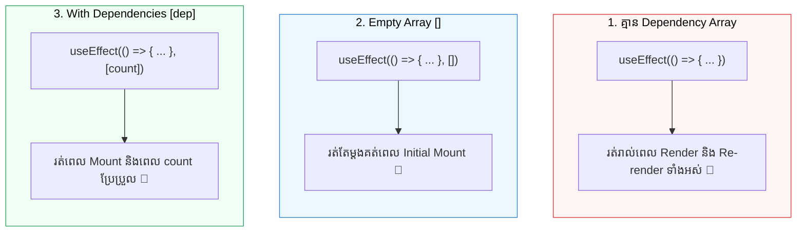

## 🎯 1. The 3 Dependency Modes



---

## 🔬 2. Comparing the 3 Modes in Code

### 🌐 Normal HTML / User Interaction Model:

```html
<!-- HTML Controls: Counter Button & Search Input -->
<div class="interactive-panel">
  <button id="btn-count">Count: 0</button>
  <input type="text" id="txt-search" placeholder="Type query..." />
</div>
```

### 💻 React Code (បំបែកតាម Mode នីមួយៗ):

```jsx
import { useState, useEffect } from 'react';

export function DependencyDemo() {
  const [count, setCount] = useState(0);
  const [query, setQuery] = useState('');

  // 🔴 Mode 1: No Dependency Array
  useEffect(() => {
    console.log('Mode 1: រត់គ្រប់ Render ទាំងអស់ (ទោះ count ឬ query ប្តូរ)');
  });

  // 🔵 Mode 2: Empty Dependency Array []
  useEffect(() => {
    console.log('Mode 2: រត់តែម្តងគត់ ពេល Component ទើបបង្ហាញដំបូង (Mount)');
  }, []);

  // 🟢 Mode 3: Specific Dependency [count]
  useEffect(() => {
    console.log(`Mode 3: រត់តែពេល count ប្រែប្រួល (បច្ចុប្បន្ន = ${count})`);
  }, [count]);

  return (
    <div>
      <button onClick={() => setCount((c) => c + 1)}>Increment Count ({count})</button>
      <input value={query} onChange={(e) => setQuery(e.target.value)} placeholder="Type query..." />
    </div>
  );
}
```

### 🔍 ការពន្យល់មួយជួរៗ (Line-by-Line Explanation):

1. `useEffect(() => { ... })` *(No Array)*
   - គ្មាន Array ខាងចុង $\rightarrow$ React នឹង run Effect នេះរាល់ពេល Component Re-render មិនថា State ណាមួយប្រែប្រួលក៏ដោយ។
2. `useEffect(() => { ... }, [])` *(Empty Array)*
   - មាន `[]` ទទេ $\rightarrow$ ប្រាប់ React ថា "គ្មាន Dependencies ណាដែលត្រូវតាមដានទេ" ដូច្នេះវា run តែលើកទី ១ (Mount) ប៉ុណ្ណោះ។ ស័ក្តិសមសម្រាប់ Initial Data Fetching ឬ Event Listener Setup។
3. `useEffect(() => { ... }, [count])` *(With Dependency)*
   - React នឹងប្រៀបធៀបតម្លៃចាស់ និងថ្មីនៃ `count` ដោយប្រើ `Object.is(oldVal, newVal)`។ បើ `count` ផ្លាស់ប្តូរ ទើប Effect ត្រូវបាន execute។

---

## 🚀 3. Complete Interactive Dependency Inspector

```jsx
import { useState, useEffect } from 'react';

export default function DependencyInspector() {
  const [count, setCount] = useState(0);
  const [text, setText] = useState('');
  const [logs, setLogs] = useState([]);

  const addLog = (msg) => {
    setLogs((prev) => [`[${new Date().toLocaleTimeString()}] ${msg}`, ...prev.slice(0, 4)]);
  };

  // Mode 2: Mount only
  useEffect(() => {
    addLog('🚀 Component Mounted (Mode 2: [])');
  }, []);

  // Mode 3: Specific count change
  useEffect(() => {
    if (count > 0) {
      addLog(`🎯 Count changed to ${count} (Mode 3: [count])`);
    }
  }, [count]);

  return (
    <div className="max-w-md mx-auto p-6 bg-white dark:bg-slate-800 rounded-2xl shadow border space-y-4">
      <h3 className="font-bold text-lg text-slate-800 dark:text-white">
        🔬 Dependency Inspector
      </h3>

      <div className="flex gap-2">
        <button
          onClick={() => setCount((c) => c + 1)}
          className="px-4 py-2 bg-blue-600 text-white rounded-xl font-bold text-sm"
        >
          Count: {count}
        </button>
        <input
          type="text"
          value={text}
          onChange={(e) => setText(e.target.value)}
          placeholder="វាយអក្សរទីនេះ..."
          className="flex-1 px-3 py-2 border rounded-xl dark:bg-slate-700 dark:text-white text-sm"
        />
      </div>

      {/* Execution Log */}
      <div className="bg-slate-900 text-green-400 p-3 rounded-xl font-mono text-xs space-y-1">
        <p className="text-slate-400 font-sans font-bold mb-1">📋 Effect Execution Logs:</p>
        {logs.map((log, i) => (
          <p key={i}>{log}</p>
        ))}
      </div>
    </div>
  );
}
```
