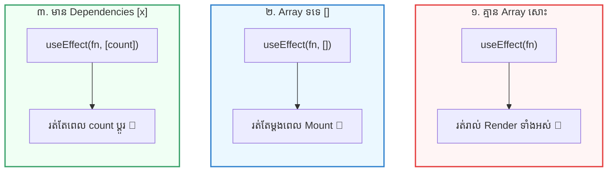

## 🎯 ១. ទម្រង់ទាំង ៣ នៃ Dependency Array

នៅក្នុង `useEffect(setupFunction, dependencies)` តម្លៃ **Dependency Array (អាគុយម៉ង់ទី ២)** ជាអ្នកកំណត់ថា៖ **«តើពេលណាទើប Effect គួររត់ឡើងវិញ?»**



---

## 🎮 ២. Interactive Simulator — សាកល្បងដោយផ្ទាល់

ខាងក្រោមនេះជា Simulator អន្តរកម្ម។ ចុចសាកល្បង **ប្តូររវាង Mode ទាំង ៣** រួចចុចប៊ូតុង State ដើម្បីតាមដានថាតើពេលណាខ្លះដែល Effect ដំណើរការ ឬត្រូវបានរំលង៖

```reactdiagram
UseEffect
```

> [!TIP]
> **សាកល្បងពិសោធន៍:**
> 1. ជ្រើសរើស **«1. គ្មាន [] (No Array)»** ➔ ចុចប្តូរ Count ឬ Text ➔ Effect នឹងរត់គ្រប់ដងទាំងអស់ ព្រោះ Component បាន Re-render!
> 2. ជ្រើសរើស **«2. ទទេ [] (Empty Array)»** ➔ ចុចប៊ូតុងទាំងពីរ ➔ Effect មិនរត់ទៀតឡើយ (Run Count នៅត្រឹម ១ ដដែល)!
> 3. ជ្រើសរើស **«3. មាន [count] (With Deps)»** ➔ ចុចប្តូរ Count ➔ Effect រត់។ ចុចប្តូរ Text ➔ Effect ត្រូវបានរំលង (Skip) ព្រោះ `count` នៅដដែល!

---

## 🔬 ៣. របៀបដែល React ប្រៀបធៀប Dependencies (`Object.is`)

តើ React ដឹងដោយរបៀបណាថា Dependency បានប្រែប្រួល ឬនៅដដែល?  
React ប្រើក្បួន **`Object.is(oldValue, newValue)`** ដើម្បីធ្វើ **Shallow Comparison** (ប្រៀបធៀបកម្រិតស្រទាប់ក្រៅ)៖

### ក. Primitive Values (Number, String, Boolean, null, undefined):
```javascript
Object.is(5, 5);             // true  ➔ តម្លៃដដែល ➔ Skip Effect ✅
Object.is("hello", "hello"); // true  ➔ តម្លៃដដែល ➔ Skip Effect ✅
Object.is(0, 1);             // false ➔ តម្លៃប្រែប្រួល ➔ Run Effect ⚡
```
សម្រាប់ Primitive values គឺគ្មានបញ្ហាអ្វីឡើយ ព្រោះវាប្រៀបធៀបតម្លៃផ្ទាល់!

### ខ. Reference Values (Object, Array, Function):
```javascript
const obj1 = { theme: 'dark' };
const obj2 = { theme: 'dark' };

Object.is(obj1, obj2); // ❌ false! ទោះបីទិន្នន័យខាងក្នុងដូចគ្នា ក៏ Memory Address ខុសគ្នាដែរ!
```
នេះហើយជាប្រភពនៃ **«អន្ទាក់ធំបំផុតក្នុង React»** ដែលយើងនឹងមើលនៅជំហានបន្ទាប់!

---

## 🪤 ៤. The Object & Function Reference Trap (អន្ទាក់ដ៏គ្រោះថ្នាក់)

### ⚠️ មើលឧទាហរណ៍អន្ទាក់នេះ៖

```jsx
function BadComponent() {
  const [count, setCount] = useState(0);

  // ❌ គ្រោះថ្នាក់: Object នេះត្រូវបានបង្កើតថ្មី (New Reference) រាល់ពេល Render!
  const options = { theme: 'dark' };

  useEffect(() => {
    console.log("Effect កំពុងរត់...");
  }, [options]); // 💥 ជួបបញ្ហា: options លើកនេះ !== options លើកមុន ➔ Effect រត់រាល់ពេល Render!

  return <button onClick={() => setCount(c => c + 1)}>Count: {count}</button>;
}
```

### 💡 ៣ វិធីដោះស្រាយដ៏ត្រឹមត្រូវ៖

#### វិធីទី ១ ៖ បញ្ជូន Primitive Value ជំនួសវិញ (វិធីងាយស្រួលបំផុត)
```jsx
// ✅ ជំនួសឱ្យការតាមដាន Object ទាំងមូល យើងតាមដានតែ string 'dark' ប៉ុណ្ណោះ
useEffect(() => {
  console.log("Effect កំពុងរត់...");
}, [options.theme]); // options.theme ជា String "dark" (Primitive) ➔ មិន Re-run ឥតប្រយោជន៍!
```

#### វិធីទី ២ ៖ រើ Object ចូលទៅក្នុង `useEffect` តែម្តង
```jsx
// ✅ បើ Object នោះប្រើតែក្នុង Effect រើវាចូលក្នុង Effect ផ្ទាល់
useEffect(() => {
  const options = { theme: 'dark' };
  // ប្រើប្រាស់ options នៅទីនេះ...
}, []); // មិនបាច់មាន options ជា dependency ទៀតទេ!
```

#### វិធីទី ៣ ៖ ប្រើ `useMemo` ឬ `useCallback`
```jsx
// ✅ រក្សា Reference ដដែលតាមរយៈ useMemo
const options = useMemo(() => ({ theme: 'dark' }), []);

useEffect(() => {
  console.log("Effect កំពុងរត់...");
}, [options]);
```

---

## 🛑 ៥. ក្បួនមិនកុហក React (The Exhaustive-deps Rule)

តើអ្នកធ្លាប់ជួប Warning ពណ៌លឿងពី ESLint ដែរឬទេ?  
> `React Hook useEffect has a missing dependency: 'count'`

### ❓ ហេតុអ្វីបានជាយើងមិនគួរ "កុហក" React ដោយដក Variable ចោល?
សាកមើលកូដនេះ៖
```jsx
// ❌ កូដកុហក React (បាត់ count ក្នុង dependency)
useEffect(() => {
  const timer = setInterval(() => {
    // ⚠️ Stale Closure: count នៅក្នុងនេះនឹងជាប់គាំងនៅតម្លៃ 0 រហូត!
    setCount(count + 1);
  }, 1000);

  return () => clearInterval(timer);
}, []); // កុហកថាគ្មាន dependency
```
**លទ្ធផលខូច៖** ក្រោយពេល ១ វិនាទី `count` ឡើងដល់ ១។ ប៉ុន្តែវិនាទីបន្ទាប់វានៅតែឡើងដល់ ១ ដដែល ព្រោះវាជាប់គាំងតម្លៃ `count = 0` ចាស់ពីពេលដំបូង (Stale Closure)!

### ✨ ដំណោះស្រាយដ៏ឆ្លាតវៃ៖ Functional State Update
```jsx
// ✅ ដំណោះស្រាយត្រឹមត្រូវ ១០០%
useEffect(() => {
  const timer = setInterval(() => {
    // ប្រើ callback (prev => prev + 1) ➔ React យកតម្លៃចុងក្រោយបង្អស់ដោយស្វ័យប្រវត្តិ
    setCount((prev) => prev + 1);
  }, 1000);

  return () => clearInterval(timer);
}, []); // ពេលនេះមិនបាច់ដាក់ count ក្នុង dependency ទេ ហើយកូដដើរយ៉ាងត្រឹមត្រូវ!
```

---

## 🚀 ៦. Complete Working Code (កូដពេញលេញ)

```jsx
import { useState, useEffect } from 'react';

export default function DependencyMastery() {
  const [count, setCount] = useState(0);
  const [search, setSearch] = useState('');
  const [logs, setLogs] = useState([]);

  const addLog = (text) => {
    setLogs((prev) => [`[${new Date().toLocaleTimeString()}] ${text}`, ...prev.slice(0, 3)]);
  };

  // 1. Empty Array: រត់តែម្តងគត់ពេល Mount
  useEffect(() => {
    addLog('🚀 Component Mount ដំបូង (Empty [])');
  }, []);

  // 2. Specific Dependency: រត់តែពេល count ប្តូរ
  useEffect(() => {
    if (count > 0) {
      addLog(`🎯 Count បានផ្លាស់ប្តូរទៅជា: ${count} ([count])`);
    }
  }, [count]);

  return (
    <div className="max-w-md mx-auto p-6 bg-white dark:bg-slate-800 rounded-2xl shadow-lg border border-slate-200 dark:border-slate-700 space-y-4">
      <h3 className="font-bold text-lg text-slate-800 dark:text-white">
        🔬 ការអនុវត្ត Dependency Array ជាក់ស្តែង
      </h3>

      <div className="flex gap-2">
        <button
          onClick={() => setCount((c) => c + 1)}
          className="px-4 py-2 bg-blue-600 hover:bg-blue-700 text-white rounded-xl font-bold text-sm transition"
        >
          Count: {count}
        </button>

        <input
          type="text"
          value={search}
          onChange={(e) => setSearch(e.target.value)}
          placeholder="វាយអក្សរ (Re-render)..."
          className="flex-1 px-3 py-2 border rounded-xl dark:bg-slate-900 dark:border-slate-700 dark:text-white text-sm outline-none focus:ring-2 focus:ring-blue-500"
        />
      </div>

      <div className="bg-slate-900 text-emerald-400 p-3.5 rounded-xl font-mono text-xs space-y-1">
        <div className="text-slate-400 font-sans font-bold mb-1">📋 កំណត់ហេតុ Effect:</div>
        {logs.map((log, idx) => (
          <div key={idx}>{log}</div>
        ))}
      </div>
    </div>
  );
}
```

---

## 🧠 ៧. សង្ខេបច្បាប់មាសងាយចាំ (Summary Cheat Sheet)

| ច្បាប់ | ការណែនាំ |
| :--- | :--- |
| **គ្មាន Array** | `useEffect(fn)` ➔ រត់គ្រប់ Render (ប្រយ័ត្នបញ្ហា Performance) |
| **Array ទទេ `[]`** | `useEffect(fn, [])` ➔ រត់តែ ១ ដងគត់ពេល Mount (Initial API Fetch) |
| **មាន Dependency `[a, b]`** | `useEffect(fn, [a, b])` ➔ រត់តែពេល `a` ឬ `b` ប្រែប្រួល |
| **កុំដាក់ Object ថ្មីក្នុង Array** | ជំនួសដោយ Primitive value (ឧ. `[user.id]`) ឬប្រើ `useMemo` |
| **ប្រើ Functional Update** | ប្រើ `setVal(prev => prev + 1)` ដើម្បីកុំឱ្យជាប់គាំង Stale Closures |
