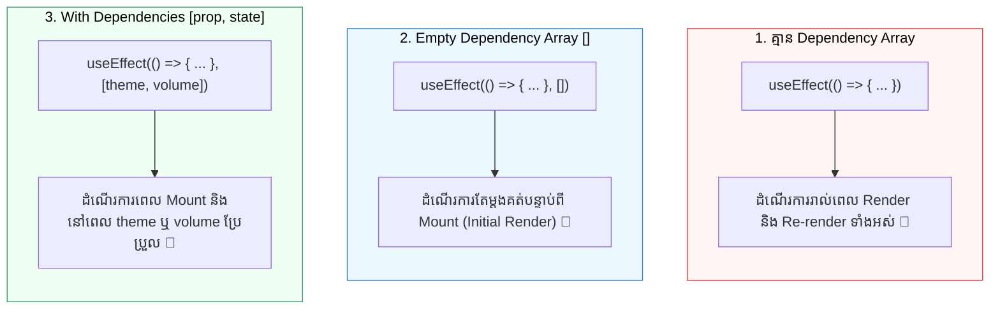
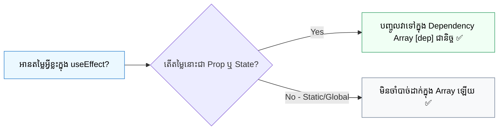

## 🎯 1. ទម្រង់ទាំង ៣ នៃ Dependency Array

Dependency Array ប្រាប់ React ថា៖ *"កុំដំណើរការ Effect នេះឡើងវិញ លុះត្រាតែតម្លៃក្នុង Array នេះមានការប្រែប្រួល!"*



### តារាងប្រៀបធៀបសង្ខេប៖

| ទម្រង់ Dependency | ពេលណា Effect ដំណើរការ? | ករណីប្រើប្រាស់ទូទៅ (Use Cases) |
| :--- | :--- | :--- |
| **`useEffect(fn)`**<br>*(No Array)* | គ្រប់ Render ទាំងអស់ (Mount + Every Update) | Component Render Logging, DOM Measurements |
| **`useEffect(fn, [])`**<br>*(Empty Array)* | តែម្តងគត់ពេល Mount (Initial Render) | Attach window listeners, initialize timer |
| **`useEffect(fn, [a, b])`**<br>*(With Dependencies)* | ពេល Mount និងពេលតម្លៃ `a` ឬ `b` ប្រែប្រួល | Sync `document.title`, sync theme, audio volume |

---

## 🔍 2. យន្តការ Dependency Comparison (`Object.is`)

នៅចន្លោះ Renders នីមួយៗ React នឹងយកតម្លៃ Dependency ក្នុង Render មុន មកប្រៀបធៀបជាមួយ Render បច្ចុប្បន្នដោយប្រើ Algorithm **`Object.is()`** (Shallow Equality)៖

```javascript
// React ធ្វើការប្រៀបធៀប Dependency នីមួយៗតាមរបៀបនេះ៖
Object.is(prevDep, nextDep);

// ឧទាហរណ៍ជាមួយ Primitives (Numbers, Strings, Booleans):
Object.is(5, 5);             // true  -> មិន Re-run Effect ទេ ✅
Object.is("dark", "light");  // false -> React នឹង Re-run Effect! 🔄

// ឧទាហរណ៍ជាមួយ Objects & Arrays (Reference Comparison):
Object.is({ theme: 'dark' }, { theme: 'dark' }); // false! (Memory address ខុសគ្នា) ⚠️
Object.is([1, 2], [1, 2]);                       // false! (Memory address ខុសគ្នា) ⚠️
```

---

## ⚠️ 3. The Object & Function Reference Trap

កំហុសទូទៅបំផុតមួយដែល Developer តែងជួបប្រទះគឺការបង្កើត Object ឬ Function នៅខាងក្នុង Component Body ហើយយកវាទៅដាក់ក្នុង Dependency Array៖

```jsx
// ❌ កូដមានបញ្ហា៖ Object Reference Trap
function AudioPlayer({ soundType, volume }) {
  // ⚠️ រាល់ពេល AudioPlayer render, object 'config' ត្រូវបានបង្កើតថ្មីក្នុង Memory!
  const config = { soundType, volume };

  useEffect(() => {
    console.log(`Setting audio volume: ${config.volume} for ${config.soundType}`);
  }, [config]); // 🚨 config ផ្លាស់ប្តូរ memory address គ្រប់ render -> Effect run គ្មានឈប់!

  return <div>...</div>;
}
```

### 💡 វិធីដោះស្រាយបញ្ហា Reference Trap៖

#### វិធីទី ១៖ ប្រើ Primitive Values ក្នុង Dependency Array ដោយផ្ទាល់ (Recommended)
```jsx
// ✅ វិធីល្អបំផុត៖ បំប្លែងទៅជា Primitive values (soundType, volume ជា string / number)
useEffect(() => {
  console.log(`Setting audio volume: ${volume} for ${soundType}`);
}, [soundType, volume]); // ✅ Re-run តែនៅពេល volume ឬ soundType ប្រែប្រួលពិតប្រាកដ
```

#### វិធីទី ២៖ ផ្លាស់ប្តូរ Object ឬ Function ទៅក្រៅ Component (បើមិនពឹងលើ Props/State)
```jsx
// ✅ ប្រសិនបើតម្លៃថេរ ចូរដាក់វានៅក្រៅ Component function
const DEFAULT_PREFERENCES = { autoPlay: false, loop: true };

function AudioControls() {
  useEffect(() => {
    applyAudioPreferences(DEFAULT_PREFERENCES);
  }, []); // មិនបាច់ដាក់ DEFAULT_PREFERENCES ព្រោះវាជា static reference នៅខាងក្រៅ
}
```

---

## 🛡️ 4. ក្បួនមាសនៃ `exhaustive-deps` Rule

React មាន ESLint Rule មួយឈ្មោះថា `react-hooks/exhaustive-deps`។

> **ក្បួនមាស (Golden Rule):** រាល់ reactive value ទាំងអស់ (Props, State, ឬ Variables/Functions ដែលគណនាពី Props/State) ដែលត្រូវបាន **អាន (Read)** នៅខាងក្នុង `useEffect` ត្រូវតែដាក់បញ្ចូលក្នុង Dependency Array ទាំងអស់!



### ឧទាហរណ៍ជាក់ស្តែង៖ ជៀសវាង Stale State ជាមួយ Functional Updates

ប្រសិនបើអ្នកចង់ Update State ក្នុង Timer ដោយមិនចាំបាច់ដាក់ State នោះក្នុង Dependency Array ចូរប្រើ **Functional State Updates**៖

```jsx
import { useState, useEffect } from 'react';

export function CleanTimer() {
  const [seconds, setSeconds] = useState(0);

  useEffect(() => {
    const timer = setInterval(() => {
      // ✅ ប្រើ functional update: prev => prev + 1
      // យើងមិនចាំបាច់ដាក់ 'seconds' ក្នុង dependency array ឡើយ!
      setSeconds(prev => prev + 1);
    }, 1000);

    return () => clearInterval(timer);
  }, []); // ✅ Dependency array នៅតែ empty [] តែ State update បានត្រឹមត្រូវជានិច្ច!

  return <h2 className="text-2xl font-bold font-mono">{seconds}s</h2>;
}
```

---

## 🎯 សេចក្តីសង្ខេប (Key Takeaways)

1. **៣ ទម្រង់:** `useEffect(fn)` (រាល់ render), `useEffect(fn, [])` (mount តែម្តង), `useEffect(fn, [deps])` (ពេល deps ប្រែប្រួល)។
2. **Object.is Shallow Comparison:** React ប្រៀបធៀបតម្លៃចាស់ និងតម្លៃថ្មី។ ប្រើ Primitive Dependencies ដើម្បីជៀសវាង Reference Recreation Trap។
3. **Include All Reactive Dependencies:** គោរពតាម `exhaustive-deps` ដើម្បីការពារកុំឱ្យមាន Bugs និង Stale Closures។
4. **Functional Updates:** ប្រើ `setCount(c => c + 1)` ក្នុង timers/callbacks ដើម្បីកុំឱ្យ dependency array រីកធំ។
