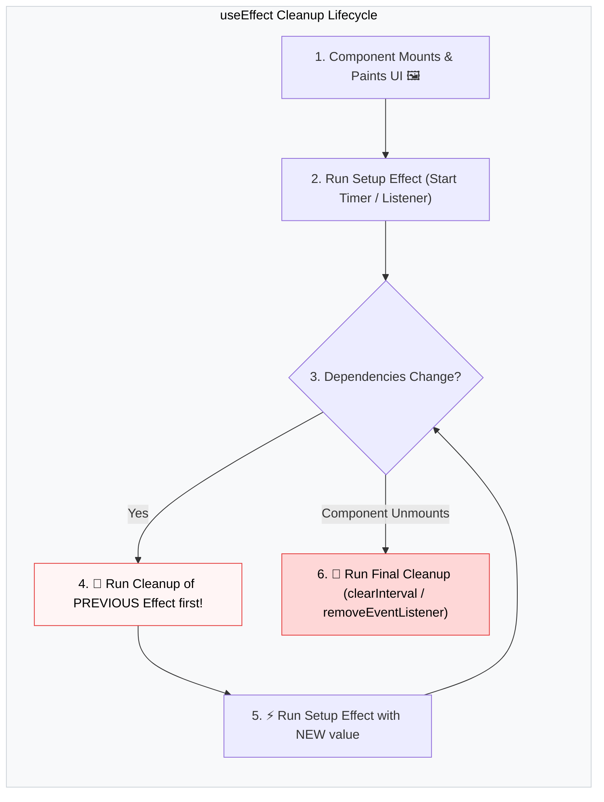

## 🧹 1. Lifecycle of Cleanup Function



---

## ⏱️ 2. Example A: Timer Interval Cleanup

### 🌐 Normal HTML / Vanilla JavaScript:

```html
<!-- HTML Digital Clock -->
<div id="clock">00:00:00</div>

<script>
  // ចាប់ផ្តើម Timer
  const timerId = setInterval(() => {
    document.getElementById('clock').innerText = new Date().toLocaleTimeString();
  }, 1000);

  // ពេលចាកចេញ ត្រូវតែលុប Timer ចោលការពារ Memory Leak!
  // clearInterval(timerId);
</script>
```

### 💻 React Code (ជាមួយ `useEffect` Cleanup):

```jsx
import { useState, useEffect } from 'react';

export function Clock() {
  const [time, setTime] = useState(new Date().toLocaleTimeString());

  useEffect(() => {
    // 1. Setup: ចាប់ផ្តើម Timer
    const timerId = setInterval(() => {
      setTime(new Date().toLocaleTimeString());
    }, 1000);

    // 2. Cleanup: បញ្ឈប់ Timer ពេល Component Unmount
    return () => {
      clearInterval(timerId);
    };
  }, []); // [] = រត់ Setup ពេល Mount និង Cleanup ពេល Unmount

  return <div className="text-xl font-mono font-bold">⏰ {time}</div>;
}
```

### 🔍 ការពន្យល់មួយជួរៗ (Line-by-Line Explanation):

1. `const timerId = setInterval(...)`
   - ចាប់ផ្តើម Background Timer ក្នុង Browser ដើម្បី update ម៉ោងរៀងរាល់ ១ វិនាទីម្តង។
2. `return () => clearInterval(timerId);`
   - **Cleanup Function:** នៅពេល Component ត្រូវបានបិទ ឬ User ផ្លាស់ប្តូរទៅកាន់ទំព័រផ្សេង React នឹងហៅ Function នេះដោយស្វ័យប្រវត្តិដើម្បីលុប Timer ចោល ការពារកុំឱ្យ Timer បន្តរត់ស្ងាត់ៗក្នុង Background បង្កជា Memory Leak។

---

## 🖱️ 3. Example B: Window Event Listener Cleanup

### 🌐 Normal HTML / Vanilla JavaScript:

```html
<!-- HTML Mouse Coordinates Tracker -->
<p id="coords">Mouse: X: 0, Y: 0</p>

<script>
  function onMouseMove(e) {
    document.getElementById('coords').innerText = `Mouse: X: ${e.clientX}, Y: ${e.clientY}`;
  }
  window.addEventListener('mousemove', onMouseMove);
  // ពេលឈប់ប្រើ: window.removeEventListener('mousemove', onMouseMove);
</script>
```

### 💻 React Code (ជាមួយ Event Cleanup):

```jsx
import { useState, useEffect } from 'react';

export function MouseTracker() {
  const [coords, setCoords] = useState({ x: 0, y: 0 });

  useEffect(() => {
    // 1. Event Handler
    const handleMove = (e) => {
      setCoords({ x: e.clientX, y: e.clientY });
    };

    // 2. Add Listener លើ Window
    window.addEventListener('mousemove', handleMove);

    // 3. Cleanup: Remove Listener ជានិច្ច
    return () => {
      window.removeEventListener('mousemove', handleMove);
    };
  }, []);

  return <p>📍 Mouse: {coords.x}px, {coords.y}px</p>;
}
```

### 🔍 ការពន្យល់មួយជួរៗ (Line-by-Line Explanation):

1. `window.addEventListener('mousemove', handleMove);`
   - ចុះឈ្មោះស្ដាប់ចលនាកណ្ដុរលើ Window ទាំងមូល។
2. `return () => window.removeEventListener('mousemove', handleMove);`
   - **សំខាន់:** ប្រសិនបើគ្មាន Cleanup ទេ រាល់ពេល Component Re-mount ចំនួន Event Listener នឹងកើនឡើងទ្វេដង (2, 4, 8, 16...) ធ្វើឱ្យ Browser គាំង CPU ធ្ងន់ធ្ងរ។

---

## 🚀 4. Complete Integrated Toggle Component

```jsx
import { useState, useEffect } from 'react';

function LiveClock() {
  const [seconds, setSeconds] = useState(0);

  useEffect(() => {
    const id = setInterval(() => {
      setSeconds((s) => s + 1);
    }, 1000);

    return () => {
      console.log('🧹 Cleanup: Timer cleared successfully!');
      clearInterval(id);
    };
  }, []);

  return (
    <div className="p-4 bg-blue-50 dark:bg-slate-700 rounded-xl text-center">
      <p className="text-2xl font-mono font-bold text-blue-600 dark:text-blue-400">
        ⏱️ {seconds}s
      </p>
      <p className="text-xs text-slate-400 mt-1">Active Timer Running</p>
    </div>
  );
}

export default function CleanupDemo() {
  const [showClock, setShowClock] = useState(true);

  return (
    <div className="max-w-sm mx-auto p-6 bg-white dark:bg-slate-800 rounded-2xl shadow border space-y-4 text-center">
      <h3 className="font-bold text-lg text-slate-800 dark:text-white">
        🧹 Cleanup Function Demo
      </h3>

      <button
        onClick={() => setShowClock((prev) => !prev)}
        className="px-4 py-2 bg-slate-900 dark:bg-slate-100 text-white dark:text-slate-900 rounded-xl text-sm font-bold"
      >
        {showClock ? '🛑 Unmount Clock' : '▶️ Mount Clock'}
      </button>

      {showClock ? (
        <LiveClock />
      ) : (
        <p className="text-xs text-red-500 py-4">
          Clock Unmounted (Timer has been cleared by cleanup)
        </p>
      )}
    </div>
  );
}
```
