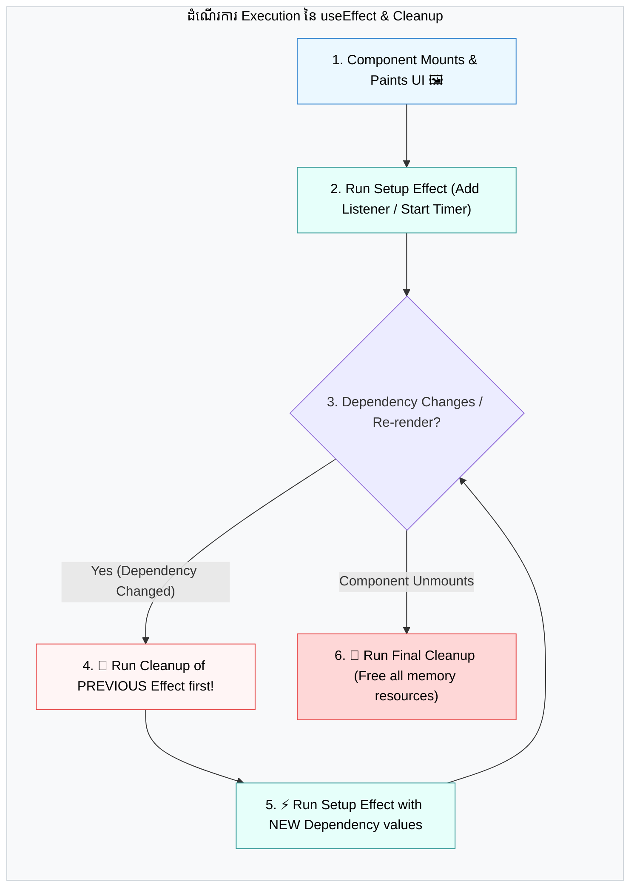
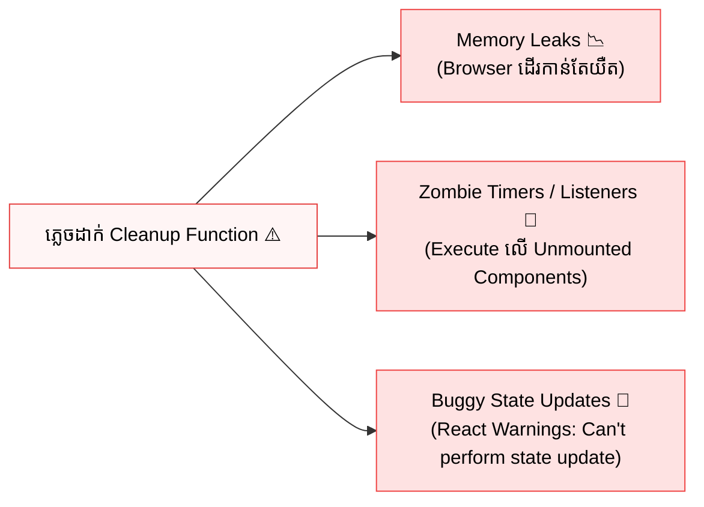

## 🧹 1. ហេតុអ្វីត្រូវមាន Cleanup Function?

នៅពេល Component ភ្ជាប់ទំនាក់ទំនងជាមួយ Browser APIs ដូចជាការចាប់ផ្តើម Timer (`setInterval`), ការស្តាប់ Keyboard/Mouse Events ឬការគូរ Animation Frame — ប្រតិបត្តិការទាំងនេះនឹងបន្តរស់នៅក្នុង Memory ទោះបីជា Component ត្រូវបានដកចេញពី DOM ក៏ដោយ!

> **Cleanup Function:** គឺជា Function មួយដែលយើង **Return ចេញពី Effect Callback** ដើម្បីធ្វើការលុបបំបាត់, បញ្ឈប់ ឬ សម្អាតរាល់ Browser Resources ទាំងអស់ដែល Effect បានបង្កើតឡើង។



---

## ⏱️ 2. Pattern 1: Timers (`setInterval` & `setTimeout`)

ប្រសិនបើអ្នកមិនធ្វើការ Clear Timer នៅពេល Component unmount ទេ `setInterval` នឹងបន្តហៅ callback រៀងរាល់វិនាទីជារៀងរហូត ដែលហៅថា **Zombie Timer**។

```jsx
import { useState, useEffect } from 'react';

export function StopWatch() {
  const [seconds, setSeconds] = useState(0);
  const [isActive, setIsActive] = useState(false);

  useEffect(() => {
    if (!isActive) return;

    // 1. Setup: បង្កើត Timer
    const intervalId = setInterval(() => {
      setSeconds(prev => prev + 1);
    }, 1000);

    // 2. Cleanup: សម្អាត Timer ពេល isActive ប្តូរ ឬ ពេល Component unmount
    return () => {
      clearInterval(intervalId);
      console.log("⏱️ Timer បានបញ្ឈប់ និងសម្អាតរួចរាល់!");
    };
  }, [isActive]); // Re-run តែនៅពេល isActive ប្រែប្រួល

  return (
    <div className="p-6 max-w-xs mx-auto text-center bg-white dark:bg-gray-900 border border-gray-200 dark:border-gray-800 rounded-2xl">
      <div className="text-5xl font-black text-blue-600 dark:text-blue-400 mb-4 font-mono">
        {seconds}s
      </div>
      <div className="flex gap-2 justify-center">
        <button
          onClick={() => setIsActive(!isActive)}
          className={`px-4 py-2 text-white font-bold rounded-xl transition ${
            isActive ? 'bg-amber-500 hover:bg-amber-600' : 'bg-emerald-600 hover:bg-emerald-700'
          }`}
        >
          {isActive ? 'ផ្អាក (Pause)' : 'ចាប់ផ្តើម (Start)'}
        </button>
        <button
          onClick={() => { setIsActive(false); setSeconds(0); }}
          className="px-4 py-2 bg-gray-200 dark:bg-gray-800 hover:bg-gray-300 dark:hover:bg-gray-700 text-gray-700 dark:text-gray-200 font-bold rounded-xl transition"
        >
          កំណត់ឡើងវិញ
        </button>
      </div>
    </div>
  );
}
```

---

## 🖱️ 3. Pattern 2: Global Window Event Listeners (`resize`, `keydown`, `scroll`)

នៅពេលអ្នកស្តាប់ Event លើ `window` (ដូចជា Scroll, Keydown, ឬ Resize) អ្នកត្រូវតែហៅ `window.removeEventListener` ក្នុង Cleanup Function ជានិច្ច៖

```jsx
import { useState, useEffect } from 'react';

export function WindowDimensionsViewer() {
  const [windowSize, setWindowSize] = useState({
    width: typeof window !== 'undefined' ? window.innerWidth : 0,
    height: typeof window !== 'undefined' ? window.innerHeight : 0,
  });

  useEffect(() => {
    const handleResize = () => {
      setWindowSize({
        width: window.innerWidth,
        height: window.innerHeight,
      });
    };

    // 1. Setup: Add Event Listener ទៅកាន់ window
    window.addEventListener('resize', handleResize);

    // 2. Cleanup: Remove Event Listener ពេល unmount
    return () => {
      window.removeEventListener('resize', handleResize);
      console.log("🧹 Resize listener ត្រូវបានដកចេញពី window!");
    };
  }, []); // Empty array [] ព្រោះយើង attach តែម្តងពេល mount

  return (
    <div className="p-4 bg-slate-50 dark:bg-slate-900/50 border border-slate-200 dark:border-slate-800 rounded-xl text-center">
      <p className="text-xs text-slate-500 uppercase tracking-wider font-bold mb-1">
        ទំហំអេក្រង់បច្ចុប្បន្ន (Window Size)
      </p>
      <p className="text-xl font-bold text-slate-800 dark:text-slate-100 font-mono">
        {windowSize.width}px × {windowSize.height}px
      </p>
    </div>
  );
}
```

---

## 🎞️ 4. Pattern 3: Animation Frames (`requestAnimationFrame`)

សម្រាប់ Smooth Graphics, Canvas ឬ Custom Game Loops យើងត្រូវតែ Cancel Animation Frame ពេល component unmount៖

```jsx
import { useState, useEffect } from 'react';

export function PulseAnimator() {
  const [scale, setScale] = useState(1);

  useEffect(() => {
    let animationFrameId;
    let angle = 0;

    const animate = () => {
      angle += 0.05;
      setScale(1 + Math.sin(angle) * 0.15); // Smooth breathing pulse
      animationFrameId = requestAnimationFrame(animate);
    };

    animationFrameId = requestAnimationFrame(animate);

    // 🧹 Cleanup: Cancel animation loop
    return () => {
      cancelAnimationFrame(animationFrameId);
    };
  }, []);

  return (
    <div className="flex justify-center p-8">
      <div
        style={{ transform: `scale(${scale})` }}
        className="w-20 h-20 bg-indigo-500 rounded-2xl shadow-lg flex items-center justify-center text-white font-bold"
      >
        Pulse
      </div>
    </div>
  );
}
```

---

## 🛑 5. អ្វីដែលកើតឡើងបើភ្លេច Cleanup? (Consequences of Missing Cleanup)



---

## 🎯 សេចក្តីសង្ខេប (Key Takeaways)

1. **Rule of Thumb:** រាល់ពេលដែល Effect បង្កើត **Listener**, **Timer**, ឬ **Animation Loop** ត្រូវតែមាន **Cleanup Function** សមាមាត្រជានិច្ច (`addEventListener` -> `removeEventListener`, `setInterval` -> `clearInterval`, `requestAnimationFrame` -> `cancelAnimationFrame`)។
2. **Timing of Cleanup:** Cleanup ដំណើរការ **មុនពេល Effect ថ្មី Execute** និង **នៅពេល Component Unmount**។
3. **Prevention of Memory Leaks:** ការសរសេរ Cleanup Function ត្រឹមត្រូវ ធានាថាកម្មវិធីរបស់អ្នកមានល្បឿនលឿន និងគ្មានបញ្ហា Memory Leaks ឡើយ។
