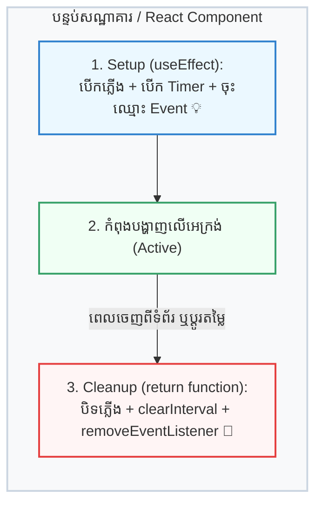
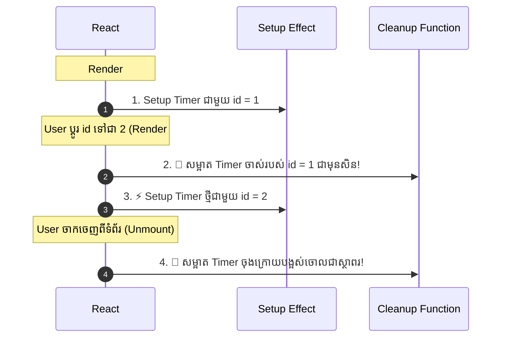

## 🏨 ១. ឧទាហរណ៍ជីវិតពិត ៖ ការជួលបន្ទប់សណ្ឋាគារ

ស្រមៃថាអ្នកទៅស្នាក់នៅសណ្ឋាគារមួយ៖
- **Setup (ចាប់ផ្តើម):** អ្នកចូលបន្ទប់ បើកម៉ាស៊ីនត្រជាក់ បើកភ្លើង និងរៀបចំឥវ៉ាន់ប្រើប្រាស់។
- **Cleanup (សម្អាត):** ពេលអ្នករៀបចំចាកចេញ (Checkout) អ្នកត្រូវតែ **បិទភ្លើង បិទម៉ាស៊ីនត្រជាក់ និងប្រគល់កូនសោ**។



> [!CAUTION]
> **ចុះបើគ្មាន Cleanup? (Memory Leak):**  
> ប្រសិនបើភ្ញៀវចេញពីបន្ទប់ដោយមិនព្រមបិទទឹក ឬបិទភ្លើង នោះភ្លើងនឹងបន្តឆេះខាតឥតប្រយោជន៍។  
> នៅក្នុង React ក៏ដូចគ្នាដែរ — ប្រសិនបើអ្នកបង្កើត `setInterval` ឬ `addEventListener` ហើយមិនព្រមសម្អាតពេលចាកចេញទេ វានឹងក្លាយជា **«Zombie Process»** ដែលបន្តរត់ស៊ី CPU និង Memory ស្ងាត់ៗក្នុងកុំព្យូទ័រ User!

---

## 🎮 ២. Interactive Simulator — សាកល្បង Mount & Unmount

ខាងក្រោមនេះជា Simulator បង្ហាញពី Lifecycle នៃ Component។ សាកល្បងចុចប៊ូតុង **"Mount / Unmount"** និងមើល **Execution Logs** ខាងក្រោម ដើម្បីឃើញថាតើ Cleanup ដំណើរការនៅពេលណា៖

```reactdiagram
Lifecycle
```

> [!TIP]
> **សង្កេតមើល:**
> 1. ពេលចុច **"Mount Component"** ➔ `useEffect` callback នឹងដំណើរការដំបូងគេ!
> 2. ពេលចុច **"Update State"** ➔ Component Re-render ធ្វើបច្ចុប្បន្នភាពលេខ។
> 3. ពេលចុច **"Unmount Component"** ➔ **Cleanup Function នឹងត្រូវបានហៅភ្លាមៗ** ដើម្បីបំផ្លាញ Timer និងសម្អាត Memory!

---

## ⏰ ៣. ពេលណាខ្លះដែល Cleanup Function ដំណើរការ?

មានករណីតែ **២ ប៉ុណ្ណោះ** ដែល React ហៅ Cleanup Function៖

```
១. ពេល Dependencies ផ្លាស់ប្តូរ (មុនពេល Effect ថ្មីរត់ ➔ វាសម្អាត Effect ចាស់សិន)
២. ពេល Component Unmount (ចាកចេញពីអេក្រង់ ➔ សម្អាតចោលជាស្ថាពរ)
```



---

## ⏱️ ៤. ឧទាហរណ៍ជាក់ស្តែង ៣ យ៉ាងនៃការប្រើ Cleanup

### ឧទាហរណ៍ទី ១ ៖ សម្អាត Timer (`setInterval`)

```jsx
import { useState, useEffect } from 'react';

function StopWatch() {
  const [seconds, setSeconds] = useState(0);

  useEffect(() => {
    // 1. SETUP: ចាប់ផ្តើម Timer
    const timerId = setInterval(() => {
      setSeconds((prev) => prev + 1);
    }, 1000);

    // 2. CLEANUP: បញ្ឈប់ Timer ពេល Component បិទ
    return () => {
      console.log("🧹 សម្អាត Timer ID:", timerId);
      clearInterval(timerId); // 👈 ការពារកុំឱ្យ Timer បន្តរត់
    };
  }, []);

  return <div className="text-2xl font-bold">⏱️ {seconds}s</div>;
}
```

---

### ឧទាហរណ៍ទី ២ ៖ សម្អាត Window Event Listener

```jsx
import { useState, useEffect } from 'react';

function MouseTracker() {
  const [coords, setCoords] = useState({ x: 0, y: 0 });

  useEffect(() => {
    const handleMouseMove = (e) => {
      setCoords({ x: e.clientX, y: e.clientY });
    };

    // 1. SETUP: ចុះឈ្មោះស្តាប់កណ្ដុរ
    window.addEventListener('mousemove', handleMouseMove);

    // 2. CLEANUP: ដកឈ្មោះចេញវិញជានិច្ច!
    return () => {
      window.removeEventListener('mousemove', handleMouseMove);
    };
  }, []);

  return <p>📍 Mouse: {coords.x}px, {coords.y}px</p>;
}
```

---

### ឧទាហរណ៍ទី ៣ ៖ Cancel Network Request ជាមួយ `AbortController`

នៅពេល User ចុចប្តូរទំព័រលឿនពេក មុនពេលទិន្នន័យពី Server មកដល់ យើងគួរតែ Cancel Request នោះចោល៖

```jsx
useEffect(() => {
  const controller = new AbortController();

  async function fetchUserData() {
    try {
      const response = await fetch(`/api/user/${userId}`, {
        signal: controller.signal, // 👈 ភ្ជាប់ signal ជាមួយ fetch
      });
      const data = await response.json();
      setUser(data);
    } catch (err) {
      if (err.name === 'AbortError') {
        console.log("Fetch ត្រូវបាន cancel ដោយសុវត្ថិភាព!");
      }
    }
  }

  fetchUserData();

  // CLEANUP: បើ userId ប្តូរ ឬ User ចាកចេញពីទំព័រ ➔ Cancel request ភ្លាម
  return () => {
    controller.abort();
  };
}, [userId]);
```

---

## 🚀 ៥. កូដពេញលេញ (Mount/Unmount Toggle Component)

```jsx
import { useState, useEffect } from 'react';

// Component កូនដែលមាន Timer
function ActiveTimer() {
  const [seconds, setSeconds] = useState(0);

  useEffect(() => {
    const id = setInterval(() => {
      setSeconds((s) => s + 1);
    }, 1000);

    return () => {
      console.log('🧹 Cleanup: Timer ត្រូវបាន clear ដោយជោគជ័យ!');
      clearInterval(id);
    };
  }, []);

  return (
    <div className="p-4 bg-emerald-50 dark:bg-emerald-950/30 border border-emerald-300 dark:border-emerald-800 rounded-xl text-center">
      <p className="text-3xl font-mono font-bold text-emerald-600 dark:text-emerald-400">
        ⏱️ {seconds}s
      </p>
      <p className="text-xs text-emerald-700 dark:text-emerald-300 mt-1">
        Timer កំពុងដំណើរការ...
      </p>
    </div>
  );
}

// Component មេសម្រាប់ Toggle បើក/បិទ
export default function CleanupDemo() {
  const [showTimer, setShowTimer] = useState(true);

  return (
    <div className="max-w-sm mx-auto p-6 bg-white dark:bg-slate-800 rounded-2xl shadow-lg border border-slate-200 dark:border-slate-700 space-y-4 text-center">
      <h3 className="font-bold text-lg text-slate-800 dark:text-white">
        🧹 Cleanup Function Demo
      </h3>

      <button
        onClick={() => setShowTimer((prev) => !prev)}
        className={`px-4 py-2 rounded-xl text-sm font-bold transition shadow ${
          showTimer
            ? 'bg-rose-600 hover:bg-rose-700 text-white'
            : 'bg-emerald-600 hover:bg-emerald-700 text-white'
        }`}
      >
        {showTimer ? '🛑 Unmount (បិទ Timer)' : '▶️ Mount (បើក Timer)'}
      </button>

      {showTimer ? (
        <ActiveTimer />
      ) : (
        <div className="p-4 bg-rose-50 dark:bg-rose-950/20 border border-rose-200 dark:border-rose-900 rounded-xl text-xs text-rose-600 dark:text-rose-400">
          Component ត្រូវបានដកចេញពីអេក្រង់ (Unmounted) ហើយ Timer ត្រូវបានបំផ្លាញចោលដោយ Cleanup Function!
        </div>
      )}
    </div>
  );
}
```

---

## 🧠 ៦. សង្ខេប Mental Model ងាយចាំ (Cheat Sheet)

| ប្រភេទ Side Effect | កូដ Setup (ក្នុង Effect) | កូដ Cleanup (ក្នុង Return) |
| :--- | :--- | :--- |
| **Timer** | `const id = setInterval(...)` | `clearInterval(id)` |
| **Timeout** | `const id = setTimeout(...)` | `clearTimeout(id)` |
| **DOM Event** | `window.addEventListener('event', fn)` | `window.removeEventListener('event', fn)` |
| **Network Fetch** | `fetch(url, { signal: ctrl.signal })` | `ctrl.abort()` |
| **WebSocket** | `const ws = new WebSocket(url)` | `ws.close()` |
