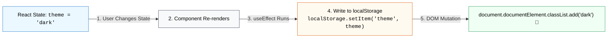

## 🌐 1. Synchronization ជាមួយ Browser `localStorage`

ការរក្សាទុកទិន្នន័យ (Settings, Theme, Draft text) ទៅកាន់ `localStorage` គឺជា Side Effect ដ៏ពេញនិយមមួយ៖



### កូដគំរូ៖ Persistent Theme Switcher

```jsx
import { useState, useEffect } from 'react';

export function ThemeSwitcher() {
  const [theme, setTheme] = useState(() => {
    // Lazy State Initialization: អានតម្លៃពី localStorage តែម្តងគត់ពេល Mount
    if (typeof window !== 'undefined') {
      return localStorage.getItem('app-theme') || 'light';
    }
    return 'light';
  });

  // ✅ Sync theme state ទៅកាន់ localStorage និង DOM
  useEffect(() => {
    localStorage.setItem('app-theme', theme);
    
    if (theme === 'dark') {
      document.documentElement.classList.add('dark');
    } else {
      document.documentElement.classList.remove('dark');
    }
  }, [theme]); // Re-sync រាល់ពេល theme ប្រែប្រួល

  return (
    <button
      onClick={() => setTheme(theme === 'light' ? 'dark' : 'light')}
      className="px-4 py-2 bg-slate-800 dark:bg-slate-100 text-white dark:text-slate-900 rounded-xl font-bold transition shadow"
    >
      {theme === 'light' ? '🌙 ប្តូរទៅ Dark Mode' : '☀️ ប្តូរទៅ Light Mode'}
    </button>
  );
}
```

---

## ⌨️ 2. Global Keyboard Shortcuts Listener (`Escape`, `Ctrl+K`)

ការចាប់ Key ចុចលើ Keyboard (ដូចជាចុច `Escape` ដើម្បីបិទ Dialog Modal) ត្រូវប្រើ `useEffect` ជាមួយ `window.addEventListener('keydown')`៖

```jsx
import { useState, useEffect } from 'react';

export function ModalWithEscapeKey() {
  const [isOpen, setIsOpen] = useState(false);

  useEffect(() => {
    // 1. ប្រសិនបើ Modal បិទ មិនបាច់ attach listener ឡើយ
    if (!isOpen) return;

    const handleKeyDown = (event) => {
      if (event.key === 'Escape') {
        console.log("Escape key pressed -> បិទ Modal");
        setIsOpen(false);
      }
    };

    // 2. Setup: Add keydown listener
    window.addEventListener('keydown', handleKeyDown);

    // 3. Cleanup: Remove listener ពេល Modal បិទ ឬ Unmount
    return () => {
      window.removeEventListener('keydown', handleKeyDown);
    };
  }, [isOpen]); // Re-run តែពេល isOpen ប្រែប្រួល

  return (
    <div>
      <button
        onClick={() => setIsOpen(true)}
        className="px-4 py-2 bg-blue-600 text-white font-bold rounded-xl"
      >
        បើកផ្ទាំង Modal
      </button>

      {isOpen && (
        <div className="fixed inset-0 bg-black/50 flex items-center justify-center p-4 z-50">
          <div className="bg-white dark:bg-gray-900 p-6 rounded-2xl max-w-sm w-full shadow-2xl space-y-4">
            <h3 className="text-lg font-bold">ចុច ESC លើ Keyboard ដើម្បីបិទ</h3>
            <p className="text-sm text-gray-500">ផ្ទាំងនេះនឹងបិទដោយស្វ័យប្រវត្តិតាមរយៈ useEffect Keydown Listener។</p>
            <button
              onClick={() => setIsOpen(false)}
              className="w-full py-2 bg-gray-200 dark:bg-gray-800 rounded-xl font-bold text-sm"
            >
              បិទផ្ទាំង (Close)
            </button>
          </div>
        </div>
      )}
    </div>
  );
}
```

---

## 📶 3. Network Online / Offline Detection

យើងអាចប្រើ `useEffect` ដើម្បីតាមដានថាតើ Device របស់ User មាន Internet Connection ឬ Offline៖

```jsx
import { useState, useEffect } from 'react';

export function NetworkStatusBanner() {
  const [isOnline, setIsOnline] = useState(
    typeof navigator !== 'undefined' ? navigator.onLine : true
  );

  useEffect(() => {
    const handleOnline = () => setIsOnline(true);
    const handleOffline = () => setIsOnline(false);

    window.addEventListener('online', handleOnline);
    window.addEventListener('offline', handleOffline);

    // 🧹 Cleanup
    return () => {
      window.removeEventListener('online', handleOnline);
      window.removeEventListener('offline', handleOffline);
    };
  }, []);

  if (isOnline) return null; // លាក់ Banner បើមាន Internet

  return (
    <div className="bg-amber-500 text-white text-xs font-bold py-2 px-4 text-center">
      ⚠️ គ្មានការតភ្ជាប់អ៊ីនធឺណិតទេ (Offline Mode)
    </div>
  );
}
```

---

## 📜 4. Window Scroll Progress Tracking

```jsx
import { useState, useEffect } from 'react';

export function ScrollProgressBar() {
  const [scrollProgress, setScrollProgress] = useState(0);

  useEffect(() => {
    const handleScroll = () => {
      const totalScroll = document.documentElement.scrollTop;
      const windowHeight =
        document.documentElement.scrollHeight -
        document.documentElement.clientHeight;
      const scroll = windowHeight > 0 ? (totalScroll / windowHeight) * 100 : 0;
      setScrollProgress(scroll);
    };

    window.addEventListener('scroll', handleScroll, { passive: true });

    return () => {
      window.removeEventListener('scroll', handleScroll);
    };
  }, []);

  return (
    <div className="fixed top-0 left-0 w-full h-1 bg-gray-200 z-50">
      <div
        className="h-full bg-blue-600 transition-all duration-75"
        style={{ width: `${scrollProgress}%` }}
      />
    </div>
  );
}
```

---

## 🎯 សេចក្តីសង្ខេប (Key Takeaways)

1. **Browser APIs Synchronization:** ប្រើ `useEffect` សម្រាប់ Sync ទៅកាន់ `localStorage`, `window.addEventListener`, និង `document` mutations។
2. **SSR Safety:** ត្រូវប្រាកដថាប្រើ `typeof window !== 'undefined'` មុននឹង access browser-only globals។
3. **Always Clean Up Listeners:** រាល់ Global Event Listener ត្រូវតែមាន `removeEventListener` ក្នុង cleanup function ជានិច្ច។
