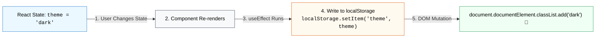

## 🌐 1. Synchronization Architecture



---

## 💾 2. Example A: LocalStorage Synchronization

### 🌐 Normal HTML / Vanilla JS:

```html
<!-- HTML Theme Toggle -->
<button onclick="localStorage.setItem('theme', 'dark'); document.body.className = 'dark';">
  Switch to Dark
</button>
```

### 💻 React Code (ជាមួយ `useEffect` Sync):

```jsx
import { useState, useEffect } from 'react';

export function StorageSyncDemo() {
  const [theme, setTheme] = useState(() => {
    return localStorage.getItem('user_theme') || 'light';
  });

  // Sync State ទៅ LocalStorage គ្រប់ពេល theme ប្រែប្រួល
  useEffect(() => {
    localStorage.setItem('user_theme', theme);
  }, [theme]);

  return (
    <button onClick={() => setTheme((t) => (t === 'light' ? 'dark' : 'light'))}>
      ប្តូរ Theme: {theme}
    </button>
  );
}
```

### 🔍 ការពន្យល់មួយជួរៗ (Line-by-Line Explanation):

1. `const [theme, setTheme] = useState(() => ...)`
   - ប្រើ Lazy Initializer ដើម្បីអានតម្លៃចាស់ពី `localStorage.getItem` តែមួយដងគត់ពេល Mount។
2. `useEffect(() => { localStorage.setItem('user_theme', theme); }, [theme]);`
   - រាល់ពេល `theme` ប្រែប្រួល Effect នឹងសរសេរទិន្នន័យថ្មីចូល Storage ដោយស្វ័យប្រវត្តិ។

---

## ⌨️ 3. Example B: Global Keyboard Shortcut Listener

### 💻 Code សម្រាប់ Keyboard Shortcut (`Escape` key):

```jsx
import { useState, useEffect } from 'react';

export function ModalShortcutDemo() {
  const [isOpen, setIsOpen] = useState(false);

  useEffect(() => {
    const handleKeyDown = (e) => {
      // ប្រសិនបើ User ចុច key "Escape" ឱ្យបិទ Modal
      if (e.key === 'Escape') {
        setIsOpen(false);
      }
    };

    window.addEventListener('keydown', handleKeyDown);

    // Cleanup: Remove listener
    return () => {
      window.removeEventListener('keydown', handleKeyDown);
    };
  }, []);

  return (
    <div>
      <button onClick={() => setIsOpen(true)}>Open Modal</button>
      {isOpen && (
        <div className="modal">
          <p>ចុចប៊ូតុង [ESC] លើ Keyboard ដើម្បីបិទ Modal នេះ!</p>
        </div>
      )}
    </div>
  );
}
```

### 🔍 ការពន្យល់មួយជួរៗ (Line-by-Line Explanation):

1. `window.addEventListener('keydown', handleKeyDown)`
   - ចុះឈ្មោះចាប់ keyboard event លើ window។
2. `if (e.key === 'Escape') setIsOpen(false)`
   - ពិនិត្យ key property នៃ event ដើម្បី trigger modal close។
3. `return () => window.removeEventListener(...)`
   - សម្អាត listener ចោលពេល component unmount ការពារ double-listeners។

---

## 📡 4. Example C: Browser Online / Offline Status

### 💻 Code សម្រាប់ Online Status:

```jsx
import { useState, useEffect } from 'react';

export function OnlineStatus() {
  const [isOnline, setIsOnline] = useState(navigator.onLine);

  useEffect(() => {
    const setOnline = () => setIsOnline(true);
    const setOffline = () => setIsOnline(false);

    window.addEventListener('online', setOnline);
    window.addEventListener('offline', setOffline);

    return () => {
      window.removeEventListener('online', setOnline);
      window.removeEventListener('offline', setOffline);
    };
  }, []);

  return (
    <div className={`p-2 rounded-lg text-xs font-bold ${isOnline ? 'bg-green-100 text-green-700' : 'bg-red-100 text-red-700'}`}>
      {isOnline ? '🟢 Connected (Online)' : '🔴 No Internet (Offline)'}
    </div>
  );
}
```

### 🔍 ការពន្យល់មួយជួរៗ (Line-by-Line Explanation):

1. `navigator.onLine`
   - អាន Network Status ដំបូងពី Web API។
2. `window.addEventListener('online' / 'offline')`
   - ចុះឈ្មោះស្ដាប់ពេល Network ដាច់ ឬភ្ជាប់មកវិញភ្លាមៗ។
