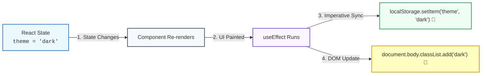

## 🌐 ១. ហេតុអ្វីបានជា Web APIs ត្រូវការ `useEffect`?

React ដំណើរការលើគំនិត **Declarative UI** (អ្នកគ្រាន់តែប្រាប់ថា UI គួរមានរូបរាងបែបណា)។  
ប៉ុន្តែ Browser Web APIs (ដូចជា `localStorage`, `window`, `document`, `navigator`) គឺជា **Imperative APIs** (ប្រព័ន្ធខាងក្រៅដែលទាមទារការបញ្ជាផ្ទាល់)៖



> [!NOTE]
> **សុវត្ថិភាពសម្រាប់ SSR (Next.js):**  
> នៅលើ Server កូដគ្មាន `window` ឬ `localStorage` ឡើយ។ ប្រសិនបើអ្នកសរសេរ `localStorage.getItem()` ក្នុង Render Phase ផ្ទាល់ កម្មវិធីនឹង crash ភ្លាម (`ReferenceError: window is not defined`)។  
> ការដាក់ក្នុង **`useEffect` ធានា ១០០% ថាកូដនឹងដំណើរការតែនៅលើ Browser ប៉ុណ្ណោះ!**

---

## 💾 ២. ករណីទី ១ ៖ LocalStorage Sync & Lazy Initialization

ដើម្បីរក្សាទុកការកំណត់របស់អ្នកប្រើប្រាស់ (ដូចជា Theme Dark/Light Mode) ទោះបីគេ Refresh ទំព័រក៏មិនបាត់បង់៖

```jsx
import { useState, useEffect } from 'react';

export function ThemeSyncDemo() {
  // ១. LAZY INITIALIZATION: អាន localStorage តែ ១ ដងគត់ពេល Mount
  const [theme, setTheme] = useState(() => {
    if (typeof window !== 'undefined') {
      return localStorage.getItem('app_theme') || 'light';
    }
    return 'light';
  });

  // ២. SYNC EFFECT: រាល់ពេល theme ប្រែប្រួល ➔ រក្សាទុកចូល localStorage ភ្លាម
  useEffect(() => {
    localStorage.setItem('app_theme', theme);
  }, [theme]); // 👈 រត់ឡើងវិញតែពេល theme ប្តូរ

  return (
    <button
      onClick={() => setTheme((prev) => (prev === 'light' ? 'dark' : 'light'))}
      className="px-4 py-2 bg-blue-600 text-white rounded-xl text-sm font-bold"
    >
      ប្តូរ Theme: {theme === 'light' ? '☀️ Light' : '🌙 Dark'}
    </button>
  );
}
```

### 🔍 ការពន្យល់មួយជួរៗ (Line-by-Line):
1. `useState(() => { ... })`:
   - ហៅថា **Lazy State Initializer**។ ប្រសិនបើយើងសរសេរ `useState(localStorage.getItem('...'))` ធម្មតា វានឹងដំណើរការអាន Disk រាល់ពេល Re-render ទាំងអស់! ការប្រើ Function `() => ...` ជួយឱ្យវាអានតែលើកទី ១ ប៉ុណ្ណោះ។
2. `localStorage.setItem('app_theme', theme)`:
   - សរសេរតម្លៃថ្មីចូល Browser Storage ដោយស្វ័យប្រវត្តិតាមរយៈ `[theme]` dependency។

---

## ⌨️ ៣. ករណីទី ២ ៖ Global Keyboard Shortcuts (ចុច ESC បិទ Modal)

```jsx
import { useState, useEffect } from 'react';

export function ModalShortcutDemo() {
  const [isOpen, setIsOpen] = useState(false);

  useEffect(() => {
    // បើ Modal មិនបានបើកទេ មិនបាច់ចុះឈ្មោះ Listener ឡើយ
    if (!isOpen) return;

    const handleKeyDown = (e) => {
      if (e.key === 'Escape') {
        console.log("User ចុចប៊ូតុង ESC ➔ បិទ Modal");
        setIsOpen(false);
      }
    };

    // SETUP: ចុះឈ្មោះស្ដាប់ Keyboard លើ Window
    window.addEventListener('keydown', handleKeyDown);

    // CLEANUP: ដកឈ្មោះចេញវិញជានិច្ចពេល Modal បិទ ឬ Unmount!
    return () => {
      window.removeEventListener('keydown', handleKeyDown);
    };
  }, [isOpen]); // 👈 តាមដាន isOpen

  return (
    <div>
      <button
        onClick={() => setIsOpen(true)}
        className="px-4 py-2 bg-indigo-600 text-white font-bold rounded-xl text-sm"
      >
        បើក Modal
      </button>

      {isOpen && (
        <div className="fixed inset-0 bg-black/50 flex items-center justify-center p-4 z-50">
          <div className="bg-white dark:bg-slate-800 p-6 rounded-2xl max-w-sm w-full text-center shadow-2xl">
            <h4 className="font-bold text-lg text-slate-800 dark:text-white">ផ្ទាំង Modal</h4>
            <p className="text-xs text-slate-500 mt-2">
              សាកល្បងចុចប៊ូតុង <strong>[ESC]</strong> លើ Keyboard របស់អ្នកដើម្បីបិទផ្ទាំងនេះ!
            </p>
            <button
              onClick={() => setIsOpen(false)}
              className="mt-4 px-4 py-1.5 bg-slate-200 dark:bg-slate-700 text-xs font-bold rounded-lg"
            >
              បិទដោយចុច Mouse
            </button>
          </div>
        </div>
      )}
    </div>
  );
}
```

---

## 📡 ៤. ករណីទី ៣ ៖ Browser Online / Offline Indicator

ចាប់ព្រឹត្តិការណ៍ពេល Internet ដាច់ ឬភ្ជាប់ឡើងវិញ៖

```jsx
import { useState, useEffect } from 'react';

export function NetworkStatusIndicator() {
  const [isOnline, setIsOnline] = useState(
    typeof navigator !== 'undefined' ? navigator.onLine : true
  );

  useEffect(() => {
    const handleOnline = () => setIsOnline(true);
    const handleOffline = () => setIsOnline(false);

    window.addEventListener('online', handleOnline);
    window.addEventListener('offline', handleOffline);

    // CLEANUP: លុប Event Listeners ពេលចាកចេញ
    return () => {
      window.removeEventListener('online', handleOnline);
      window.removeEventListener('offline', handleOffline);
    };
  }, []); // [] = ចុះឈ្មោះម្តងគត់ពេល Mount

  if (isOnline) return null; // បើមាន Internet ធម្មតា មិនបាច់បង្ហាញ Banner រំខានទេ

  return (
    <div className="bg-rose-500 text-white text-xs font-bold py-2 px-4 text-center">
      ⚠️ បាត់បង់ការភ្ជាប់អ៊ីនធឺណិត (Offline Mode) — សូមពិនិត្យមើល Network របស់អ្នក!
    </div>
  );
}
```

---

## 📜 ៥. ករណីទី ៤ ៖ Scroll Position & ប៊ូតុង "Back to Top"

```jsx
import { useState, useEffect } from 'react';

export function BackToTopButton() {
  const [showButton, setShowButton] = useState(false);

  useEffect(() => {
    const handleScroll = () => {
      // បើ Scroll ចុះក្រោមលើសពី 300px ➔ បង្ហាញប៊ូតុង
      if (window.scrollY > 300) {
        setShowButton(true);
      } else {
        setShowButton(false);
      }
    };

    window.addEventListener('scroll', handleScroll);

    return () => {
      window.removeEventListener('scroll', handleScroll);
    };
  }, []);

  const scrollToTop = () => {
    window.scrollTo({ top: 0, behavior: 'smooth' });
  };

  if (!showButton) return null;

  return (
    <button
      onClick={scrollToTop}
      className="fixed bottom-6 right-6 p-3 bg-blue-600 text-white rounded-full shadow-lg hover:bg-blue-700 transition"
      title="ត្រឡប់ទៅលើវិញ"
    >
      ⬆️
    </button>
  );
}
```

---

## 🧠 ៦. សង្ខេប Mental Model ងាយចាំ (Cheat Sheet)

| Browser Web API | របៀបប្រើក្នុង React | ចំណុចត្រូវប្រុងប្រយ័ត្ន |
| :--- | :--- | :--- |
| **`localStorage`** | អានតាម `useState(() => ...)` ហើយ Save តាម `useEffect(..., [val])` | ពិនិត្យ `typeof window !== 'undefined'` សម្រាប់ SSR |
| **`window.addEventListener`** | ចុះឈ្មោះក្នុង `useEffect(..., [])` | **ត្រូវតែមាន Cleanup** `removeEventListener` ជានិច្ច |
| **`navigator.onLine`** | ចាប់ `online` និង `offline` events | ផ្តល់ Visual Banner ជូន User ពេលដាច់ Internet |
| **`window.scrollY`** | ចាប់ `scroll` event ដើម្បីបង្ហាញ Back-to-Top | ជៀសវាងការគណនាធ្ងន់ៗក្នុង scroll handler |
