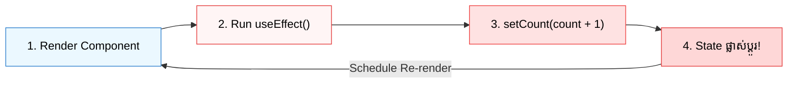

## 🛑 1. Pitfall 1: The Infinite Re-render Loop



### 💻 Code ប្រៀបធៀប ខុស vs ត្រូវ:

```jsx
// ❌ ខុសធ្ងន់ធ្ងរ៖ Infinite Loop គាំង Browser!
function BadCounter() {
  const [count, setCount] = useState(0);
  useEffect(() => {
    setCount(count + 1); // 🚨 Update state គ្មាន dependency array
  });
}

// ✅ ត្រឹមត្រូវ៖ មាន Dependency Array ច្បាស់លាស់ ឬប្រើ Event Handler
function GoodCounter() {
  const [count, setCount] = useState(0);
  return <button onClick={() => setCount((c) => c + 1)}>+1</button>;
}
```

---

## 🧮 2. Pitfall 2: You Don't Need an Effect for Derived State

### 🌐 Normal HTML / Logic:

```html
<!-- Full Name Display -->
<p>First: Sok | Last: Dara</p>
<p>Full Name: Sok Dara</p>
```

### 💻 Code ប្រៀបធៀប ខុស vs ត្រូវ:

```jsx
// ❌ មិនល្អ៖ ប្រើ useEffect បង្កឱ្យមាន Re-render ២ ដង!
function BadProfile() {
  const [firstName, setFirstName] = useState('Sok');
  const [lastName, setLastName] = useState('Dara');
  const [fullName, setFullName] = useState('');

  useEffect(() => {
    setFullName(`${firstName} ${lastName}`); // ⚠️ Extra Re-render!
  }, [firstName, lastName]);

  return <p>{fullName}</p>;
}

// ✅ ល្អបំផុត (Derived State): គណនាភ្លាមៗក្នុង Render Phase!
function GoodProfile() {
  const [firstName, setFirstName] = useState('Sok');
  const [lastName, setLastName] = useState('Dara');

  // គណនាផ្ទាល់ក្នុង 1ms គ្មាន extra re-render ឡើយ!
  const fullName = `${firstName} ${lastName}`;

  return <p>{fullName}</p>;
}
```

### 🔍 ការពន្យល់មួយជួរៗ (Line-by-Line Explanation):

1. `const fullName = `${firstName} ${lastName}`;`
   - ទិន្នន័យណាដែលអាចគណនាបានពី `state` ឬ `props` ដែលមានស្រាប់ ត្រូវគណនាផ្ទាល់ក្នុង JavaScript Body នៃ Component មិនត្រូវបង្កើត `useState` ឬ `useEffect` បន្ថែមឡើយ។

---

## ⏰ 3. Pitfall 3: Stale Closures in Timers

### 💻 Code ប្រៀបធៀប Stale Closure:

```jsx
// ❌ Stale Closure: count ជាប់គាំងត្រឹម 0 ជានិច្ច!
useEffect(() => {
  const id = setInterval(() => {
    setCount(count + 1); // 🚨 count យកតែតម្លៃ 0 ដំបូង
  }, 1000);
  return () => clearInterval(id);
}, []);

// ✅ ដំណោះស្រាយ: ប្រើ Functional State Update
useEffect(() => {
  const id = setInterval(() => {
    setCount((prev) => prev + 1); // ✅ ទទួលបានតម្លៃថ្មីបំផុតជានិច្ច
  }, 1000);
  return () => clearInterval(id);
}, []);
```

### 🔍 ការពន្យល់មួយជួរៗ (Line-by-Line Explanation):

1. `setCount((prev) => prev + 1)`
   - ប្រើ **Functional Update** `(prev) => ...` ដើម្បីធានាថា Callback អានតម្លៃ State ចុងក្រោយបំផុតក្នុង Memory ជានិច្ច។
