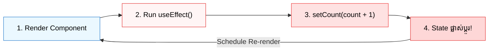
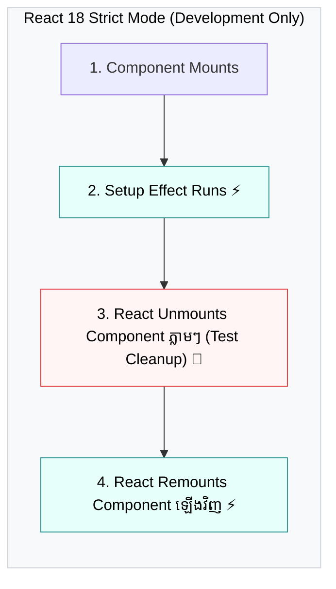

## 🛑 1. Pitfall 1: The Infinite Re-render Loop

កំហុសដែលកើតឡើងញឹកញាប់បំផុតគឺការ **Update State** នៅខាងក្នុង `useEffect` ដោយមិនបានកំណត់ Dependency Array ឱ្យបានត្រឹមត្រូវ៖

```jsx
// ❌ កំហុសធ្ងន់ធ្ងរ៖ Infinite Re-render Loop!
function BrokenCounter() {
  const [count, setCount] = useState(0);

  // 🚨 Effect នេះ run គ្រប់ render -> setCount ធ្វើឱ្យ re-render -> run effect ម្តងទៀត -> Loop គាំង Browser!
  useEffect(() => {
    setCount(count + 1);
  });

  return <div>{count}</div>;
}
```



### 💡 វិធីដោះស្រាយ៖
- កំណត់ Dependency Array ច្បាស់លាស់ (`[]` ឬ `[dep]`)។
- ពិចារណាថាតើអ្នកពិតជាត្រូវការ `useEffect` ដែរឬទេ ឬគ្រាន់តែជា Derived State។

---

## 🔒 2. Pitfall 2: Stale Closures (ការចាប់យកតម្លៃចាស់)

នៅពេលដែល `useEffect` ឬ `setInterval` ដំណើរការ callback function នោះនឹងបង្កើត Closure ដែលចងចាំតម្លៃ State នៅពេលវាត្រូវបានបង្កើតដំបូង៖

```jsx
// ❌ បញ្ហា Stale Closure៖
function StaleTimer() {
  const [count, setCount] = useState(0);

  useEffect(() => {
    const timer = setInterval(() => {
      // ⚠️ count ក្នុង closure នេះនៅតែជា 0 ជានិច្ច ព្រោះ array ជា []!
      setCount(count + 1); // 0 + 1 = 1 រៀងរាល់វិនាទី!
    }, 1000);

    return () => clearInterval(timer);
  }, []); // count មិនកើនឡើងលើសពី 1 ឡើយ

  return <h1>{count}</h1>;
}

// ✅ ដំណោះស្រាយ៖ ប្រើ Functional Update (prev => prev + 1)
function FixedTimer() {
  const [count, setCount] = useState(0);

  useEffect(() => {
    const timer = setInterval(() => {
      // ✅ ទទួលបានតម្លៃចុងក្រោយបំផុតជានិច្ចពី React State Engine
      setCount((prev) => prev + 1);
    }, 1000);

    return () => clearInterval(timer);
  }, []);

  return <h1>{count}</h1>;
}
```

---

## 🚫 3. You Might Not Need an Effect: Derived State

> **ច្បាប់សំខាន់:** ប្រសិនបើតម្លៃមួយអាច **គណនាចេញពី Props ឬ State ដែលមានស្រាប់** ចូរ **កុំបង្កើត State ថ្មី ហើយកុំប្រើ useEffect ដើម្បី Sync វា!**

```jsx
// ❌ មិនល្អ៖ Extra State + Extra useEffect = 2 ដង Render និងកូដស្មុគស្មាញ
function UserFullNameBad({ firstName, lastName }) {
  const [fullName, setFullName] = useState('');

  useEffect(() => {
    setFullName(`${firstName} ${lastName}`);
  }, [firstName, lastName]); // បង្កើន 1 Extra Re-render រាល់ពេល props ដូរ!

  return <h2>{fullName}</h2>;
}

// ✅ ល្អឥតខ្ចោះ៖ គណនាផ្ទាល់ក្នុងពេល Render (Derived Value)
function UserFullNameGood({ firstName, lastName }) {
  // ⚡ គណនាលឿនបំផុត គ្មាន extra render គ្មាន bugs!
  const fullName = `${firstName} ${lastName}`;

  return <h2>{fullName}</h2>;
}
```

---

## 🖱️ 4. You Might Not Need an Effect: User Actions

កុំប្រើ `useEffect` សម្រាប់កិច្ចការដែលកើតឡើងដោយសារ **ការចុចរបស់ User (User Interactions)** ដូចជាការបង្ហាញ alert ឬការផ្លាស់ប្តូរ state។ ចូរដាក់កូដនោះក្នុង **Event Handler** ដោយផ្ទាល់!

```jsx
// ❌ មិនល្អ៖ ប្រើ useEffect សម្រាប់ User Action
function ResetButtonBad() {
  const [isReset, setIsReset] = useState(false);
  const [score, setScore] = useState(100);

  useEffect(() => {
    if (isReset) {
      setScore(0);
      alert("Score has been reset!");
      setIsReset(false);
    }
  }, [isReset]);

  return <button onClick={() => setIsReset(true)}>កំណត់ពិន្ទុឡើងវិញ</button>;
}

// ✅ ល្អឥតខ្ចោះ៖ ដាក់ក្នុង Event Handler ផ្ទាល់
function ResetButtonGood() {
  const [score, setScore] = useState(100);

  const handleReset = () => {
    setScore(0);
    alert("Score has been reset!");
  };

  return <button onClick={handleReset}>កំណត់ពិន្ទុឡើងវិញ</button>;
}
```

---

## 🧪 5. React 18 StrictMode Double Invocation

នៅក្នុង **React 18 Development Mode**, អ្នកនឹងសង្កេតឃើញថា `console.log` ក្នុង `useEffect` ដំណើរការ **២ ដង** នៅពេលទំពើរបើកដំបូង៖



### ហេតុអ្វីបានជា React ធ្វើបែបនេះ?
- ដើម្បីជួយ Developer ផ្ទៀងផ្ទាត់ថាតើអ្នកបានសរសេរ **Cleanup Function** បានត្រឹមត្រូវឬនៅ។
- ប្រសិនបើអ្នកសរសេរ Cleanup ត្រឹមត្រូវ (ដូចជា `clearInterval` ឬ `removeEventListener`), ការ Mount ២ ដងនឹងមិនបណ្តាលឱ្យមាន Bugs អ្វីទាំងអស់!
- **ចំណាំ:** នៅក្នុង Production Mode, Effect នឹងដំណើរការតែ **១ ដងគត់** ដូចធម្មតា។

---

## 🎯 សេចក្តីសង្ខេប (Summary Checklist)

| សេណារីយ៉ូ (Scenario) | គួរប្រើ useEffect ឬអត់? | ដំណោះស្រាយត្រឹមត្រូវ |
| :--- | :---: | :--- |
| គណនាទិន្នន័យពី Props/State | ❌ ទេ | គណនាផ្ទាល់ក្នុង Render Body (Derived State) |
| ធ្វើការងារពេល User ចុចប៊ូតុង | ❌ ទេ | សរសេរក្នុង `onClick` Event Handler |
| Synchronize ជាមួយ `localStorage` | ✅ គួរប្រើ | ប្រើ `useEffect` ជាមួយ key dependency |
| ស្តាប់ Browser Window Events (`resize`, `keydown`) | ✅ គួរប្រើ | ប្រើ `useEffect` + `removeEventListener` |
| គ្រប់គ្រង Timers (`setInterval`, `setTimeout`) | ✅ គួរប្រើ | ប្រើ `useEffect` + `clearInterval` |
