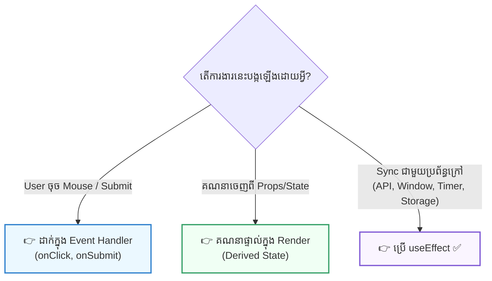

## 🧭 ១. ទស្សនវិជ្ជា "You Might Not Need an Effect"

យោងតាមឯកសារផ្លូវការរបស់ React Team៖  
> **«`useEffect` គឺជាច្រកចេញ (Escape Hatch) សម្រាប់ធ្វើការជាមួយប្រព័ន្ធខាងក្រៅ។ កុំប្រើវាសម្រាប់រៀបចំ Data Flow ធម្មតាក្នុង React ឱ្យសោះ!»**



---

## 🧮 ២. កំហុសទី ១ ៖ ប្រើ useEffect សម្រាប់គណនាទិន្នន័យ (Derived State)

### ❌ កូដអាក្រក់ (Anti-pattern ធ្វើឱ្យ Re-render ២ ដង):
```jsx
function UserProfile() {
  const [firstName, setFirstName] = useState('Sok');
  const [lastName, setLastName] = useState('Dara');
  const [fullName, setFullName] = useState(''); // ❌ បង្កើត State ឥតប្រយោជន៍

  // ⚠️ អាក្រក់ណាស់! Component ត្រូវ Render លើកទី ១ រួចទើប Effect រត់ ➔ បង្កជា Render លើកទី ២!
  useEffect(() => {
    setFullName(`${firstName} ${lastName}`);
  }, [firstName, lastName]);

  return <h1>{fullName}</h1>;
}
```

### ✅ កូដល្អឥតខ្ចោះ (Derived State):
```jsx
function UserProfile() {
  const [firstName, setFirstName] = useState('Sok');
  const [lastName, setLastName] = useState('Dara');

  // ✨ គណនាផ្ទាល់ភ្លាមៗក្នុងពេល Render គ្មាន Re-render បន្ថែម ស៊ីពេលត្រឹម 0.001ms!
  const fullName = `${firstName} ${lastName}`;

  return <h1>{fullName}</h1>;
}
```

---

## 🔍 ៣. កំហុសទី ២ ៖ Filter បញ្ជីទិន្នន័យតាម Search Query

### ❌ កូដអាក្រក់:
```jsx
function ProductList({ products }) {
  const [query, setQuery] = useState('');
  const [filteredProducts, setFilteredProducts] = useState([]); // ❌

  useEffect(() => {
    setFilteredProducts(
      products.filter((p) => p.name.toLowerCase().includes(query.toLowerCase()))
    );
  }, [products, query]);

  return (/* ... */);
}
```

### ✅ កូដល្អឥតខ្ចោះ:
```jsx
function ProductList({ products }) {
  const [query, setQuery] = useState('');

  // ✨ គណនាផ្ទាល់! បើ list ធំខ្លាំង (រាប់ម៉ឺន rows) អាចរុំជាមួយ useMemo
  const filteredProducts = products.filter((p) =>
    p.name.toLowerCase().includes(query.toLowerCase())
  );

  return (/* ... */);
}
```

---

## 🛒 ៤. កំហុសទី ៣ ៖ ដាក់កូដ User Actions ចូលក្នុង `useEffect`

ស្រមៃថាអ្នកកំពុងធ្វើប៊ូតុង "Buy Now":

### ❌ កូដខុសរបៀប:
```jsx
function Cart() {
  const [isBuying, setIsBuying] = useState(false);

  // ❌ កុំធ្វើបែបនេះ! ការទិញទំនិញជា Action របស់ User មិនមែនជា Synchronization ទេ
  useEffect(() => {
    if (isBuying) {
      buyProduct();
    }
  }, [isBuying]);

  return <button onClick={() => setIsBuying(true)}>ទិញឥឡូវនេះ</button>;
}
```

### ✅ កូដត្រឹមត្រូវ:
```jsx
function Cart() {
  // ✅ ដាក់ក្នុង Event Handler ផ្ទាល់តែម្តង ច្បាស់លាស់ និងគ្មាន Bug!
  const handleBuyClick = () => {
    buyProduct();
  };

  return <button onClick={handleBuyClick}>ទិញឥឡូវនេះ</button>;
}
```

---

## 🔄 ៥. កំហុសទី ៤ ៖ Reset State តាមរយៈ `useEffect`

ចុះបើអ្នកចង់ Reset ប្រអប់ Comment ឱ្យទទេស្អាត នៅពេល User ប្តូរទៅមើល Profile របស់មនុស្សម្នាក់ទៀត (`userId` ប្រែប្រួល)?

### ❌ កូដស្មុគស្មាញ និងយឺត:
```jsx
function CommentBox({ userId }) {
  const [comment, setComment] = useState('');

  // ⚠️ Component ត្រូវ Render ជាមួយ comment ចាស់សិន រួចទើប Effect reset comment ជាក្រោយ
  useEffect(() => {
    setComment('');
  }, [userId]);

  return <textarea value={comment} onChange={(e) => setComment(e.target.value)} />;
}
```

### ✅ ដំណោះស្រាយដ៏អស្ចារ្យ ៖ ប្រើ `key` prop!
```jsx
// នៅក្នុង Component មេ:
export default function App() {
  const [selectedUserId, setSelectedUserId] = useState(1);

  // ✨ គ្រាន់តែដាក់ key={selectedUserId}
  // React នឹងដឹងថាជា Component ថ្មី ➔ លុប state ចាស់ចោល ហើយបង្កើត state ដើមឡើងវិញភ្លាម!
  return <CommentBox key={selectedUserId} userId={selectedUserId} />;
}
```

---

## 🛑 ៦. កំហុសទី ៥ ៖ Infinite Re-render Loop

```jsx
// ❌ គ្រោះថ្នាក់បំផុត
function InfiniteCounter() {
  const [count, setCount] = useState(0);

  // គ្មាន Dependency Array ➔ រត់រាល់ Render ➔ setState ➔ Re-render ➔ រត់ Effect ➔ ...
  useEffect(() => {
    setCount(count + 1);
  });
}
```

### 💡 វិធានការដោះស្រាយ៖
1. **តែងតែផ្តល់ Dependency Array ជានិច្ច** (`[]` ឬ `[dependencies]`)។
2. បើចង់ធ្វើ Timer ចូរប្រើ `setInterval` រួមជាមួយ `clearInterval` ក្នុង Cleanup។

---

## 🧠 ៧. តារាងវិនិច្ឆ័យ "តើខ្ញុំគួរប្រើ useEffect ដែរឬទេ?"

| ស្ថានភាព / ការងារ | ដំណោះស្រាយត្រឹមត្រូវ | ហេតុផល |
| :--- | :--- | :--- |
| បូកអក្សរ, គណនាតម្លៃសរុប (Total) | **Derived State** (គណនាផ្ទាល់ក្នុង Render) | គ្មាន extra re-render, លឿនបំផុត |
| Filter បញ្ជីទិន្នន័យតាម Search Query | **Direct Filter / `useMemo`** | មិនចាំបាច់មាន useState ស្ទួន |
| User ចុចប៊ូតុង Submit ឬ Buy | **Event Handler (`onClick`)** | ជាសកម្មភាពផ្ទាល់របស់ User |
| Reset Form ពេលប្តូរ ID | **ប្រើ `key={id}` prop** | React reset state ដោយស្វ័យប្រវត្តិ |
| ទាញទិន្នន័យពី API លើកដំបូង | **`useEffect(..., [])`** | ធ្វើសមកាលកម្មជាមួយ Network Server |
| កែប្រែ Browser Tab Title (`document.title`) | **`useEffect(..., [val])`** | ធ្វើសមកាលកម្មជាមួយ Browser DOM |
| បង្កើត Timer (`setInterval`) | **`useEffect` + Cleanup** | ធ្វើសមកាលកម្មជាមួយ Browser Timer |
