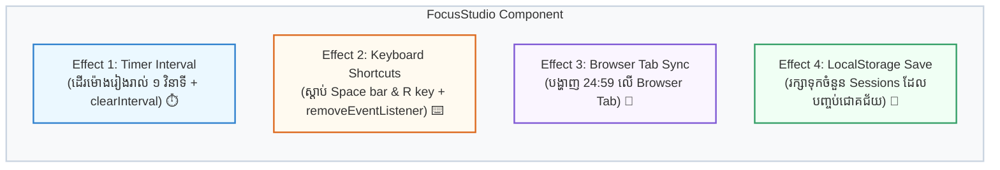

## 🎯 ១. ស្ថាបត្យកម្មគម្រោង (Separation of Concerns)

នៅក្នុងកម្មវិធីជាក់ស្តែង យើងមិនត្រូវញាត់កូដ Side Effects ទាំងអស់ចូលក្នុង `useEffect` តែមួយឡើយ។ យើងបែងចែកវាជា **៤ Effects តូចៗ** ដាច់ដោយឡែកពីគ្នា៖



---

## 💻 ២. កូដពេញលេញនៃគម្រោង Focus Studio

```jsx
import { useState, useEffect } from 'react';

export default function FocusStudio() {
  const [timeLeft, setTimeLeft] = useState(25 * 60); // 25 នាទី (គិតជាវិនាទី)
  const [isActive, setIsActive] = useState(false);
  const [sessions, setSessions] = useState(() => {
    if (typeof window !== 'undefined') {
      return Number(localStorage.getItem('focus_sessions')) || 0;
    }
    return 0;
  });

  // ==========================================
  // EFFECT 1: គ្រប់គ្រងដំណើរការ TIMER (setInterval)
  // ==========================================
  useEffect(() => {
    // បើមិនទាន់ចុច Start ទេ មិនបាច់ចាប់ផ្តើម Timer ឡើយ
    if (!isActive) return;

    const timerId = setInterval(() => {
      setTimeLeft((prev) => {
        if (prev <= 1) {
          // ពេលដល់ 0 វិនាទី ➔ បញ្ឈប់ Timer និងកត់ត្រា Session
          setIsActive(false);
          setSessions((s) => s + 1);
          return 0;
        }
        return prev - 1;
      });
    }, 1000);

    // CLEANUP: បញ្ឈប់ Timer ពេល User ចុច Pause ឬ Unmount
    return () => {
      clearInterval(timerId);
    };
  }, [isActive]);

  // ==========================================
  // EFFECT 2: GLOBAL KEYBOARD SHORTCUTS
  // ==========================================
  useEffect(() => {
    const handleKeyDown = (e) => {
      if (e.code === 'Space') {
        e.preventDefault(); // ទប់ស្កាត់ការ Scroll ទំព័រចុះក្រោម
        setIsActive((prev) => !prev); // Toggle Play/Pause
      } else if (e.key === 'r' || e.key === 'R') {
        setIsActive(false);
        setTimeLeft(25 * 60); // Reset ទៅ 25 នាទី
      }
    };

    window.addEventListener('keydown', handleKeyDown);

    // CLEANUP: ដក listener ចេញពេល component unmount
    return () => {
      window.removeEventListener('keydown', handleKeyDown);
    };
  }, []); // [] = ចុះឈ្មោះម្តងគត់

  // ==========================================
  // EFFECT 3: BROWSER TAB TITLE SYNC
  // ==========================================
  useEffect(() => {
    const minutes = Math.floor(timeLeft / 60);
    const seconds = timeLeft % 60;
    const timeFormatted = `${minutes.toString().padStart(2, '0')}:${seconds
      .toString()
      .padStart(2, '0')}`;

    if (isActive) {
      document.title = `⏳ (${timeFormatted}) កំពុង Focus!`;
    } else {
      document.title = '🎯 Focus Studio';
    }
  }, [timeLeft, isActive]);

  // ==========================================
  // EFFECT 4: LOCALSTORAGE AUTO-SAVE
  // ==========================================
  useEffect(() => {
    localStorage.setItem('focus_sessions', String(sessions));
  }, [sessions]);

  // គណនា Formatted Time ក្នុង Render Phase (Derived State)
  const displayMinutes = Math.floor(timeLeft / 60);
  const displaySeconds = timeLeft % 60;
  const timeString = `${displayMinutes.toString().padStart(2, '0')}:${displaySeconds
    .toString()
    .padStart(2, '0')}`;

  return (
    <div className="max-w-md mx-auto p-8 bg-white dark:bg-slate-800 rounded-3xl shadow-xl border border-slate-200 dark:border-slate-700 text-center">
      <div className="flex items-center justify-between mb-4">
        <span className="text-xs font-bold uppercase tracking-wider text-slate-400">
          Pomodoro Productivity
        </span>
        <span className="text-xs px-2.5 py-1 bg-emerald-100 dark:bg-emerald-900/40 text-emerald-700 dark:text-emerald-300 font-bold rounded-full">
          🏆 {sessions} Sessions
        </span>
      </div>

      <h2 className="text-2xl font-bold text-slate-800 dark:text-white">
        🎯 Focus Studio
      </h2>

      {/* CLOCK DISPLAY */}
      <div className="text-6xl font-mono font-black text-blue-600 dark:text-blue-400 py-8 tracking-wider">
        {timeString}
      </div>

      {/* CONTROLS */}
      <div className="flex justify-center gap-3">
        <button
          onClick={() => setIsActive((prev) => !prev)}
          className={`px-6 py-3 rounded-xl font-bold text-sm text-white transition shadow-md ${
            isActive
              ? 'bg-amber-500 hover:bg-amber-600'
              : 'bg-blue-600 hover:bg-blue-700'
          }`}
        >
          {isActive ? '⏸️ Pause (Space)' : '▶️ Start (Space)'}
        </button>

        <button
          onClick={() => {
            setIsActive(false);
            setTimeLeft(25 * 60);
          }}
          className="px-5 py-3 bg-slate-100 dark:bg-slate-700 hover:bg-slate-200 text-slate-700 dark:text-slate-200 rounded-xl font-bold text-sm transition"
        >
          🔄 Reset (R)
        </button>
      </div>

      {/* FOOTER SHORTCUTS */}
      <div className="mt-8 pt-4 border-t border-slate-100 dark:border-slate-700 text-xs text-slate-400 space-y-1">
        <p>💡 ចុចប៊ូតុង <strong>[Spacebar]</strong> ដើម្បី Play / Pause</p>
        <p>💡 ចុចប៊ូតុង <strong>[R]</strong> ដើម្បី Reset មក ២៥ នាទីវិញ</p>
      </div>
    </div>
  );
}
```

---

## 🔍 ៣. ការវិភាគចំណុចគន្លឹះនៃកូដ

1. **ហេតុអ្វីបានជា Timer ប្រើ `[isActive]`?**  
   ប្រសិនបើ User ចុច Pause យើងមិនត្រូវឱ្យ Timer បន្តរត់ទៀតឡើយ។ នៅពេល `isActive` ប្តូរមក `false` Cleanup នឹងហៅ `clearInterval` ភ្លាម។
2. **ហេតុអ្វីបានជា Keyboard Listener ប្រើ `[]`?**  
   យើងចង់ចុះឈ្មោះស្តាប់ Keyboard តែ **ម្តងគត់** នៅពេល Component Mount។ ដោយសារ `setIsActive((prev) => !prev)` ប្រើ Functional State Update វាមិនពឹងផ្អែកលើតម្លៃ `isActive` ខាងក្រៅឡើយ ធ្វើឱ្យវាមានសុវត្ថិភាពខ្ពស់ គ្មានបញ្ហា Stale Closure។
3. **ហេតុអ្វីបានជា Time String មិនដាក់ក្នុង `useState`?**  
   ព្រោះ `displayMinutes` និង `displaySeconds` អាចគណនាដោយផ្ទាល់ពី `timeLeft` ក្នុង Render Phase (Derived State)។ នេះជាការអនុវត្តតាមក្បួន *You Might Not Need an Effect*!

---

## 🏆 ៤. បញ្ជីត្រួតពិនិត្យការអនុវត្ត (Checklist)

- [x] Timer ដើររលូន ១ វិនាទីម្តង
- [x] Memory Leak ត្រូវបានការពារដោយ `clearInterval` ពេល Pause ឬ Unmount
- [x] ចុច Spacebar ដំណើរការ Play/Pause លើ Keyboard ផ្ទាល់
- [x] ចំណងជើង Tab លើ Browser បង្ហាញលេខរាប់ថយក្រោយតាមពេលវេលាជាក់ស្តែង
- [x] ចំនួន Session ត្រូវបានកត់ត្រាទុកក្នុង LocalStorage មិនបាត់ពេល Refresh
