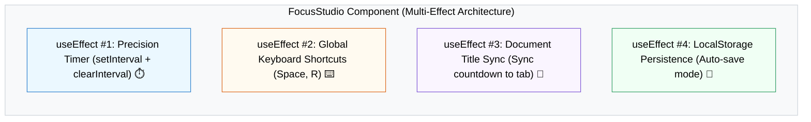

## 🎯 1. Separation of Concerns Architecture



---

## 🎨 2. Normal HTML Studio Dashboard Layout

មុននឹងបន្ថែម React Hooks នេះជារចនាសម្ព័ន្ធ HTML សាមញ្ញរបស់ Timer Dashboard៖

```html
<!-- HTML Timer Dashboard Structure -->
<div class="studio-card">
  <h2>⏱️ Focus Timer</h2>
  <div class="timer-display">25:00</div>

  <div class="controls">
    <button type="button">▶️ Start (Space)</button>
    <button type="button">🔄 Reset (R)</button>
  </div>

  <p class="hint">Keyboard Shortcuts: [Space] Pause/Play | [R] Reset</p>
</div>
```

---

## 💻 3. Isolated React Effects

### ⏱️ Effect 1: Precision Timer with Cleanup
```javascript
useEffect(() => {
  if (!isActive) return;

  const timer = setInterval(() => {
    setTimeLeft((prev) => {
      if (prev <= 1) {
        setIsActive(false);
        return 0;
      }
      return prev - 1;
    });
  }, 1000);

  return () => clearInterval(timer);
}, [isActive]);
```

### ⌨️ Effect 2: Global Keyboard Shortcut Listener
```javascript
useEffect(() => {
  const handleKeyDown = (e) => {
    if (e.code === 'Space') {
      e.preventDefault();
      setIsActive((prev) => !prev); // Toggle Start/Pause
    } else if (e.key === 'r' || e.key === 'R') {
      setIsActive(false);
      setTimeLeft(25 * 60); // Reset
    }
  };

  window.addEventListener('keydown', handleKeyDown);
  return () => window.removeEventListener('keydown', handleKeyDown);
}, []);
```

### 📄 Effect 3: Browser Tab Title Sync
```javascript
useEffect(() => {
  const mins = Math.floor(timeLeft / 60);
  const secs = timeLeft % 60;
  const formatted = `${mins.toString().padStart(2, '0')}:${secs.toString().padStart(2, '0')}`;

  document.title = isActive ? `⏳ (${formatted}) Focus Time!` : 'Focus Studio';
}, [timeLeft, isActive]);
```

---

## 🚀 4. Complete Integrated Focus Studio Project

```jsx
import { useState, useEffect } from 'react';

export default function FocusStudio() {
  const [timeLeft, setTimeLeft] = useState(25 * 60);
  const [isActive, setIsActive] = useState(false);

  // 1. TIMER EFFECT
  useEffect(() => {
    if (!isActive) return;
    const interval = setInterval(() => {
      setTimeLeft((t) => (t > 0 ? t - 1 : 0));
    }, 1000);
    return () => clearInterval(interval);
  }, [isActive]);

  // 2. SHORTCUTS EFFECT
  useEffect(() => {
    const handleKey = (e) => {
      if (e.code === 'Space') {
        e.preventDefault();
        setIsActive((a) => !a);
      } else if (e.key.toLowerCase() === 'r') {
        setIsActive(false);
        setTimeLeft(25 * 60);
      }
    };
    window.addEventListener('keydown', handleKey);
    return () => window.removeEventListener('keydown', handleKey);
  }, []);

  // 3. TITLE SYNC EFFECT
  useEffect(() => {
    const m = Math.floor(timeLeft / 60);
    const s = timeLeft % 60;
    const timeStr = `${m.toString().padStart(2, '0')}:${s.toString().padStart(2, '0')}`;
    document.title = isActive ? `(${timeStr}) Focus Studio` : 'Focus Studio';
  }, [timeLeft, isActive]);

  const minutes = Math.floor(timeLeft / 60);
  const seconds = timeLeft % 60;

  return (
    <div className="max-w-md mx-auto p-8 bg-white dark:bg-slate-800 rounded-3xl shadow-xl border text-center">
      <h2 className="text-xl font-bold text-slate-800 dark:text-white mb-6">
        🎯 Focus Studio
      </h2>

      {/* TIMER DISPLAY */}
      <div className="text-6xl font-mono font-black text-blue-600 dark:text-blue-400 py-6 tracking-wider">
        {minutes.toString().padStart(2, '0')}:{seconds.toString().padStart(2, '0')}
      </div>

      {/* CONTROLS */}
      <div className="flex justify-center gap-3 mt-4">
        <button
          onClick={() => setIsActive((a) => !a)}
          className={`px-6 py-2.5 rounded-xl font-bold text-sm text-white transition ${
            isActive ? 'bg-amber-500 hover:bg-amber-600' : 'bg-blue-600 hover:bg-blue-700'
          }`}
        >
          {isActive ? '⏸️ Pause' : '▶️ Start'}
        </button>
        <button
          onClick={() => {
            setIsActive(false);
            setTimeLeft(25 * 60);
          }}
          className="px-4 py-2.5 bg-slate-100 dark:bg-slate-700 text-slate-700 dark:text-slate-200 rounded-xl font-bold text-sm"
        >
          🔄 Reset
        </button>
      </div>

      <p className="text-xs text-slate-400 mt-6">
        💡 Shortcuts: ចុច <code>[Space]</code> ដើម្បី Play/Pause | ចុច <code>[R]</code> ដើម្បី Reset
      </p>
    </div>
  );
}
```
