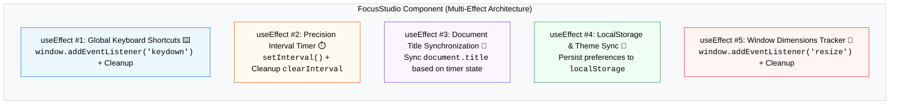

## 🎯 1. ស្ថាបត្យកម្មនៃគម្រោង (Architecture & Separation of Concerns)

នៅក្នុងគម្រោង **Focus & Productivity Studio** នេះ យើងនឹងប្រើប្រាស់ `useEffect` ចំនួន ៤ ដោយបែងចែកតាមមុខងារច្បាស់លាស់ (100% Pure `useEffect` ដោយគ្មាន Fetch API)៖



---

## 🛠️ 2. កូដពេញលេញនៃគម្រោង (`FocusStudio.jsx`)

```jsx
import { useState, useEffect } from 'react';

export default function FocusStudio() {
  // --- 1. STATES ---
  const [secondsLeft, setSecondsLeft] = useState(25 * 60); // 25 នាទី Pomodoro
  const [isRunning, setIsRunning] = useState(false);
  const [sessionCount, setSessionCount] = useState(0);

  // Lazy Initial State ពី LocalStorage
  const [isDarkMode, setIsDarkMode] = useState(() => {
    if (typeof window !== 'undefined') {
      return localStorage.getItem('focus-theme') === 'dark';
    }
    return false;
  });

  const [windowWidth, setWindowWidth] = useState(
    typeof window !== 'undefined' ? window.innerWidth : 1024
  );

  // -------------------------------------------------------------
  // EFFECT 1: Precision Interval Timer (Setup + Cleanup)
  // -------------------------------------------------------------
  useEffect(() => {
    if (!isRunning) return;

    const timerId = setInterval(() => {
      setSecondsLeft((prev) => {
        if (prev <= 1) {
          setIsRunning(false);
          setSessionCount((c) => c + 1);
          return 25 * 60; // Reset ក្រោយចប់ Session
        }
        return prev - 1;
      });
    }, 1000);

    // 🧹 Cleanup: សម្អាត Timer ពេល Pause ឬ Unmount
    return () => {
      clearInterval(timerId);
    };
  }, [isRunning]);

  // -------------------------------------------------------------
  // EFFECT 2: Global Keyboard Shortcuts (Keydown Listener + Cleanup)
  // -------------------------------------------------------------
  useEffect(() => {
    const handleKeyDown = (e) => {
      // Space: Toggle Start/Pause
      if (e.code === 'Space') {
        e.preventDefault();
        setIsRunning((r) => !r);
      }
      // R: Reset Timer
      if (e.key === 'r' || e.key === 'R') {
        setIsRunning(false);
        setSecondsLeft(25 * 60);
      }
      // D: Toggle Dark Mode
      if (e.key === 'd' || e.key === 'D') {
        setIsDarkMode((prev) => !prev);
      }
    };

    window.addEventListener('keydown', handleKeyDown);

    // 🧹 Cleanup: Remove listener ពេល Unmount
    return () => {
      window.removeEventListener('keydown', handleKeyDown);
    };
  }, []); // Empty array [] ព្រោះយើងប្រើ Functional Updates

  // -------------------------------------------------------------
  // EFFECT 3: Document Title Synchronization
  // -------------------------------------------------------------
  useEffect(() => {
    const minutes = Math.floor(secondsLeft / 60);
    const seconds = secondsLeft % 60;
    const timeFormatted = `${String(minutes).padStart(2, '0')}:${String(seconds).padStart(2, '0')}`;

    if (isRunning) {
      document.title = `⏳ (${timeFormatted}) Focus Studio`;
    } else {
      document.title = `⏸️ [Paused] Focus Studio`;
    }
  }, [secondsLeft, isRunning]);

  // -------------------------------------------------------------
  // EFFECT 4: LocalStorage & Theme Synchronization
  // -------------------------------------------------------------
  useEffect(() => {
    localStorage.setItem('focus-theme', isDarkMode ? 'dark' : 'light');
    if (isDarkMode) {
      document.documentElement.classList.add('dark');
    } else {
      document.documentElement.classList.remove('dark');
    }
  }, [isDarkMode]);

  // -------------------------------------------------------------
  // EFFECT 5: Window Resize Listener (Viewport Tracking)
  // -------------------------------------------------------------
  useEffect(() => {
    const handleResize = () => setWindowWidth(window.innerWidth);
    window.addEventListener('resize', handleResize);

    return () => {
      window.removeEventListener('resize', handleResize);
    };
  }, []);

  // --- HELPER FORMATTING ---
  const minutes = Math.floor(secondsLeft / 60);
  const seconds = secondsLeft % 60;
  const timeDisplay = `${String(minutes).padStart(2, '0')}:${String(seconds).padStart(2, '0')}`;

  // --- UI RENDERING ---
  return (
    <div className={`min-h-[500px] p-8 flex flex-col items-center justify-center transition-colors duration-300 rounded-3xl ${
      isDarkMode ? 'bg-slate-900 text-slate-100' : 'bg-slate-50 text-slate-800'
    }`}>
      <div className={`max-w-md w-full p-8 rounded-3xl shadow-xl border transition-all ${
        isDarkMode ? 'bg-slate-800 border-slate-700' : 'bg-white border-slate-200'
      }`}>
        
        {/* Top Bar */}
        <div className="flex justify-between items-center mb-6">
          <div>
            <h1 className="text-xl font-black">🎯 Focus Studio</h1>
            <p className="text-xs text-slate-400">Viewport Width: {windowWidth}px</p>
          </div>
          <button
            onClick={() => setIsDarkMode(!isDarkMode)}
            className="p-2.5 rounded-xl border border-slate-300 dark:border-slate-600 hover:bg-slate-100 dark:hover:bg-slate-700 transition text-sm"
          >
            {isDarkMode ? '☀️ Light' : '🌙 Dark'}
          </button>
        </div>

        {/* Timer Display */}
        <div className="text-center my-8">
          <div className="text-6xl font-black font-mono tracking-tight text-indigo-600 dark:text-indigo-400">
            {timeDisplay}
          </div>
          <span className={`inline-block mt-3 px-3 py-1 rounded-full text-xs font-bold ${
            isRunning 
              ? 'bg-emerald-100 text-emerald-700 dark:bg-emerald-950 dark:text-emerald-300 animate-pulse'
              : 'bg-amber-100 text-amber-700 dark:bg-amber-950 dark:text-amber-300'
          }`}>
            {isRunning ? '🔥 កំពុងផ្តោតអារម្មណ៍ (In Session)' : '⏸️ បានផ្អាក (Paused)'}
          </span>
        </div>

        {/* Controls */}
        <div className="flex gap-3 justify-center mb-6">
          <button
            onClick={() => setIsRunning(!isRunning)}
            className={`px-6 py-3 rounded-2xl font-bold text-white shadow-lg transition ${
              isRunning ? 'bg-amber-600 hover:bg-amber-700' : 'bg-indigo-600 hover:bg-indigo-700'
            }`}
          >
            {isRunning ? 'ផ្អាក (Space)' : 'ចាប់ផ្តើម (Space)'}
          </button>
          
          <button
            onClick={() => { setIsRunning(false); setSecondsLeft(25 * 60); }}
            className="px-4 py-3 rounded-2xl font-bold border border-slate-300 dark:border-slate-600 hover:bg-slate-100 dark:hover:bg-slate-700 transition text-sm"
          >
            កំណត់ឡើងវិញ (R)
          </button>
        </div>

        {/* Keyboard Shortcuts Cheatsheet */}
        <div className="pt-4 border-t border-slate-200 dark:border-slate-700 text-xs text-slate-400 space-y-1.5">
          <p className="font-bold text-slate-500 uppercase tracking-wider mb-2">⌨️ គ្រាប់ចុចកាត់ (Shortcuts):</p>
          <div className="flex justify-between">
            <span>ចុច <kbd className="px-1.5 py-0.5 bg-slate-200 dark:bg-slate-700 rounded font-mono">Space</kbd></span>
            <span>ចាប់ផ្តើម / ផ្អាក Timer</span>
          </div>
          <div className="flex justify-between">
            <span>ចុច <kbd className="px-1.5 py-0.5 bg-slate-200 dark:bg-slate-700 rounded font-mono">R</kbd></span>
            <span>Reset Timer ទៅ 25:00</span>
          </div>
          <div className="flex justify-between">
            <span>ចុច <kbd className="px-1.5 py-0.5 bg-slate-200 dark:bg-slate-700 rounded font-mono">D</kbd></span>
            <span>ប្តូរ Theme Dark / Light</span>
          </div>
          <div className="flex justify-between pt-2 text-indigo-500 font-bold">
            <span>Session សម្រេចបាន៖</span>
            <span>{sessionCount} Sessions</span>
          </div>
        </div>

      </div>
    </div>
  );
}
```

---

## 🔍 3. ការពន្យល់កូដលម្អិត (Deep-Dive Analysis)

| Effect | គោលបំណង | Dependency Array | Cleanup Function ធ្វើអ្វីខ្លះ? |
| :--- | :--- | :---: | :--- |
| **Effect 1 (Timer)** | រាប់ថយក្រោយ 1 វិនាទីម្តង | `[isRunning]` | ហៅ `clearInterval` ពេល Pause ឬ Unmount |
| **Effect 2 (Keyboard)** | ស្តាប់ Event ចុច Key `Space`, `R`, `D` | `[]` (Mount only) | ហៅ `removeEventListener` ដើម្បីកុំឱ្យ Leak |
| **Effect 3 (Title)** | Sync ចំណងជើង Tab Browser (`document.title`) | `[secondsLeft, isRunning]` | គ្មាន Cleanup (ព្រោះការ assign `document.title` override តម្លៃចាស់) |
| **Effect 4 (Storage)** | រក្សាទុក Theme ទៅ `localStorage` | `[isDarkMode]` | គ្មាន Cleanup (សរសេរចូល disk) |
| **Effect 5 (Resize)** | តាមដានទទឹង Window (`window.innerWidth`) | `[]` (Mount only) | ហៅ `removeEventListener('resize')` |

---

## 🎯 4. លំហាត់អនុវត្តបន្ថែម (Challenge Exercises)

1. **Custom Timer Intervals:** បន្ថែមប៊ូតុងជ្រើសរើស Mode (Short Break: 5min, Long Break: 15min, Focus: 25min) និង synchronize ជាមួយ `useEffect`។
2. **Audio Chime on Finish:** ប្រើប្រាស់ `new Audio('/bell.mp3').play()` ក្នុង `useEffect` នៅពេល `secondsLeft === 0` ដើម្បីបន្លឺសំឡេងរោទ៍ជូនដំណឹង។
