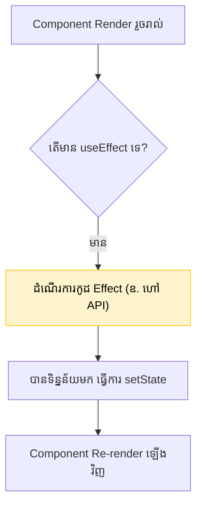

## 🪢 អ្វីទៅជាការធ្វើសមកាលកម្ម (Synchronization)?

React ត្រូវបានរចនាឡើងដើម្បីយក State ទៅគូរចេញជា UI។ វាពូកែខាងរឿងហ្នឹងណាស់! 
ប៉ុន្តែចុះបើអ្នកចង់អោយវាយកទិន្នន័យពី Database? ឫចង់អោយវាបើក/បិទ `setInterval`? រឿងទាំងនេះ **React មិនអាចគ្រប់គ្រងបានដោយស្វ័យប្រវត្តិទេ (វាជា Side Effects)**។

នៅទីនេះហើយដែល `useEffect` ចូលខ្លួនមកជួយ! វាអនុញ្ញាតអោយអ្នកឈានជើងចេញពីវដ្តធម្មតារបស់ React ដើម្បីទៅធ្វើការងារជាមួយប្រព័ន្ធខាងក្រៅ។



---

## 📦 ការប្រើប្រាស់ Dependency Array `[ ]`

`useEffect` ទទួលយកប្រអប់មួយនៅខាងចុង ហៅថា **Dependency Array**។ វាជាអ្នកបញ្ជាថា តើ Effect នេះគួរតែរត់នៅពេលណា។

```jsx
import { useEffect, useState } from 'react';

function Analytics() {
  const [count, setCount] = useState(0);

  // 1. អត់មានប្រអប់ []
  // វានឹងរត់រាល់ពេលដែល Component Render សារជាថ្មី (មិនសូវមានគេប្រើទេ)
  useEffect(() => {
    console.log("រត់រហូត!");
  });

  // 2. មានប្រអប់ទទេ []
  // វានឹងរត់តែម្តងគត់! នៅពេលដែល Component លេចចេញមកលើកដំបូង
  // សាកសមបំផុតសម្រាប់ការហៅ API (Data Fetching)
  useEffect(() => {
    console.log("រត់តែម្តងគត់នៅពេលចាប់ផ្តើម!");
  }, []);

  // 3. មានអថេរនៅក្នុងប្រអប់ [count]
  // វានឹងរត់នៅពេលចាប់ផ្តើម និងរាល់ពេលដែលអថេរ `count` ប្រែប្រួល
  useEffect(() => {
    console.log(`រត់រាល់ពេល count ប្រែប្រួល: ${count}`);
  }, [count]);
}
```

---

## 🧹 ការសម្អាត (Cleanup Function)

ប្រសិនបើអ្នកបើកម៉ាស៊ីនត្រជាក់ពេលចូលបន្ទប់ អ្នកត្រូវចាំបិទវាពេលចាកចេញ។ 
នៅក្នុង `useEffect` ក៏ដូចគ្នា! ប្រសិនបើអ្នកភ្ជាប់ Event Listener ឫបង្កើត Timer អ្នកត្រូវតែសម្អាតវាចោលនៅពេល Component ត្រូវបានបិទ (Unmount) ជៀសវាងការខូច Memory Leak។

អ្នកអាចធ្វើវាបានដោយ **Return Function មួយនៅខាងចុង** នៃ Effect៖

```jsx
useEffect(() => {
  // 1. កូដដែលនឹងដំណើរការពេល Effect ចាប់ផ្តើម
  const timer = setInterval(() => {
    console.log("កំពុងដើរ...");
  }, 1000);

  // 2. កូដដែលនឹងដំណើរការពេល Effect ត្រូវបិទ (Cleanup)
  return () => {
    clearInterval(timer); // បិទ Timer វិញអោយស្អាត
  };
}, []);
```

---

## 🐛 ហេតុអ្វីបានជាកូដខ្ញុំរត់ ២ ដង? (Strict Mode)

អ្នកចាប់ផ្តើមដំបូងតែងតែភ្ញាក់ផ្អើល ពេលឃើញ `console.log` នៅក្នុង `useEffect` លោត ២ ដង!
សូមកុំភ័យ! នេះជាលក្ខណៈពិសេសរបស់ **React Strict Mode** (ដែលមានដំណើរការតែក្នុងពេល Development ប៉ុណ្ណោះ មិនប៉ះពាល់ពេលដាក់អោយគេប្រើពិតប្រាកដទេ)។

React មានចេតនារត់ Effect ២ ដង (Mount -> Unmount -> Mount) ដើម្បី **ជួយឆែកមើលថា តើអ្នកភ្លេចសរសេរ Cleanup Function ដែរឬទេ!** 
ប្រសិនបើអ្នកសរសេរកូដបានត្រឹមត្រូវ ការរត់ ២ ដងនេះ នឹងមិនបង្កបញ្ហាដល់គម្រោងអ្នកឡើយ។

```reactdiagram
Lifecycle
```
