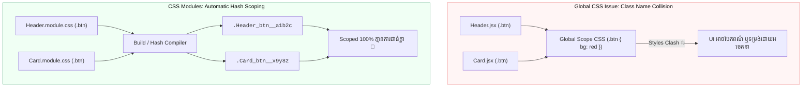

## 🎨 1. Global CSS Issue vs CSS Modules Solution



---

## 🛠️ 2. ការអនុវត្តក្នុងកូដជាក់ស្តែង

### ក. បង្កើតឯកសារ `Button.module.css`៖
```css
.primaryBtn {
  background-color: #2563eb;
  color: white;
  padding: 10px 20px;
  border-radius: 8px;
  border: none;
  font-weight: 600;
  cursor: pointer;
  transition: background-color 0.2s;
}

.primaryBtn:hover {
  background-color: #1d4ed8;
}

.dangerBtn {
  background-color: #dc2626;
}
```

### ខ. នាំចូលទៅប្រើក្នុង `Button.jsx`៖
```jsx
import styles from './Button.module.css';

export function ActionButton({ label, isDanger = false }) {
  // styles គឺជា JS Object ដែលផ្ទុក Hashed Class Names
  return (
    <button className={`${styles.primaryBtn} ${isDanger ? styles.dangerBtn : ''}`}>
      {label}
    </button>
  );
}
```
