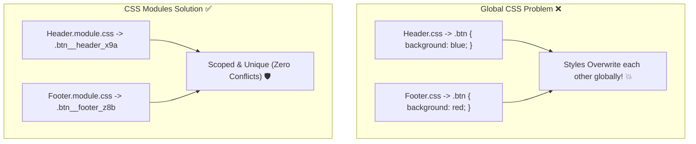

## 💥 1. Global CSS Collision vs CSS Modules



---

## 🎨 2. Standard CSS vs CSS Modules

### 🌐 Normal HTML & Standard CSS:

```html
<!-- HTML Structure -->
<button class="primary-btn">ចុចទីនេះ</button>

<!-- style.css (Global Scope) -->
<style>
  .primary-btn {
    background-color: #2563eb;
    color: white;
    padding: 10px 20px;
    border-radius: 12px;
  }
</style>
```

### 💻 React CSS Module Code:

```css
/* src/components/Button.module.css */
.primaryBtn {
  background-color: #2563eb;
  color: #ffffff;
  padding: 10px 20px;
  border-radius: 12px;
  font-weight: bold;
  border: none;
  cursor: pointer;
  transition: background-color 0.2s;
}

.primaryBtn:hover {
  background-color: #1d4ed8;
}
```

```jsx
// src/components/Button.jsx
import styles from './Button.module.css';

export function Button({ children, onClick }) {
  // ប្រើ styles.primaryBtn ជា JavaScript Object
  return (
    <button className={styles.primaryBtn} onClick={onClick}>
      {children}
    </button>
  );
}
```

### 🔍 ការពន្យល់មួយជួរៗ (Line-by-Line Explanation):

1. `import styles from './Button.module.css';`
   - Import CSS Module ជា JavaScript Object។
2. `className={styles.primaryBtn}`
   - React នឹងចង Class Name ទៅកាន់ Unique Hash ដូចជា `Button_primaryBtn__d7a8e` ដែលបង្កើតឡើងដោយ Vite/Webpack។
3. **Scoped Styling:** ទោះបីជាមាន Component ផ្សេងទៀតមាន class ឈ្មោះ `.primaryBtn` ក៏ដោយ ក៏វាមិនប៉ះពាល់ ឬជាន់គ្នាឡើយ។

---

## 🚀 3. Complete Integrated Component

```jsx
// src/components/Card.jsx
import styles from './Card.module.css';

export default function ScopedCard() {
  return (
    <div className="p-6 bg-white dark:bg-slate-800 rounded-2xl shadow max-w-sm mx-auto text-center">
      <h3 className="text-xl font-bold mb-2 text-slate-800 dark:text-white">
        🛡️ CSS Module Scoping
      </h3>
      <p className="text-xs text-slate-400 mb-4">
        Class ទាំងអស់ត្រូវបាន Scoped យ៉ាងមានសុវត្ថិភាព 100%។
      </p>
      <button className="px-4 py-2 bg-blue-600 hover:bg-blue-700 text-white rounded-xl font-bold text-sm transition">
        Scoped Action Button
      </button>
    </div>
  );
}
```
