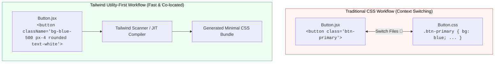

## 🎨 1. Traditional CSS vs Tailwind CSS Workflow



---

## ⚙️ 2. ការដំឡើង Tailwind CSS ក្នុង Vite

```bash
# 1. ដំឡើង Tailwind Packages
npm install -D tailwindcss postcss autoprefixer

# 2. បង្កើត config files
npx tailwindcss init -p
```

### កែប្រែ `tailwind.config.js`៖
```javascript
/** @type {import('tailwindcss').Config} */
export default {
  content: ["./index.html", "./src/**/*.{js,ts,jsx,tsx}"],
  theme: {
    extend: {},
  },
  plugins: [],
}
```

### បន្ថែម Directives ទៅក្នុង `src/index.css`៖
```css
@tailwind base;
@tailwind components;
@tailwind utilities;
```
