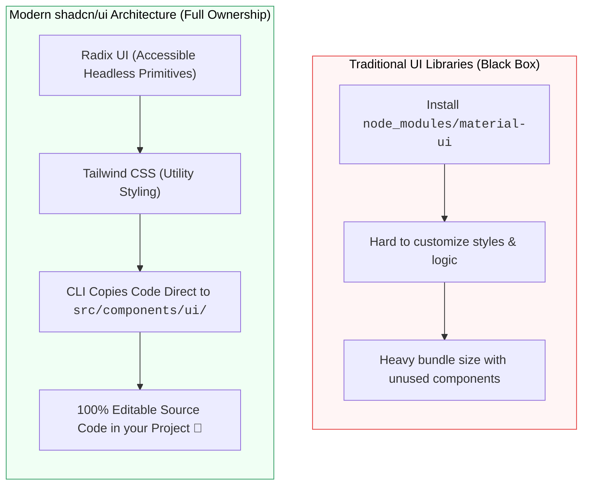

## 🧩 1. Modern Component Architecture ជាមួយ shadcn/ui



---

## 🎨 2. ការប្រើប្រាស់ Lucide React Icons

```bash
npm install lucide-react
```

```jsx
import { LayoutDashboard, Users, ShoppingCart, Settings, Bell } from 'lucide-react';

export function SidebarNav() {
  return (
    <nav className="w-64 bg-slate-900 text-slate-300 min-h-screen p-4 space-y-2">
      <div className="flex items-center gap-3 px-3 py-4 text-white font-bold border-b border-slate-800">
        <LayoutDashboard className="text-blue-500" />
        <span>Admin Panel</span>
      </div>

      <a href="#" className="flex items-center gap-3 px-3 py-2 rounded-lg bg-blue-600 text-white font-medium">
        <Users size={18} />
        <span>អតិថិជន</span>
      </a>

      <a href="#" className="flex items-center gap-3 px-3 py-2 rounded-lg hover:bg-slate-800 transition">
        <ShoppingCart size={18} />
        <span>ការបញ្ជាទិញ</span>
      </a>

      <a href="#" className="flex items-center gap-3 px-3 py-2 rounded-lg hover:bg-slate-800 transition">
        <Settings size={18} />
        <span>ការកំណត់</span>
      </a>
    </nav>
  );
}
```
