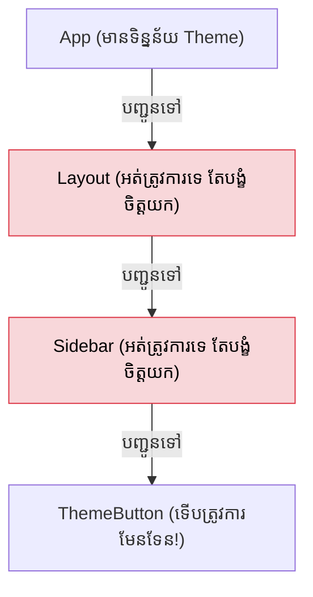

## 🕳️ បញ្ហា Prop Drilling

ស្រមៃថាអ្នកមានទិន្នន័យ `Theme (ងងឹត ឫ ភ្លឺ)` នៅលើកំពូល `App`។ ប៉ុន្តែប៊ូតុងដែលត្រូវការប្តូរពណ៌ វាស្ថិតនៅជ្រៅមែនទែននៅខាងក្រោម។


ការបញ្ជូនទិន្នន័យបន្តកន្ទុយគ្នាបែបនេះហៅថា **Prop Drilling** ដែលធ្វើអោយកូដពិបាកថែទាំ។

---

## 🪄 ដំណោះស្រាយជាមួយ Context API

React Context អនុញ្ញាតអោយយើងបញ្ជូនទិន្នន័យកាត់កណ្តាលខ្យល់បានយ៉ាងងាយ! ការប្រើប្រាស់មាន ៣ ជំហាន៖

### ជំហានទី 1: បង្កើត Context
ដំបូង យើងត្រូវបង្កើត "បំពង់បញ្ជូនទិន្នន័យ" មួយជាមុនសិន។

```jsx
import { createContext } from 'react';

// បង្កើត Context (ជាទូទៅគេទុកវានៅក្នុងឯកសារដាច់ដោយឡែក)
export const ThemeContext = createContext("light"); 
```

### ជំហានទី 2: ប្រើប្រាស់ Provider រុំពីក្រៅ
ដើម្បីអោយអ្នកខាងក្រោមអាចស្រូបយកទិន្នន័យបាន អ្នកត្រូវយក `Provider` ទៅរុំពីក្រៅ និងបញ្ជូនតម្លៃដែលអ្នកចង់ចែកចាយ (value)។

```jsx
import { useState } from 'react';
import { ThemeContext } from './ThemeContext';
import Layout from './Layout';

function App() {
  const [theme, setTheme] = useState("dark");

  return (
    // អ្វីៗទាំងអស់ដែលនៅក្នុងនេះ នឹងអាចស្រូបយក theme="dark" បាន!
    <ThemeContext.Provider value={theme}>
      <Layout />
    </ThemeContext.Provider>
  );
}
```

### ជំហានទី 3: ទាញយកទិន្នន័យដោយ `useContext`
ឥឡូវនេះ នៅឯប៊ូតុងដែលនៅជ្រៅខាងក្រោម មិនចាំបាច់រង់ចាំទទួល Props ពីមេទេ វាអាចលូកដៃទៅចាប់យកទិន្នន័យពីលើអាកាសបានដោយផ្ទាល់!

```jsx
import { useContext } from 'react';
import { ThemeContext } from './ThemeContext';

function ThemeButton() {
  // ហៅទិន្នន័យតាមរយៈ useContext
  const currentTheme = useContext(ThemeContext);

  return (
    <button className={currentTheme === "dark" ? "btn-dark" : "btn-light"}>
      បច្ចុប្បន្នភាព: {currentTheme}
    </button>
  );
}
```

---

## ⚠️ Context មិនមែនជាឧបករណ៍គ្រប់គ្រង State (Global State) នោះទេ!

ការយល់ច្រឡំដ៏ធំបំផុត: *"ខ្ញុំមិនចាំបាច់រៀន Redux ឫ Zustand ទេ ព្រោះខ្ញុំមាន Context ហើយ!"*

តាមពិត Context គ្រាន់តែជា "បំពង់បញ្ជូន (Dependency Injection)" ប៉ុណ្ណោះ។ វាមិនមានសមត្ថភាពគ្រប់គ្រង State ដោយខ្លួនឯងទេ។ រាល់ពេលដែលតម្លៃ Context ប្រែប្រួល (ទោះបន្តិចបន្តួចក៏ដោយ) **រាល់ Component ទាំងអស់ដែលតភ្ជាប់ជាមួយវានឹង Re-render ឡើងវិញទាំងអស់!** វាអាចធ្វើអោយវេបសាយអ្នកដើរយឺតខ្លាំង។

**សេចក្តីសន្និដ្ឋាន:**
- ✅ **គួរប្រើ Context:** សម្រាប់ទិន្នន័យដែលកម្រនឹងប្រែប្រួល (ឧ. Theme, ភាសា, ទិន្នន័យ User ដែលបាន Login)។
- ❌ **មិនគួរប្រើ Context:** សម្រាប់ទិន្នន័យដែលផ្លាស់ប្តូរញឹកញាប់ (ឧ. ទិន្នន័យវាយអត្ថបទ, ចលនាសត្វ)។ បើទិន្នន័យធំនិងស្មុគស្មាញ អ្នកគួរប្រើប្រាស់ Zustand ឫ Redux។

```reactdiagram
ContextAPI
```
