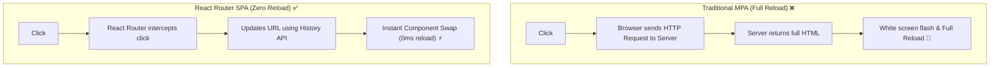

## 🗺️ 1. Multi-Page (MPA) vs Single-Page Routing (SPA)



---

## 🧭 2. HTML Links vs React Router Configuration

### 🌐 Normal HTML Links:

```html
<!-- HTML Multi-Page Navigation (Reloads the whole page!) -->
<nav>
  <a href="/">Home</a>
  <a href="/about">About</a>
  <a href="/contact">Contact</a>
</nav>
```

### 💻 React Router Setup Code:

```jsx
// src/App.jsx
import { BrowserRouter, Routes, Route, Link } from 'react-router-dom';

function Home() { return <h2>🏠 ទំព័រដើម (Home)</h2>; }
function About() { return <h2>ℹ️ អំពីយើង (About)</h2>; }
function Contact() { return <h2>📞 ទំនាក់ទំនង (Contact)</h2>; }

export default function App() {
  return (
    <BrowserRouter>
      {/* NAVIGATION BAR */}
      <nav className="flex gap-4 p-4 bg-slate-100 dark:bg-slate-800">
        <Link to="/" className="font-bold text-blue-600">Home</Link>
        <Link to="/about" className="font-bold text-blue-600">About</Link>
        <Link to="/contact" className="font-bold text-blue-600">Contact</Link>
      </nav>

      {/* ROUTE DEFINITIONS */}
      <main className="p-6">
        <Routes>
          <Route path="/" element={<Home />} />
          <Route path="/about" element={<About />} />
          <Route path="/contact" element={<Contact />} />
        </Routes>
      </main>
    </BrowserRouter>
  );
}
```

### 🔍 ការពន្យល់មួយជួរៗ (Line-by-Line Explanation):

1. `<BrowserRouter>`
   - ផ្តល់បរិបទ Routing និងតភ្ជាប់ React App ទៅនឹង Browser URL Address Bar។
2. `<Link to="/about">`
   - ជំនួស `<a href="...">`។ វាទប់ស្កាត់ការ Refresh ទំព័រ និងប្តូរ Component ភ្លាមៗក្នុងពេល 0ms។
3. `<Routes>`
   - ដើរតួជា Container ពិនិត្យមើល URL បច្ចុប្បន្ន រួចជ្រើសរើស `<Route>` ណាដែលត្រូវគ្នាមកបង្ហាញ។
4. `<Route path="/about" element={<About />} />`
   - ប្រសិនបើ URL គឺ `/about` វានឹង Render Component `<About />`។
