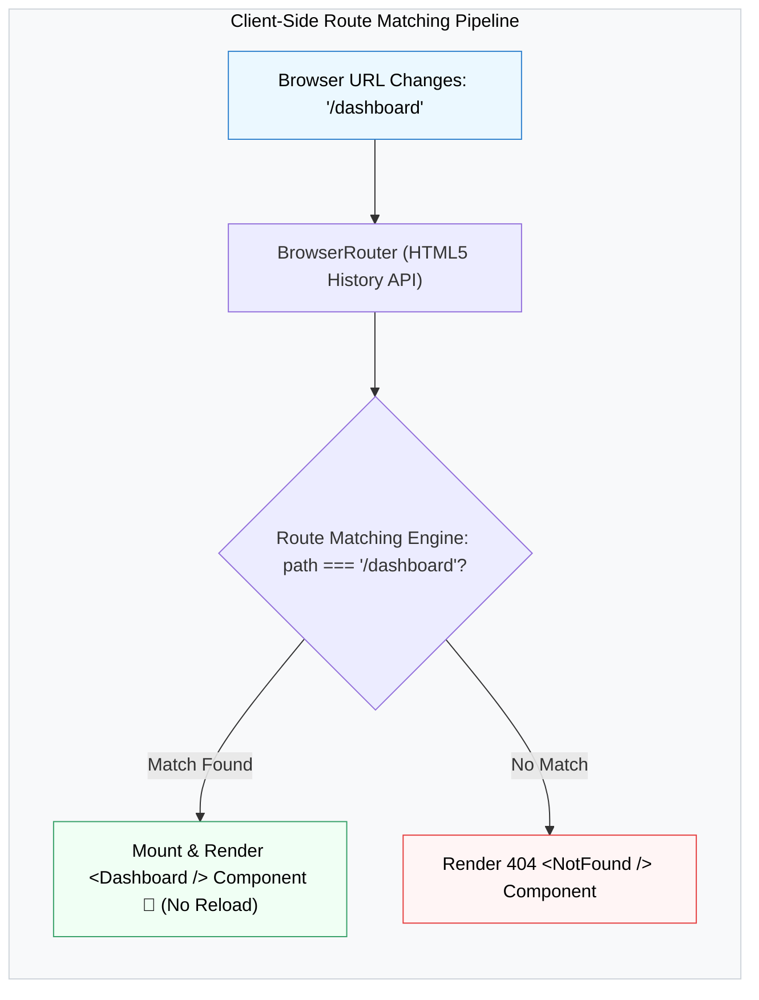

## 🗺️ 1. Client-Side Routing Architecture



---

## ⚙️ 2. ការដំឡើង និង Setup

```bash
npm install react-router-dom
```

```jsx
// ឯកសារ: src/App.jsx
import { BrowserRouter, Routes, Route } from 'react-router-dom';

function Home() { return <h1 className="p-8 text-2xl font-bold">🏠 ទំព័រដើម (Home)</h1>; }
function About() { return <h1 className="p-8 text-2xl font-bold">ℹ️ អំពីយើង (About)</h1>; }
function NotFound() { return <h1 className="p-8 text-2xl font-bold text-red-500">404 រកមិនឃើញទំព័រឡើយ!</h1>; }

export default function App() {
  return (
    <BrowserRouter>
      <Routes>
        <Route path="/" element={<Home />} />
        <Route path="/about" element={<About />} />
        <Route path="*" element={<NotFound />} />
      </Routes>
    </BrowserRouter>
  );
}
```
