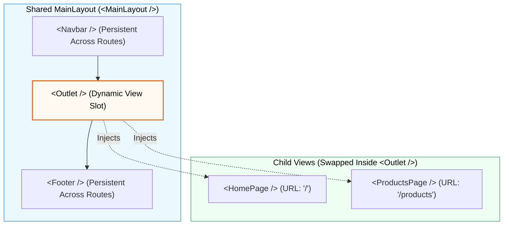

## 🏛️ 1. Layout Routes Architecture



---

## 🛠️ 2. កូដអនុវត្តជាក់ស្តែង

### ក. បង្កើត `MainLayout.jsx`
```jsx
import { Outlet, Link } from 'react-router-dom';

export default function MainLayout() {
  return (
    <div className="min-h-screen flex flex-col">
      {/* Persistent Navbar */}
      <header className="bg-slate-900 text-white p-4 flex justify-between items-center">
        <span className="font-black text-xl">MyStore</span>
        <nav className="space-x-4">
          <Link to="/" className="hover:text-blue-400">ទំព័រដើម</Link>
          <Link to="/products" className="hover:text-blue-400">ផលិតផល</Link>
        </nav>
      </header>

      {/* Dynamic Content Slot */}
      <main className="flex-1 p-6 bg-slate-50">
        <Outlet />
      </main>

      {/* Persistent Footer */}
      <footer className="bg-slate-200 text-slate-600 p-4 text-center text-sm">
        © 2026 MyStore. All Rights Reserved.
      </footer>
    </div>
  );
}
```

### ខ. កំណត់ Nested Routes ក្នុង `App.jsx`
```jsx
import { BrowserRouter, Routes, Route } from 'react-router-dom';
import MainLayout from './layouts/MainLayout';
import HomePage from './pages/HomePage';
import ProductsPage from './pages/ProductsPage';

export default function App() {
  return (
    <BrowserRouter>
      <Routes>
        <Route path="/" element={<MainLayout />}>
          <Route index element={<HomePage />} />
          <Route path="products" element={<ProductsPage />} />
        </Route>
      </Routes>
    </BrowserRouter>
  );
}
```
